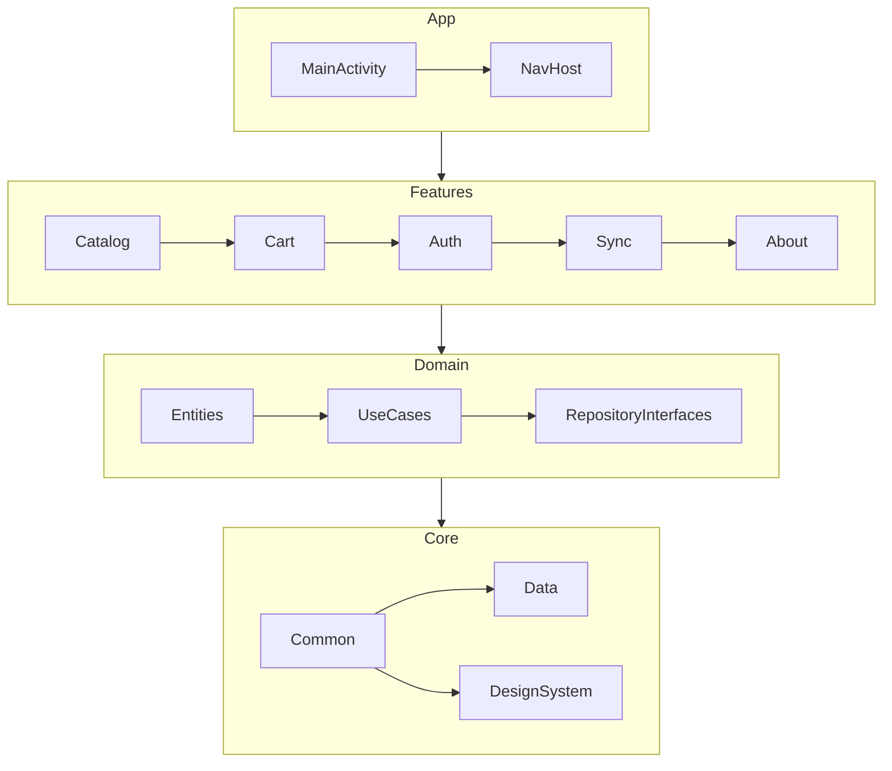

# 🛍️ PocketShop

> Aplicativo Android modular desenvolvido em **Kotlin**, criado para demonstrar **boas práticas de arquitetura**, **Clean Code** e a **aplicação dos 23 Design Patterns GoF** no contexto Android moderno, utilizando **Jetpack Compose**, **Coroutines**, **Flow**, **Room**, **Retrofit** e **Hilt**.

---

## 📱 Visão geral

O **PocketShop** é um exemplo completo e didático de um aplicativo **e-commerce simples**, construído de forma **modular, escalável e testável**.  
O foco é demonstrar como aplicar **padrões de projeto clássicos (GoF)** em harmonia com as **boas práticas do ecossistema Android**, sem cair em *over-engineering*.

O projeto está dividido em múltiplos módulos (app + features + core + domain), cada um ilustrando diferentes padrões e princípios **SOLID**.

---

## ⚙️ Stack principal

| Categoria | Tecnologia / Biblioteca |
|------------|------------------------|
| Linguagem | Kotlin (100%) |
| UI | Jetpack Compose + Material 3 |
| DI | Hilt |
| Concorrência | Coroutines + Flow |
| Persistência | Room |
| Rede | Retrofit + OkHttp |
| Paginação | Paging 3 |
| Navegação | Navigation Compose |
| Testes | JUnit + MockK + Turbine |
| Build | Gradle (KTS) + Version Catalog |
| Modularização | Android App + Android Libraries + 1 Dynamic Feature |

---

## 🧩 Estrutura modular

```
PocketShop/
│
├── app/                         # Aplicativo principal (entrypoint)
│
├── core/
│   ├── common/                  # Utilitários, Result/Either, extensões
│   ├── data/                    # Retrofit, Room, Repositórios, Adapters
│   └── designsystem/            # Tokens de design, tema e componentes Compose
│
├── domain/                      # Entidades, Use Cases e interfaces (Bridge)
│
├── feature/
│   ├── catalog/                 # Lista e filtro de produtos
│   ├── cart/                    # Carrinho, promoções e descontos
│   ├── auth/                    # Login e registro (Facade/Proxy)
│   ├── sync/                    # Sincronização offline-first
│   └── about/                   # Dynamic Feature: informações do app, docs
│
└── docs/
    ├── README.md                # Catálogo geral de Design Patterns
    └── PocketShop.md            # Este arquivo (documentação do app)
```

---

## 🧱 Tipos de módulo e finalidade

| Módulo | Tipo | Descrição |
|---------|------|------------|
| `:app` | **Android Application (Phone & Tablet)** | Ponto de entrada, navegação e injeção global (Hilt) |
| `:core:common` | **Android Library** | Utilitários, classes base, `Result`, extensões Kotlin |
| `:core:designsystem` | **Android Library** | Temas, cores, tipografia e componentes Compose reutilizáveis |
| `:core:data` | **Android Library** | Integração de rede (Retrofit), banco local (Room) e Repositórios |
| `:domain` | **Kotlin Library** | Entidades, Use Cases, regras de negócio e interfaces de repositório |
| `:feature:catalog` | **Android Library** | Catálogo de produtos, filtros e ordenações |
| `:feature:cart` | **Android Library** | Carrinho de compras com suporte a undo/redo e promoções |
| `:feature:auth` | **Android Library** | Fluxo de autenticação e gerenciamento de sessão |
| `:feature:sync` | **Android Library** | Sincronização offline, jobs e WorkManager |
| `:feature:about` | **Dynamic Feature** | Tela sobre o app, documentação visual e resumo de padrões |

---

## 🧠 Padrões GoF aplicados (exemplos reais)

| Categoria | Padrão | Onde aparece |
|------------|--------|---------------|
| Criacionais | **Factory Method** | Criação de repositórios (Remote/Local) no módulo `core:data` |
| Criacionais | **Abstract Factory** | `UiFactory` (Light/Dark) em `core:designsystem` |
| Criacionais | **Builder** | Criação de `WorkRequest` e `HttpClient.Builder` |
| Criacionais | **Prototype** | Clonagem de configurações de filtro em `domain` |
| Criacionais | **Singleton** | Instâncias únicas de `Retrofit`, `RoomDatabase` e `Logger` |
| Estruturais | **Adapter** | Mapeamento entre DTO ↔ Entity ↔ Domain |
| Estruturais | **Bridge** | `Repository` ↔ `DataSource` (abstração + implementação) |
| Estruturais | **Composite** | Hierarquia de categorias de produto e UI Compose |
| Estruturais | **Decorator** | Cache e log wrappers para DataSources |
| Estruturais | **Facade** | `AuthFacade` unifica login local + remoto |
| Estruturais | **Flyweight** | Cache de cores e estilos no `core:designsystem` |
| Estruturais | **Proxy** | `Retrofit.create()` (proxy dinâmico) e `by lazy` |
| Comportamentais | **Strategy** | Estratégias de ordenação e desconto |
| Comportamentais | **State** | `UiState` (Loading/Success/Error) em ViewModels |
| Comportamentais | **Observer** | `StateFlow` e `collectAsState()` |
| Comportamentais | **Command** | Ações do carrinho com suporte a `undo()` |
| Comportamentais | **Template Method** | Pipelines de sincronização |
| Comportamentais | **Chain of Responsibility** | Validação de formulários e interceptors |
| Comportamentais | **Interpreter** | Mini DSL de filtros (`price>100 AND inStock`) |
| Comportamentais | **Iterator** | Iteração sobre listas ou páginas (Paging 3) |
| Comportamentais | **Mediator** | Coordenação de filtros ↔ lista ↔ gráficos |
| Comportamentais | **Memento** | Histórico de alterações no carrinho |
| Comportamentais | **Visitor** | Exportação/validação de relatórios no `about` |

---

## 🧩 Arquitetura geral



---

## 🧰 Ferramentas de desenvolvimento

- Android Studio Ladybug+
- Gradle com Version Catalog (`libs.versions.toml`)
- CI/CD compatível (GitHub Actions ou Jenkinsfile)
- Testes com MockWebServer + in-memory Room
- Dependências centralizadas no Version Catalog

---

## 🧪 Testes

- **Unit Tests:** JUnit + MockK + Turbine
- **Instrumented Tests:** Robolectric + Compose UI Testing
- **Coverage:** JaCoCo configurável por módulo
- **Padrão:** Cada feature possui `...ViewModelTest`, `...UseCaseTest`, `...RepositoryTest`

---

## 💾 Banco e rede (resumo)

- **Room:** persistência local; DAOs geram caches (Adapter Pattern)
- **Retrofit:** comunicação HTTP, interceptors Decorator + Chain of Responsibility
- **WorkManager:** sincronização automática (Template Method)

---

## 🧱 Princípios SOLID aplicados

- **SRP:** cada classe tem uma única responsabilidade clara
- **OCP:** novos comportamentos adicionados por extensão, não modificação
- **LSP:** substituições seguras entre classes e abstrações
- **ISP:** interfaces pequenas e coesas
- **DIP:** dependências sempre por abstração (`Repository`, `UseCase`)

---

## 🧠 Padrões Android e boas práticas

- `ViewModel` com `StateFlow`
- `rememberSaveable` em Compose
- Camadas bem separadas (`data`, `domain`, `ui`)
- `Repository` como ponte (Bridge Pattern)
- `UseCase` invocado via operador `invoke()`
- Nenhum componente Android nas camadas de domínio

---

## 🧭 Como rodar

1. **Clone o projeto**
   ```bash
   git clone https://github.com/ronaldsantos63/gof_design_patterns.git
   ```
2. **Abra no Android Studio (branch `PocketShop`)**
3. **Sincronize dependências**
   ```bash
   ./gradlew sync
   ```
4. **Rode a aplicação**
   ```bash
   ./gradlew :app:installDebug
   ```

---

## 🧱 Convenções de código

- Padrão de nome: `PascalCase` para classes, `camelCase` para funções/variáveis
- Cada módulo possui seu próprio `README.md` explicando o padrão aplicado
- Código documentado com `KDoc`
- Commits seguem [Conventional Commits](https://www.conventionalcommits.org)
- Branch principal: `PocketShop`

---

## 📚 Documentação complementar

- [Guia dos Design Patterns](README.md) — documentação completa dos 23 padrões GoF
- [PocketShop Architecture Overview](#) — em breve
- [Patterns Overview Diagram (Mermaid)](#) — em breve

---

## 📜 Licença

MIT © 2025 Ronald Santos

---

## ✨ Citação

> “Simplicidade é a sofisticação máxima.” — Leonardo da Vinci
