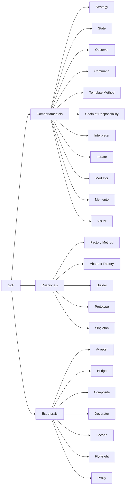

# 🧠 Design Patterns em Kotlin e Android

> Um guia **completo, prático e visual** dos 23 **Design Patterns do GoF**, aplicados ao ecossistema Android moderno — com código em **Kotlin**, diagramas **Mermaid**, e foco em **Clean Architecture**, **SOLID**, e **boas práticas reais de mercado**.

---

## 🚀 Objetivo do projeto

Este repositório serve como um **catálogo interativo de padrões de projeto** aplicados em Kotlin/Android.  
Cada padrão contém:

- 📘 Explicação teórica e motivação
- ✅ Quando aplicar e quando evitar
- ⚙️ Diagrama UML e de sequência (Mermaid)
- 💻 Exemplo real em Kotlin (Android-friendly)
- 🧩 Relações com outros padrões
- 🚫 Anti-patterns e cuidados SOLID
- 🧪 Testes unitários essenciais

Além disso, o repositório também propõe um **projeto unificado** (📱 *PocketShop*) que demonstra **como aplicar os padrões em harmonia**, sem ferir o SOLID nem cair em over-engineering.

---

## 🧭 Organização

Os padrões estão separados por **categoria GoF** seguindo a estrutura:

```
app/src/main/java/com/ronaldsantos/designpatterns/
│
├── comportamentais/     # Comunicação e responsabilidade entre objetos
├── criacionais/          # Criação e ciclo de vida de objetos
├── estruturais/          # Composição e relação entre classes/objetos
└── ui/theme/             # Suporte de layout e theming
```

Cada pasta contém um `README.md` dedicado com todos os detalhes e diagramas do padrão.

---

## 🧩 Índice de Padrões

### 🧠 Comportamentais
| Padrão                                                                                                                 | Descrição |
|------------------------------------------------------------------------------------------------------------------------|------------|
| [Strategy](app/src/main/java/com/ronaldsantos/designpatterns/comportamentais/strategy/README.md)                       | Trocar algoritmos em tempo de execução |
| [State](app/src/main/java/com/ronaldsantos/designpatterns/comportamentais/state/README.md)                                   | Gerenciar estados de forma independente |
| [Observer](app/src/main/java/com/ronaldsantos/designpatterns/comportamentais/observer/README.md)                             | Notificação reativa de eventos |
| [Command](app/src/main/java/com/ronaldsantos/designpatterns/comportamentais/command/README.md)                               | Encapsular ações como objetos |
| [Template Method](app/src/main/java/com/ronaldsantos/designpatterns/comportamentais/templatemethod/README.md)                | Definir o esqueleto de um algoritmo |
| [Chain of Responsibility](app/src/main/java/com/ronaldsantos/designpatterns/comportamentais/chainofresponsability/README.md) | Encadear manipuladores de requisições |
| [Interpreter](app/src/main/java/com/ronaldsantos/designpatterns/comportamentais/interpreter/README.md)                       | Interpretar DSLs e expressões simples |
| [Iterator](app/src/main/java/com/ronaldsantos/designpatterns/comportamentais/iterator/README.md)                             | Navegar coleções sem expor estrutura |
| [Mediator](app/src/main/java/com/ronaldsantos/designpatterns/comportamentais/mediator/README.md)                             | Centralizar comunicação entre objetos |
| [Memento](app/src/main/java/com/ronaldsantos/designpatterns/comportamentais/memento/README.md)                               | Armazenar e restaurar estados anteriores |
| [Visitor](app/src/main/java/com/ronaldsantos/designpatterns/comportamentais/visitor/README.md)                               | Executar operações em objetos variados |

---

### 🏗️ Criacionais
| Padrão | Descrição |
|--------|------------|
| [Factory Method](app/src/main/java/com/ronaldsantos/designpatterns/criacionais/factorymethod/README.md) | Deixar subclasses decidirem qual classe instanciar |
| [Abstract Factory](app/src/main/java/com/ronaldsantos/designpatterns/criacionais/abstractmethod/README.md) | Criar famílias de objetos relacionados |
| [Builder](app/src/main/java/com/ronaldsantos/designpatterns/criacionais/builder/README.md) | Construção passo a passo de objetos complexos |
| [Prototype](app/src/main/java/com/ronaldsantos/designpatterns/criacionais/prototype/README.md) | Clonar objetos existentes |
| [Singleton](app/src/main/java/com/ronaldsantos/designpatterns/criacionais/singleton/README.md) | Garantir uma única instância global |

---

### 🧱 Estruturais
| Padrão | Descrição |
|--------|------------|
| [Adapter](app/src/main/java/com/ronaldsantos/designpatterns/estruturais/adapter/README.md) | Converter interfaces incompatíveis |
| [Bridge](app/src/main/java/com/ronaldsantos/designpatterns/estruturais/bridge/README.md) | Separar abstração da implementação |
| [Composite](app/src/main/java/com/ronaldsantos/designpatterns/estruturais/composite/README.md) | Compor objetos em hierarquias |
| [Decorator](app/src/main/java/com/ronaldsantos/designpatterns/estruturais/decorator/README.md) | Adicionar responsabilidades dinamicamente |
| [Facade](app/src/main/java/com/ronaldsantos/designpatterns/estruturais/facade/README.md) | Fornecer uma interface simples a um sistema complexo |
| [Flyweight](app/src/main/java/com/ronaldsantos/designpatterns/estruturais/flyweight/README.md) | Compartilhar objetos imutáveis para economizar memória |
| [Proxy](app/src/main/java/com/ronaldsantos/designpatterns/estruturais/proxy/README.md) | Controlar o acesso a outro objeto |

---

## 🗺️ Mapa geral dos padrões GoF



---

## 🧪 Execução e navegação

1. **Clone o repositório**
   ```bash
   git clone https://github.com/seuusuario/design-patterns-kotlin.git
   ```
2. **Abra no Android Studio / IntelliJ IDEA**
    - Cada diretório de padrão tem um `README.md` + exemplos de código Kotlin.
    - É possível rodar snippets diretamente com `MainActivity.kt` ou via testes.

3. **Visualize os diagramas**
    - O VSCode e o IntelliJ possuem suporte nativo a `mermaid` (ou instale o plugin *Markdown Preview Enhanced*).

4. **Explore o projeto unificado** (*PocketShop*)
    - Contém exemplos reais aplicando múltiplos padrões em conjunto.
    - Cada módulo (`catalog`, `cart`, `auth`, `sync`) demonstra uma categoria diferente.

---

## 💡 Dicas para estudo

- Leia os padrões na ordem GoF, mas **observe os relacionamentos** (ex.: Strategy + State, Command + Memento).
- Use os **diagramas** para entender **responsabilidade e colaboração**.
- Sempre pergunte-se:
    - “Estou resolvendo um problema real?”
    - “Este padrão realmente simplifica o código?”
    - “Estou ferindo algum princípio SOLID?”

---

## 🧩 Próximos passos

- Criar um **resumo visual unificado** (todos os padrões + relações principais).
- Adicionar o **projeto PocketShop** demonstrando aplicação prática integrada.
- No futuro, abrir um novo repositório para **padrões modernos não-GoF** (Repository, UseCase, DI, CQRS, etc.).

---

## 🧠 Autor & Créditos

Desenvolvido por **Ronald Santos**, Android Developer & Software Architect.

---

### Licença

MIT © 2025 Ronald Santos

---

🎯 *“Simplicidade é a sofisticação máxima.” — Leonardo da Vinci*