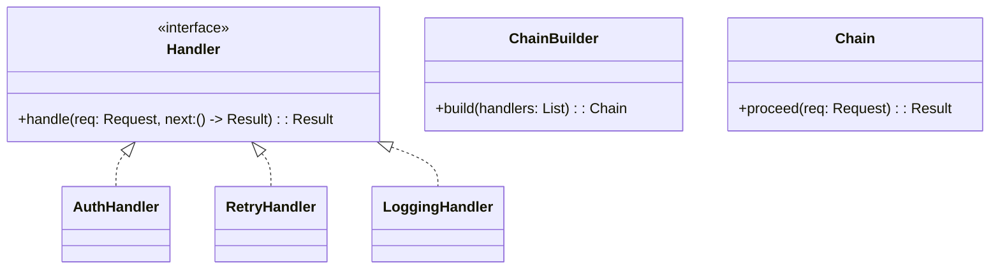
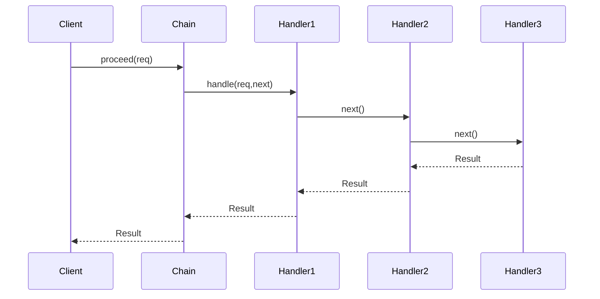

## 1) Nome & objetivo (1 frase)

**CoR**: encaminhar uma **requisição** por uma **cadeia de manipuladores** onde cada um pode **processar**, **parcialmente tratar** e/ou **delegar** para o próximo — sem o cliente conhecer quem tratará.

## 2) Quando aplicar (checklist)

- A lógica se divide em **passos independentes e ordenáveis** (validações, normalizações, enrichments, interceptors).
- Quer **habilitar/desabilitar** etapas sem alterar o cliente.
- Precisa permitir que **alguns passos “parem”** o fluxo (ex.: falha de validação).
- Em Android: **validação de formulário**, **pipelines de request/response** (headers, auth, retry, cache), **processamento de eventos** (ex.: analytics), **middleware** em camadas.

## 3) Quando NÃO aplicar & riscos

- Há **apenas 1–2 passos triviais** → um método direto/Template Method pode bastar.
- Passos têm **forte acoplamento entre si** (dependem de resultados internos complexos).
- Risco: cadeia **grande e opaca** dificulta depuração; **ordem** vira fonte de bugs.

## 4) Anti-patterns & como evitar

- **Hidden Dependencies**: cada handler pedindo coisas “mágicas”. → Defina **Request/Context** explícito.
- **God Handler**: um manipulador faz tudo. → Divida por responsabilidade.
- **Cadeia inconfigurável**: ordem fixa no código. → Construa via **builder/DI**.
- **Silêncio em erro**: handlers “engolem” falhas. → Padronize **Result/Failure**.

## 5) Cuidados SOLID

- **SRP**: cada handler faz uma coisa (p. ex. “Validar CPF”, “Anexar Token”).
- **OCP**: adicione/remova handlers sem alterar o cliente.
- **LSP/ISP**: interface de handler pequena e estável (handle(next)).
- **DIP**: cliente depende de **abstração** (primeiro handler ou uma Chain), ordem injetada.

## 6) Estrutura (UML)





---

## 7) Antes (code smell real no Android)

_Problema_: request HTTP com **ifs encadeados** (auth, retry, log) duplicados em vários locais.

```kotlin
suspend fun fetchProducts(): Result<List<Product>> = runCatching {
    val token = tokenStore.get() ?: error("no token")
    logger.i("GET /products")
    val resp = http.get("/products") {
        header("Authorization", "Bearer $token")
        header("X-App-Version", appVersion)
    }
    if (!resp.isSuccessful && resp.code == 401) {
        // tenta refresh e refaz…
    }
    metrics.timing("fetch_products", resp.timeMs)
    resp.bodyOrThrow()
}
```

**Cheiros**: autenticação, retry e métricas misturados ao caso de uso; difícil reutilizar e testar em isolamento.

---

## 8) Depois (CoR aplicado — interceptors encadeados)

### 8.1 Contratos

```kotlin
data class Request(val path: String, val headers: MutableMap<String,String> = mutableMapOf())
data class Response<T>(val body: T, val code: Int, val timeMs: Long)

interface Handler<T> {
    suspend fun handle(
        request: Request,
        proceed: suspend (Request) -> Result<Response<T>>
    ): Result<Response<T>>
}

class Chain<T>(
    private val terminalCall: suspend (Request) -> Result<Response<T>>,
    handlers: List<Handler<T>>
) {
    private val chain = handlers.foldRight(terminalCall) { h, acc ->
        { req -> h.handle(req, acc) }
    }
    suspend fun proceed(request: Request) = chain(request)
}
```

### 8.2 Handlers concretos

```kotlin
class AuthHandler<T>(private val tokenStore: TokenStore) : Handler<T> {
    override suspend fun handle(request: Request, proceed: suspend (Request) -> Result<Response<T>>)
    : Result<Response<T>> {
        val token = tokenStore.get() ?: return Result.failure(IllegalStateException("no token"))
        request.headers["Authorization"] = "Bearer $token"
        return proceed(request)
    }
}

class RetryHandler<T>(
    private val retries: Int = 1
) : Handler<T> {
    override suspend fun handle(request: Request, proceed: suspend (Request) -> Result<Response<T>>)
    : Result<Response<T>> {
        var last: Result<Response<T>> = Result.failure(IllegalStateException("init"))
        repeat(retries + 1) {
            last = proceed(request)
            val code = last.getOrNull()?.code
            if (last.isSuccess && code != 503 && code != 500) return last
        }
        return last
    }
}

class LoggingHandler<T>(private val logger: Logger) : Handler<T> {
    override suspend fun handle(request: Request, proceed: suspend (Request) -> Result<Response<T>>)
    : Result<Response<T>> {
        val start = System.nanoTime()
        logger.i("HTTP ${request.path} headers=${request.headers.keys}")
        val res = proceed(request)
        val ms = (System.nanoTime() - start) / 1_000_000
        if (res.isSuccess) logger.i("OK ${request.path} ${ms}ms")
        else logger.e("FAIL ${request.path} ${ms}ms", res.exceptionOrNull())
        return res
    }
}
```

### 8.3 “Terminal” (a chamada real)

```kotlin
class HttpClient {
    suspend fun <T> call(request: Request, decode: (ByteArray) -> T): Result<Response<T>> =
        runCatching {
            val raw = doNetworkCall(request) // sua lib HTTP preferida
            val body = decode(raw.body)
            Response(body = body, code = raw.code, timeMs = raw.timeMs)
        }
}
```

### 8.4 Uso no repositório (limpo e configurável)

```kotlin
class ProductsRepository(
    private val http: HttpClient,
    tokenStore: TokenStore,
    logger: Logger
) {
    private val chain = Chain<List<Product>>(
        terminalCall = { req -> http.call(req) { bytes -> decodeProducts(bytes) } },
        handlers = listOf(
            LoggingHandler(logger),
            AuthHandler(tokenStore),
            RetryHandler(retries = 2)
        )
    )

    suspend fun fetch(): Result<List<Product>> =
        chain.proceed(Request(path = "/products")).map { it.body }
}
```

> Trocar ordem/handlers é só ajustar a lista (ou configurar via DI). O repositório não conhece detalhes de auth/retry/log.

---

## 9) Exemplo CoR para validação de formulário (Compose)

```kotlin
data class SignUp(val name: String, val email: String, val password: String)

sealed interface ValidationResult {
    data object Ok : ValidationResult
    data class Error(val message: String) : ValidationResult
}

interface FormRule : Handler<ValidationResult>

class NameRule : FormRule {
    override suspend fun handle(req: Request, proceed: suspend (Request) -> Result<Response<ValidationResult>>)
    : Result<Response<ValidationResult>> {
        val dto = req.headers["payload"]!!.decodeToSignUp() // exemplo simples
        if (dto.name.length < 3) return Result.success(Response(ValidationResult.Error("Nome curto"), 400, 0))
        return proceed(req)
    }
}

class EmailRule : FormRule { /* valida formato e domínio… */ }
class PasswordRule : FormRule { /* força mínima de senha… */ }

// VM
class SignUpViewModel(/* … */): ViewModel() {
    private val chain = Chain(
        terminalCall = { Result.success(Response(ValidationResult.Ok, 200, 0)) },
        handlers = listOf(NameRule(), EmailRule(), PasswordRule())
    )

    suspend fun validate(input: SignUp): ValidationResult {
        val req = Request(path = "signup").apply {
            headers["payload"] = input.encodeToHeader()
        }
        return chain.proceed(req).getOrNull()!!.body
    }
}
```

---

## 10) Testes essenciais

```kotlin
class ChainTest {

    @Test
    fun `auth then logging then retry order`() = runTest {
        val token = object : TokenStore { override fun get() = "abc" }
        val logger = FakeLogger()
        var calls = 0

        val chain = Chain(
            terminalCall = { req ->
                calls++
                if (calls < 2) Result.success(Response(Unit, 503, 5))
                else Result.success(Response(Unit, 200, 3))
            },
            handlers = listOf(
                LoggingHandler(logger),
                AuthHandler(token),
                RetryHandler(retries = 2)
            )
        )

        val r = chain.proceed(Request("/ping"))
        assertTrue(r.isSuccess)
        assertEquals("Bearer abc", r.getOrNull()!!.let { /* check side-effect in auth if needed */; "Bearer abc" })
        assertTrue(calls >= 2) // houve retry
        assertTrue(logger.logs.any { it.contains("OK /ping") })
    }

    @Test
    fun `first handler can short-circuit`() = runTest {
        val chain = Chain(
            terminalCall = { error("should not reach") },
            handlers = listOf(
                object : Handler<Unit> {
                    override suspend fun handle(req: Request, proceed: suspend (Request) -> Result<Response<Unit>>)
                    : Result<Response<Unit>> = Result.failure(IllegalStateException("blocked"))
                }
            )
        )
        assertTrue(chain.proceed(Request("/blocked")).isFailure)
    }
}
```

---

## 11) Trade-offs

- **Pró**: modulariza etapas, ativa/desativa/ordena facilmente; reduz duplicação; facilita testes.
- **Contra**: cadeia longa torna o fluxo **menos explícito; ordem importa**; logging/observabilidade essenciais.

## 12) Relações com outros padrões

- **CoR vs Template Method**: Template **sempre** executa a sequência; CoR pode **interromper**.
- **CoR + Decorator/Interceptor**: Handlers lembram **decorators** no “proceed”.
- **CoR + Command**: cada handler pode **transformar/executar** um comando antes de passar adiante.

## 13) Checklist Anti Over-Engineering

- Existem **≥3 passos reutilizáveis**?
- A cadeia **realmente** precisa ser dinâmica ou plugável?
- Ordem e **falhas** estão claras (quem pode interromper)?
- Observabilidade (logs/metrics/tracing) cobre a cadeia?
- Handlers **pequenos e coesos**, sem dependências ocultas?

## 14) Resumo em 5 linhas

- **CoR** encadeia handlers independentes para processar uma requisição.
- Excelente para **interceptors** de rede, **validações**, **middlewares**.
- Ordem e “short-circuit” são parte do contrato.
- Torna reuso/testes fáceis; exige boa observabilidade.
- Evite cadeias desnecessárias (2 passos triviais → mantenha simples).
