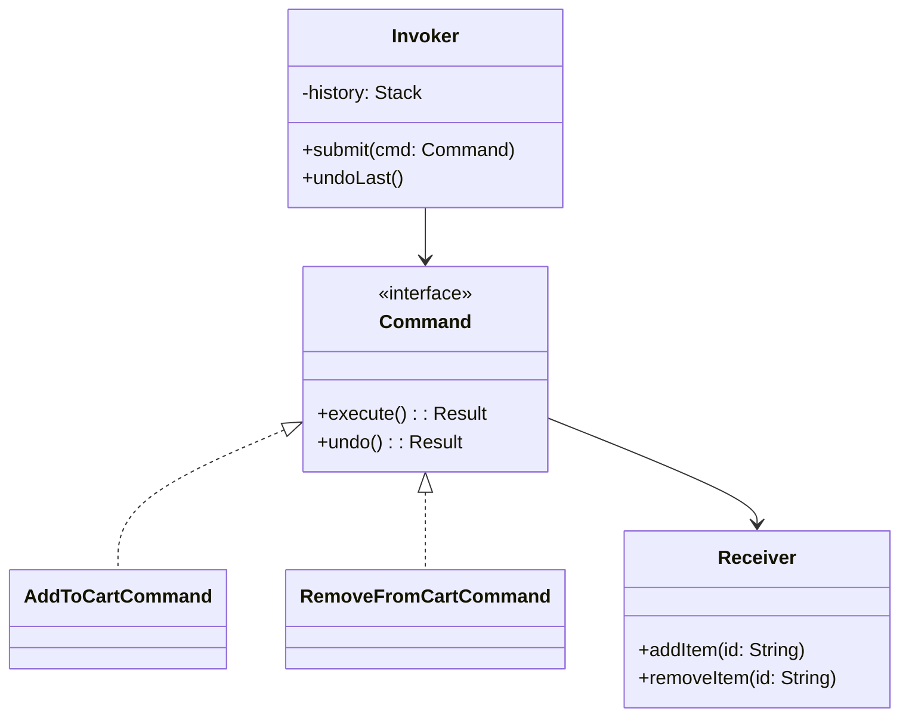
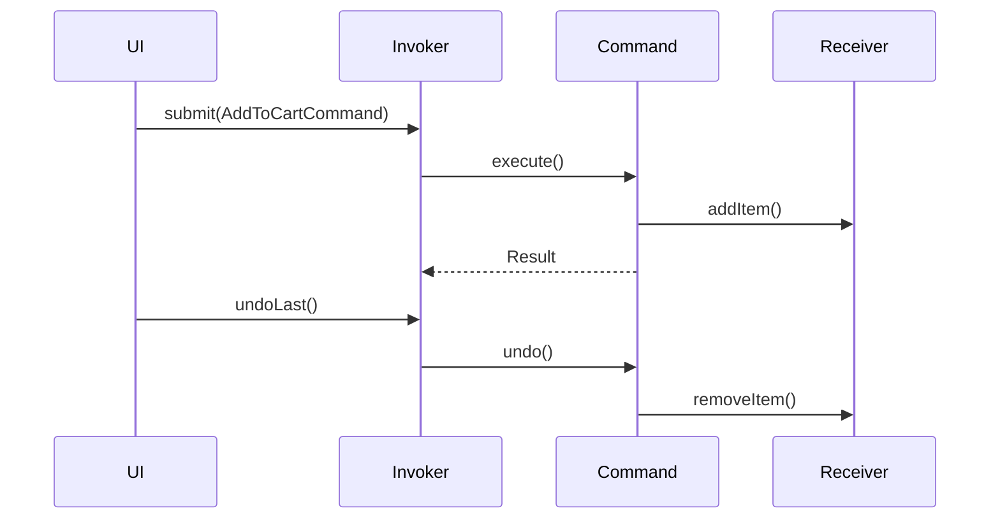

## 1) Nome & objetivo (1 frase)

**Command**: encapsular uma **ação** (o “o que fazer”) como um **objeto** com `execute()` (e opcionalmente `undo()`), possibilitando **fila**, **log**, **retentativas**, **desfazer/refazer** e **desacoplamento** entre quem pede e quem executa.

## 2) Quando aplicar (checklist)

- Precisa de **undo/redo** (ex.: carrinho, edição de texto/desenho, configurações).
- Deseja **fila de comandos** (offline-first: enfileirar e sincronizar depois).
- Precisa **logar/reexecutar** ações (retry/backoff; idempotência).
- Quer **desacoplar UI** da execução (ex.: “Use Cases” invocados como comandos).
- Orquestra **transações** ou **batch** de operações.

## 3) Quando NÃO aplicar & riscos

- Ação é trivial, sem necessidade de histórico, fila ou reexecução. 
- “Command” vira apenas **um método embrulhado** → complexidade sem ganho.
- Se não há undo nem fila, um **use case direto** pode ser melhor.

## 4) Anti-patterns & como evitar

- **God Invoker**: um único executor sabe tudo → separe por **CommandBus/Handlers** e por feature.
- **Commands com efeitos secretos**: deixe **efeitos explícitos** (contratos claros, idempotência onde possível).
- **Command ≠ Callback aleatório**: defina **interface estável** e tratamento de erros.

## 5) Cuidados SOLID

- **SRP**: cada Command representa **uma ação coesa**.
- **OCP**: novos comandos entram **sem** mexer na UI/Invoker.
- **DIP**: UI depende de **abstrações** (Command/Bus), não de repositórios concretos.
- **ISP**: contratos mínimos (`execute()`, `undo()` quando aplicável).

## 6) Estrutura (UML)





---

## 7) Antes (code smell real)

_Problema_: UI chama serviços diretamente; **sem histórico**, **sem retry**, difícil desacoplar.

```kotlin
class CartViewModel(private val repo: CartRepository) : ViewModel() {
    val items = MutableStateFlow<List<CartItem>>(emptyList())

    fun add(id: String) = viewModelScope.launch {
        repo.addItem(id)           // efeito direto
        items.value = repo.items() // sem histórico/undo
    }

    fun remove(id: String) = viewModelScope.launch {
        repo.removeItem(id)
        items.value = repo.items()
    }
}
```

---

## 8) Depois (Command aplicado — undo/redo + fila offline)

### 8.1 Contratos

```kotlin
interface Command {
    suspend fun execute(): Result<Unit>
    suspend fun undo(): Result<Unit> = Result.success(Unit) // opcional
    val idempotencyKey: String? get() = null
}

interface CommandInvoker {
    suspend fun submit(command: Command): Result<Unit>
    suspend fun undoLast(): Result<Unit>
}
```

### 8.2 Receiver (domínio/infra)

```kotlin
interface CartService {
    suspend fun add(itemId: String)
    suspend fun remove(itemId: String)
    suspend fun items(): List<CartItem>
}
```

### 8.3 Comandos concretos (com idempotência/undo)

```kotlin
class AddToCartCommand(
    private val service: CartService,
    private val itemId: String
) : Command {
    override val idempotencyKey: String = "add-$itemId"

    override suspend fun execute(): Result<Unit> = runCatching {
        service.add(itemId)
    }

    override suspend fun undo(): Result<Unit> = runCatching {
        service.remove(itemId)
    }
}

class RemoveFromCartCommand(
    private val service: CartService,
    private val itemId: String
) : Command {
    override val idempotencyKey: String = "remove-$itemId"

    override suspend fun execute(): Result<Unit> = runCatching {
        service.remove(itemId)
    }

    override suspend fun undo(): Result<Unit> = runCatching {
        service.add(itemId)
    }
}
```

### 8.4 Invoker com histórico e fila (offline-first)

```kotlin
class InMemoryCommandInvoker(
    private val queue: ArrayDeque<Command> = ArrayDeque(),
    private val history: ArrayDeque<Command> = ArrayDeque()
) : CommandInvoker {

    override suspend fun submit(command: Command): Result<Unit> = runCatching {
        queue.addLast(command)
        processQueue()
    }

    private suspend fun processQueue() {
        while (queue.isNotEmpty()) {
            val cmd = queue.removeFirst()
            val result = cmd.execute()
            if (result.isSuccess) {
                history.addLast(cmd)
            } else {
                // Re-enfileirar com backoff, persistir, avisar UI, etc.
                // Aqui poderíamos usar WorkManager se for necessário sobreviver ao processo.
                throw result.exceptionOrNull()!!
            }
        }
    }

    override suspend fun undoLast(): Result<Unit> = runCatching {
        val last = history.removeLastOrNull() ?: return Result.failure(IllegalStateException("Empty history"))
        last.undo().getOrThrow()
    }
}
```

### 8.5 ViewModel (limpa, desacoplada)

```kotlin
class CartViewModel(
    private val invoker: CommandInvoker,
    private val cartService: CartService
) : ViewModel() {

    private val _ui = MutableStateFlow<List<CartItem>>(emptyList())
    val ui: StateFlow<List<CartItem>> = _ui

    fun load() = viewModelScope.launch {
        _ui.value = cartService.items()
    }

    fun add(id: String) = viewModelScope.launch {
        invoker.submit(AddToCartCommand(cartService, id))
        _ui.value = cartService.items()
    }

    fun remove(id: String) = viewModelScope.launch {
        invoker.submit(RemoveFromCartCommand(cartService, id))
        _ui.value = cartService.items()
    }

    fun undo() = viewModelScope.launch {
        invoker.undoLast()
        _ui.value = cartService.items()
    }
}
```

### 8.6 Compose (exemplo)

```kotlin
@Composable
fun CartScreen(vm: CartViewModel) {
    val items by vm.ui.collectAsState()

    // ... LazyColumn(items) { ... }

    Row {
        Button(onClick = vm::undo) { Text("Desfazer") }
    }
}
```

> Observação: para **persistência de fila** e **execução resiliente**, substitua o invoker por **WorkManager** (cada comando vira WorkRequest serializável com idempotencyKey).

## 9) Testes essenciais

```kotlin
class CommandTests {

    @Test
    fun `add then undo returns to original state`() = runTest {
        val fake = FakeCartService()
        val invoker = InMemoryCommandInvoker()

        invoker.submit(AddToCartCommand(fake, "x")).getOrThrow()
        assertTrue(fake.items().any { it.id == "x" })

        invoker.undoLast().getOrThrow()
        assertTrue(fake.items().none { it.id == "x" })
    }

    class FakeCartService : CartService {
        private val data = mutableListOf<CartItem>()
        override suspend fun add(itemId: String) { data += CartItem(itemId) }
        override suspend fun remove(itemId: String) { data.removeIf { it.id == itemId } }
        override suspend fun items(): List<CartItem> = data.toList()
    }

    data class CartItem(val id: String)
}
```

---

## 10) Trade-offs

- **Pró**: undo/redo, fila, log e reexecução; desacoplamento e testabilidade.
- **Contra**: mais classes/serialização; cuidado com **idempotência**, **ordem** e **conflitos** em reexecução.

## 11) Relações com outros padrões

- **Command + Memento**: snapshot do estado para **undo** robusto.
- **Command + Composite**: **macro-commands** (várias ações como uma só).
- **Command + Queue/WorkManager**: confiabilidade e execução adiada.
- **Command vs Use Case**: muitos times modelam **Use Cases** como **Commands** (mesma ideia de encapsular ação).

## 12) Checklist Anti Over-Engineering

- Precisa **undo/redo** ou **fila persistente**? Se não, talvez **use case direto**.
- Comandos são **grãos úteis** (nem micro demais nem macro demais)?
- **Idempotência** definida para reexecução?
- **Visibilidade**: logging/telemetria por comando ajuda debugar.
- Sem **God Invoker**: responsabilidades claras.

## 13) Resumo em 5 linhas

- **Command** encapsula ações com execute()/undo() e permite fila, log e reexecução.
- Excelente para **offline-first**, **desfazer/refazer**, **orquestrações**.
- Torna a UI fina e testável; integra bem com **WorkManager**.
- Custo: serialização, controle de ordem e idempotência.
- Combine com **Memento/Composite** para fluxos mais ricos.
