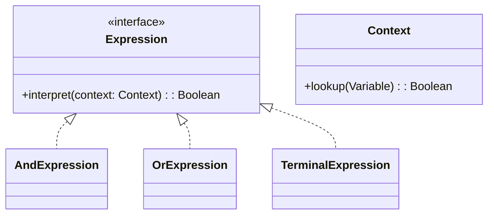
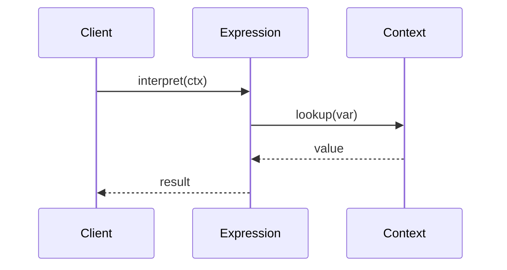

## 1) Nome & objetivo (1 frase)

**Interpreter**: definir uma **linguagem** (gramática simples) e fornecer um **interpretador** que avalia expressões escritas nela.

## 2) Quando aplicar (checklist)

- Precisa dar **poder de configuração** ao usuário ou sistema com uma mini-linguagem (expressões, filtros, regras).
- A gramática é **pequena e estável** (ex.: filtros lógicos, DSL de validação, queries simples).
- Quer **expressividade declarativa** sem codar regras hardcoded.
- Em Android: filtros dinâmicos em listas (ex.: "valor > 100 AND ativo = true"), regras de **notificação** configuráveis, motor de **feature flags** simples, ou **expressões matemáticas** básicas no app.

## 3) Quando NÃO aplicar & riscos

- Gramática é **complexa** (compilador/interpreter completo → overkill → use parser libs como ANTLR/Kotlin DSL).
- A “linguagem” muda com frequência → manutenção dolorosa.
- Só precisa de **1 ou 2 regras fixas** → if direto é melhor.

## 4) Anti-patterns & como evitar

- **Parser caseiro gigante** → prefira compor expressões em objetos pequenos.
- **Tudo vira string** → prefira AST (árvore de expressões tipadas).
- **Performance ruim** em expressões grandes → cachear parse/resultados.

## 5) Cuidados SOLID

- **SRP**: cada nó da gramática avalia **um tipo de operação**.
- **OCP**: adicione novo operador criando nova classe de expressão.
- **ISP/DIP**: expor interface mínima `Expression.interpret(context)`.

---

## 6) Estrutura (UML)





---

## 7) Antes (code smell real)

_Problema_: filtros de pesquisa codificados com `if/when`, difíceis de expandir.

```kotlin
fun matchesFilter(item: Product, filter: String): Boolean {
    return when (filter) {
        "expensive" -> item.price > 100
        "active" -> item.active
        "expensive_and_active" -> item.price > 100 && item.active
        else -> true
    }
}
```

**Cheiros**: filtros hardcoded, cada nova regra exige mexer no código → **violação do OCP**.

---

## 8) Depois (Interpreter aplicado)

### 8.1 Contratos

```kotlin
interface Expression {
    fun interpret(ctx: Product): Boolean
}
```

### 8.2 Expressões concretas

```kotlin
class PriceGreaterThan(private val value: Double) : Expression {
    override fun interpret(ctx: Product): Boolean = ctx.price > value
}

class IsActive : Expression {
    override fun interpret(ctx: Product): Boolean = ctx.active
}

class AndExpression(
    private val left: Expression,
    private val right: Expression
) : Expression {
    override fun interpret(ctx: Product) = left.interpret(ctx) && right.interpret(ctx)
}

class OrExpression(
    private val left: Expression,
    private val right: Expression
) : Expression {
    override fun interpret(ctx: Product) = left.interpret(ctx) || right.interpret(ctx)
}
```

### 8.3 Contexto de uso

```kotlin
data class Product(val id: String, val price: Double, val active: Boolean)

class FilterEngine {
    // poderia vir de parser de string → Expression
    fun expensiveAndActive(): Expression =
        AndExpression(PriceGreaterThan(100.0), IsActive())
}
```

### 8.4 ViewModel usando interpreter

```kotlin
class ProductsViewModel(
    private val repo: ProductsRepository,
    private val engine: FilterEngine
) : ViewModel() {

    private val _ui = MutableStateFlow<List<Product>>(emptyList())
    val ui: StateFlow<List<Product>> = _ui

    fun loadWithFilter() = viewModelScope.launch {
        val all = repo.fetch()
        val expr = engine.expensiveAndActive()
        _ui.value = all.filter { expr.interpret(it) }
    }
}
```

---

## 9) Testes essenciais

```kotlin
class InterpreterTest {

    @Test
    fun `expensive and active works`() {
        val p1 = Product("1", 200.0, true)
        val p2 = Product("2", 50.0, true)
        val p3 = Product("3", 200.0, false)

        val expr = AndExpression(PriceGreaterThan(100.0), IsActive())

        assertTrue(expr.interpret(p1))
        assertFalse(expr.interpret(p2))
        assertFalse(expr.interpret(p3))
    }

    @Test
    fun `or expression works`() {
        val p = Product("1", 20.0, false)
        val expr = OrExpression(PriceGreaterThan(10.0), IsActive())
        assertTrue(expr.interpret(p))
    }
}
```

---

## 10) Trade-offs

- **Pró**: flexibilidade, DSL declarativa, extensível via novas classes.
- **Contra**: performance baixa em gramáticas grandes, difícil para expressões muito complexas → melhor parser/DSL.

## 11) Relações com outros padrões

- **Interpreter + Composite**: AST é uma árvore (cada nó é um Expression).
- **Interpreter + Flyweight**: reuso de expressões comuns para performance.
- **Interpreter vs Strategy**: Strategy troca algoritmo; Interpreter **modela linguagem inteira**.

## 12) Checklist Anti Over-Engineering

- A linguagem é **pequena e estável**?
- Precisa mesmo de mini-DSL ou um **Strategy/Predicate** basta?
- Expressões são **reutilizáveis** em vários lugares?
- Parser simples ou AST construída manualmente é suficiente?

## 13) Resumo em 5 linhas

- **Interpreter** cria uma mini-linguagem declarativa para expressar regras.
- Útil para filtros, expressões lógicas, feature flags, validações.
- Extensível via novos nós (OCP).
- Cuidado com gramáticas grandes (use parser/DSL).
- Combina com **Composite** para estruturar AST.
