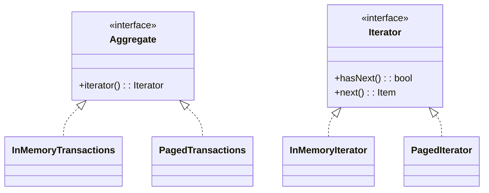
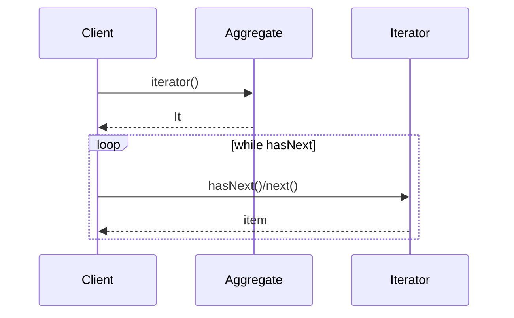

## 1) Nome & objetivo (1 frase)

**Iterator**: prover uma forma **uniforme** de percorrer elementos de uma coleção/estrutura **sem expor a representação interna**.

## 2) Quando aplicar (checklist)

- Você quer **isolar** a forma de percorrer dados (ordem, paginação, cache) do cliente.
- Há **múltiplas fontes** (memória, DB, rede) com a **mesma interface de iteração**.
- Precisa **padronizar** acesso a estruturas não-lineares (árvores, páginas, cursores).
- Em Android: paginação **Room + Retrofit**, cursores de **MediaStore**, leitura de **streams** (Files/ContentResolver), **Lazy paging**.

## 3) Quando NÃO aplicar & riscos

- Só usa **List/Sequence** simples (o for de Kotlin já resolve).
- Iteração única e trivial (adicionar camada extra vira sobrecarga).
- Iterator que **vaza detalhes** (ex.: exige cast para saber o tipo real) derrota o objetivo.

## 4) Anti-patterns & como evitar

- **Expor coleção mutável**: devolva **Sequence/Iterator** imutável ou snapshots.
- **Iterador que bloqueia UI**: para fontes lentas, use **suspend/Flow/Paging**.
- **Misturar paginação e transformação em um único iterador gigante**: componha responsabilidades.

## 5) Cuidados SOLID

- **SRP**: o iterador cuida **só** da travessia; transformação/negócio ficam fora.
- **OCP**: novas fontes viram **novos iteradores** sem mudar o cliente.
- **DIP**: cliente depende de **interfaces** (Iterator<T>, suspend fetchers), não de coleções concretas.

---

## 6) Estrutura (UML)





---

## 7) Antes (code smell real)

_Problema_: cada cliente sabe **como** paginar/mesclar cache + rede, duplicando código.

```kotlin
suspend fun loadAll(): List<Tx> {
    val page1 = api.page(1)
    val page2 = api.page(2)
    val cached = dao.getAll()
    // mistura de ordenação, deduplicação e paginação espalhada…
    return (cached + page1 + page2).distinctBy { it.id }.sortedByDescending { it.date }
}
```

**Cheiros**: acoplamento à fonte e à estratégia de paginação; difícil reutilizar/testar.

---

## 8) Depois (Iterator aplicado)

### 8.1 Contratos

```kotlin
interface TxAggregate {
    fun iterator(): Iterator<Tx>
}

data class Tx(val id: String, val date: Long, val amount: Double)
```

### 8.2 Iterador em memória

```kotlin
class InMemoryIterator(
    private val data: List<Tx>
) : Iterator<Tx> {
    private var index = 0
    override fun hasNext() = index < data.size
    override fun next() = data[index++]
}

class InMemoryTransactions(
    private val source: List<Tx>
) : TxAggregate {
    override fun iterator(): Iterator<Tx> =
        InMemoryIterator(source.sortedByDescending { it.date })
}
```

### 8.3 Iterador paginado (rede + cache, deduplicando)

```kotlin
interface TxApi {
    suspend fun page(page: Int): List<Tx>
}
interface TxDao {
    suspend fun getAll(): List<Tx>
}

class PagedIterator(
    private val api: TxApi,
    private val dao: TxDao,
    private val pageSize: Int = 50,
    private val maxPages: Int = 3
) : Iterator<Tx> {

    private var buffer: MutableList<Tx> = mutableListOf()
    private var idx = 0
    private var page = 0
    private var initialized = false
    private var finished = false

    private suspend fun ensureBuffer() {
        if (!initialized) {
            initialized = true
            val cached = dao.getAll()
            buffer.addAll(cached)
        }
        while (idx >= buffer.size && !finished) {
            page++
            if (page > maxPages) { finished = true; break }
            val remote = api.page(page)
            if (remote.isEmpty()) { finished = true; break }
            buffer.addAll(remote)
            buffer = buffer
                .distinctBy { it.id }
                .sortedByDescending { it.date }
                .toMutableList()
        }
    }

    override fun hasNext(): Boolean {
        // ponte entre sync Iterator e fonte suspending:
        // sinaliza que pode haver mais; o cliente deve consumir via wrapper suspenso/Flow
        return !finished || idx < buffer.size
    }

    override fun next(): Tx {
        if (idx >= buffer.size) error("Chame ensureBuffer via wrapper suspenso antes de next()")
        return buffer[idx++]
    }

    // wrapper suspenso para uso seguro:
    suspend fun nextSuspending(): Tx? {
        ensureBuffer()
        if (idx >= buffer.size) return null
        return buffer[idx++]
    }
}

class PagedTransactions(
    private val api: TxApi,
    private val dao: TxDao
) : TxAggregate {
    override fun iterator(): Iterator<Tx> = PagedIterator(api, dao)
}
```

### 8.4 Uso na ViewModel (expondo como Flow)

```kotlin
class TxViewModel(
    private val aggregate: TxAggregate
) : ViewModel() {

    val items: Flow<Tx> = flow {
        when (val it = aggregate.iterator()) {
            is PagedIterator -> {
                while (true) {
                    val next = it.nextSuspending() ?: break
                    emit(next)
                }
            }
            else -> {
                while (it.hasNext()) emit(it.next())
            }
        }
    }.flowOn(Dispatchers.IO)
}
```

### 8.5 Compose (exemplo)

```kotlin
@Composable
fun TxScreen(vm: TxViewModel) {
    val list = remember { mutableStateListOf<Tx>() }
    LaunchedEffect(Unit) {
        vm.items.collect { list.add(it) }
    }
    // LazyColumn(list) { /* render */ }
}
```

> Observação: Em cenários reais de paginação em Android, **Paging 3** já implementa um “Iterator reativo” robusto — pense nele como um Iterator especializado. Use o padrão para **unificar** fontes próprias ou estruturas customizadas.

---

## 9) Testes essenciais

```kotlin
class IteratorTests {

    @Test
    fun `in-memory iterator yields sorted desc by date`() {
        val data = listOf(
            Tx("1", 100, 10.0),
            Tx("2", 300, 30.0),
            Tx("3", 200, 20.0)
        )
        val agg = InMemoryTransactions(data)
        val it = agg.iterator()
        val out = mutableListOf<Tx>()
        while (it.hasNext()) out += it.next()
        assertEquals(listOf("2","3","1"), out.map { it.id })
    }

    @Test
    fun `paged iterator merges cache then pages distinct and sorted`() = runTest {
        val api = object : TxApi {
            override suspend fun page(page: Int): List<Tx> = when (page) {
                1 -> listOf(Tx("2", 250, 25.0))
                2 -> listOf(Tx("4", 400, 40.0))
                else -> emptyList()
            }
        }
        val dao = object : TxDao {
            override suspend fun getAll(): List<Tx> = listOf(Tx("1", 150, 15.0), Tx("2", 200, 20.0))
        }
        val it = PagedIterator(api, dao, maxPages = 2)

        val seen = mutableListOf<Tx>()
        while (true) {
            val n = it.nextSuspending() ?: break
            seen += n
        }
        // Esperado: cache (dedup com paginação), ordenado desc
        assertEquals(listOf("4","2","1"), seen.map { it.id }.distinct())
    }
}
```

---

## 10) Trade-offs

- **Pró**: oculta representação/estratégia de travessia; unifica acesso a fontes; facilita testes.
- **Contra**: pode ser redundante em Kotlin (listas/seq/paging já resolvem); integrar suspend com Iterator síncrono requer wrappers.

## 11) Relações com outros padrões

- **Iterator + Composite**: percorrer árvores (pré/pós-ordem) com iteradores específicos.
- **Iterator + Decorator**: acrescentar filtros/map em cima do iterador.
- **Iterator vs Visitor**: Iterator percorre; Visitor **aplica operações** aos elementos.

## 12) Checklist Anti Over-Engineering

- A travessia é **não-trivial** (páginas, árvore, mescla cache+rede)?
- Vários clientes precisam da **mesma iteração**?
- Benefício claro sobre List/Sequence/Paging?
- Sem vazar detalhes (casts, estados internos)?

## 13) Resumo em 5 linhas

- **Iterator** padroniza a travessia sem expor a estrutura interna.
- Útil para **paginação**, **cursores** e **estruturas customizadas**.
- Em Android, **Paging 3** já cobre muitos casos — use o padrão para unificar fontes próprias.
- Atenção ao **bridging com suspend** (use Flow/wrappers).
- Combina com **Composite** e **Decorator** para cenários avançados.
