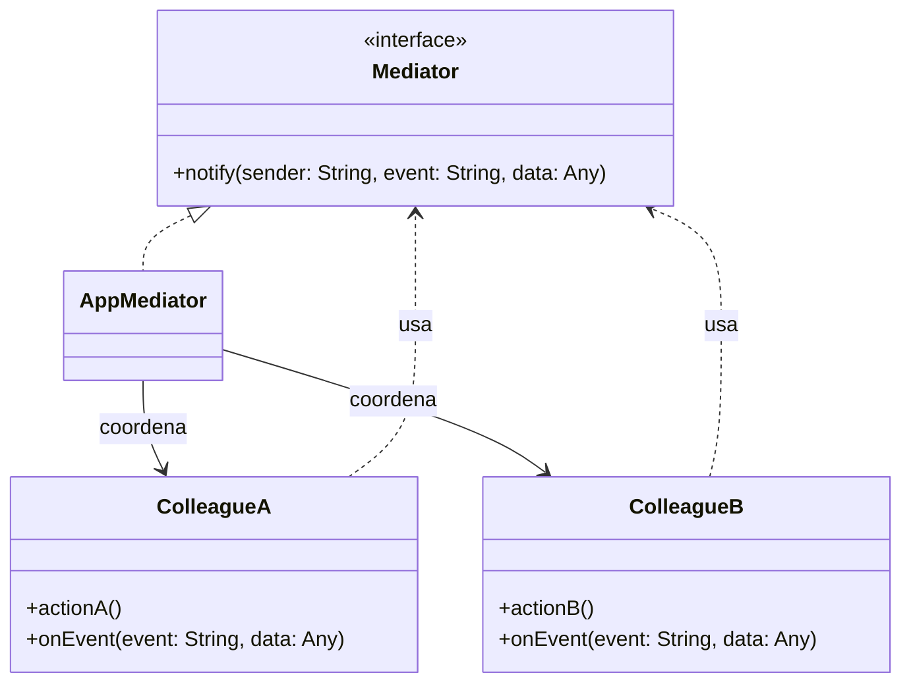
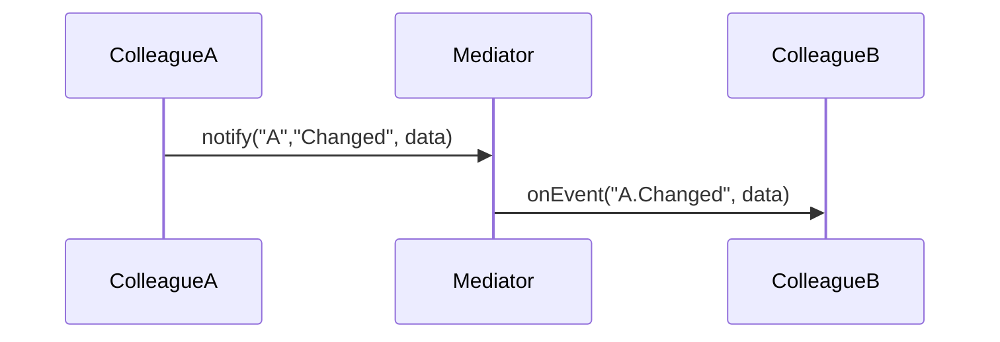

## 1) Nome & objetivo (1 frase)

**Mediator**: centralizar a **comunicação/coordenação** entre objetos (“colegas”), para que **não** conversem **diretamente** entre si, reduzindo acoplamento.

## 2) Quando aplicar (checklist)

- Muitos componentes/“colegas” se referenciam entre si, criando **teias de dependência** (ex.: múltiplos módulos da UI que precisam se sincronizar).
- Precisa **orquestrar** regras entre partes independentes (ex.: formulário com campos dependentes, wizard, player).
- Quer **testar** regras de coordenação sem instanciar toda a UI.

## 3) Quando NÃO aplicar & riscos

- Poucos componentes, interação **simples** → um callback direto é suficiente.
- Se o mediador vira um **God Object** com toda a lógica, você apenas deslocou o problema.

## 4) Anti-patterns & como evitar

- **God Mediator**: extraia políticas em **Strategies/UseCases**; mantenha o mediador fino.
- **Dependências ocultas**: declare **eventos e comandos** explicitamente.
- **Acoplamento acidental com UI**: deixe o mediador no **domínio/aplicação**; a UI só observa/aciona.

## 5) Cuidados SOLID

- **SRP**: o Mediator **coordena**; cada colega faz seu trabalho.
- **OCP**: novas regras via novas **políticas/handlers** sem reescrever colegas.
- **DIP**: colegas dependem de **interface do Mediator**, não de outros colegas.

---

## 6) Estrutura (UML)





---

## 7) Antes (code smell real)

_Problema_: dois módulos de tela conversam **direto**, criando dependência cíclica.

```kotlin
class FilterPanel(private val list: ResultsList) {
    fun onFilterChanged(f: Filter) {
        list.applyFilter(f) // acoplamento direto
    }
}

class ResultsList {
    fun applyFilter(f: Filter) { /* ... */ }
}
```

**Cheiros**: FilterPanel depende de ResultsList. Se amanhã existir ChartPanel, SummaryPanel… tudo quebra em teia.

---

## 8) Depois (Mediator aplicado)

### 8.1 Contratos

```kotlin
interface UiMediator {
    fun notify(sender: String, event: String, data: Any? = null)
}
```

### 8.2 Colegas

```kotlin
class FilterPanel(private val mediator: UiMediator) {
    fun onFilterChanged(f: Filter) {
        mediator.notify(sender = "FilterPanel", event = "FilterChanged", data = f)
    }
}

class ResultsList {
    fun onEvent(event: String, data: Any?) {
        if (event == "FilterPanel.FilterChanged") applyFilter(data as Filter)
    }
    fun applyFilter(f: Filter) { /* ... atualiza lista ... */ }
}

class ChartPanel {
    fun onEvent(event: String, data: Any?) {
        if (event == "FilterPanel.FilterChanged") redrawWithFilter(data as Filter)
    }
    private fun redrawWithFilter(f: Filter) { /* ... */ }
}
```

### 8.3 Mediator concreto (regras centralizadas)

```kotlin
class AppMediator(
    private val resultsList: ResultsList,
    private val chartPanel: ChartPanel
) : UiMediator {
    override fun notify(sender: String, event: String, data: Any?) {
        val key = "$sender.$event"
        when (key) {
            "FilterPanel.FilterChanged" -> {
                resultsList.onEvent(key, data)
                chartPanel.onEvent(key, data)
            }
            // outras orquestrações...
        }
    }
}
```

### 8.4 ViewModel como “fachada” para a UI (opcional)

```kotlin
class DashboardViewModel(
    private val mediator: UiMediator
) : ViewModel() {
    fun changeFilter(f: Filter) = mediator.notify("FilterPanel", "FilterChanged", f)
}
```

### 8.5 Compose (exemplo)

```kotlin
@Composable
fun DashboardScreen(vm: DashboardViewModel) {
    // UI chama VM; VM aciona Mediator; colegas reagem
    // FilterPanelComposable { selected -> vm.changeFilter(selected) }
    // ResultsListComposable(...)  // reage internamente via mediator
    // ChartPanelComposable(...)
}
```

> Nota: Em apps com arquitetura reativa, o **Mediator** pode coordenar via **Flow/SharedFlow** ao invés de chamada direta, mantendo o padrão (o mediador propaga aos colegas).

---

## 9) Versão Mediator com Flow (mais reativo)

```kotlin
interface ReactiveMediator {
    val events: MutableSharedFlow<Pair<String, Any?>>
    suspend fun emit(sender: String, event: String, data: Any? = null)
}

class ReactiveMediatorImpl : ReactiveMediator {
    override val events = MutableSharedFlow<Pair<String, Any?>>(extraBufferCapacity = 64)
    override suspend fun emit(sender: String, event: String, data: Any?) {
        events.emit("$sender.$event" to data)
    }
}

class ResultsListReactive(scope: CoroutineScope, mediator: ReactiveMediator) {
    init {
        scope.launch {
            mediator.events.collect { (key, data) ->
                if (key == "FilterPanel.FilterChanged") applyFilter(data as Filter)
            }
        }
    }
    private fun applyFilter(f: Filter) { /* ... */ }
}
```

---

## 10) Testes essenciais

```kotlin
class MediatorTests {

    @Test
    fun `filter change notifies both colleagues`() {
        val list = spyk(ResultsList())
        val chart = spyk(ChartPanel())
        val mediator = AppMediator(list, chart)

        val panel = FilterPanel(mediator)
        panel.onFilterChanged(Filter("recent"))

        verify { list.onEvent("FilterPanel.FilterChanged", any()) }
        verify { chart.onEvent("FilterPanel.FilterChanged", any()) }
    }
}
```

---

## 11) Trade-offs

- **Pró**: reduz dependências cruzadas, facilita evolução e testes; ponto único para políticas.
- **Contra**: risco de **inflar** o mediador; debug exige boa observabilidade de eventos.

## 12) Relações com outros padrões

- **Mediator vs Observer**: Mediator **coordena** explicitamente; Observer apenas **notifica** interessados.
- **Mediator + Facade**: Facade simplifica **acesso**; Mediator **orquestra comportamentos**.
- **Mediator + Command**: eventos podem carregar **comandos** a executar.
- **Mediator + State**: decisões de roteamento podem depender do **estado**.

## 13) Checklist Anti Over-Engineering

- Há **muitos colegas** com dependências cruzadas?
- Regras de coordenação **mudam** com frequência (boa justificativa para centralizar)?
- Mediator está **enxuto** e políticas pesadas foram extraídas?
- Eventos/contratos **claros** e testáveis?

## 14) Resumo em 5 linhas

- **Mediator** remove acoplamentos diretos entre colegas, centralizando coordenação.
- Excelente para **dashboards**, **wizards**, **componentes de tela** que precisam se sincronizar.
- Mantenha o mediador **fino**; extraia políticas quando crescer.
- Pode ser **reativo** via SharedFlow.
- Combina com **Command/Observer/State**.
