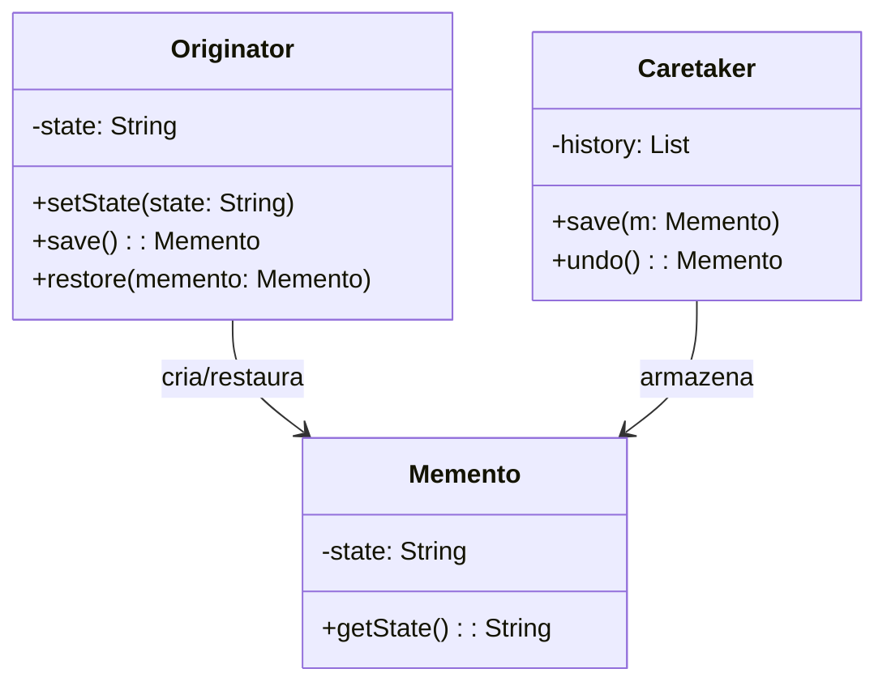
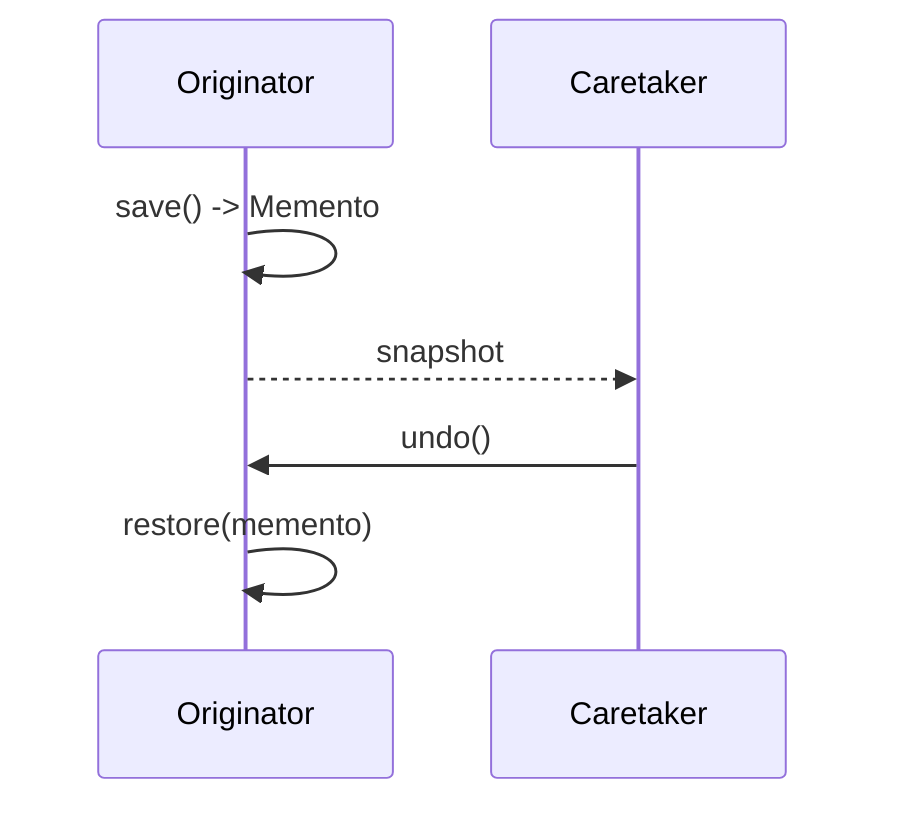

## 1) Nome & objetivo (1 frase)

**Memento**: capturar e restaurar o **estado interno** de um objeto sem violar o encapsulamento — útil para **undo/redo**, **rollback** e **histórico de alterações**.

---

## 2) Quando aplicar (checklist)

- Precisa de **undo/redo** em operações (edição, desenho, formulário, carrinho, etc.).
- Deseja **snapshot** de estado antes de operações arriscadas (rollback).
- Precisa manter **histórico navegável** (anterior/próximo estado).
- Em Android: **edição de texto**, **formulários com passos**, **configurações com preview**, **desenho**, **Command + undo**.

---

## 3) Quando NÃO aplicar & riscos

- Estado é **barato de recomputar** ou já armazenado no banco → snapshot é desnecessário.
- Objetos têm **estado muito grande** (RAM alto → serialize parcial).
- Controle de estado poderia ser feito por **ViewModel + SavedStateHandle/Flow** sem snapshots explícitos.

---

## 4) Anti-patterns & como evitar

- **Memento gigante**: salve apenas o **estado relevante**.
- **Fuga de encapsulamento**: o originador nunca expõe internamente; use métodos save() e restore().
- **Falta de controle de histórico**: use Caretaker (controlador) para limitar quantos estados guardar.

---

## 5) Cuidados SOLID

- **SRP**: cada classe tem papel claro: Originator (estado), Memento (snapshot), Caretaker (histórico).
- **OCP**: novos tipos de snapshots sem alterar o Caretaker.
- **DIP**: Caretaker depende da abstração de Memento.

---

## 6) Estrutura (UML)





---

## 7) Antes (code smell real)

_Problema_: sem histórico; apenas sobrescreve o estado atual.

```kotlin
class TextEditor {
    var content: String = ""
    fun write(text: String) { content += text }
    fun undo() { /* impossível sem histórico */ }
}
```

**Cheiros**: não há histórico; undo impossível; violação do OCP se precisar logar cada mudança.

---

## 8) Depois (Memento aplicado)

### 8.1 Originator

```kotlin
class TextEditor {
    private var content = StringBuilder()

    fun write(text: String) { content.append(text) }

    fun getText() = content.toString()

    fun save(): EditorMemento = EditorMemento(content.toString())

    fun restore(m: EditorMemento) {
        content = StringBuilder(m.getState())
    }
}
```

### 8.2 Memento (imutável)

```kotlin
data class EditorMemento(private val state: String) {
    fun getState(): String = state
}
```

### 8.3 Caretaker (controla histórico)

```kotlin
class History {
    private val stack = ArrayDeque<EditorMemento>()

    fun backup(m: EditorMemento) { stack.addLast(m) }

    fun undo(): EditorMemento? =
        if (stack.isNotEmpty()) stack.removeLast() else null
}
```

### 8.4 ViewModel aplicando o padrão

```kotlin
class EditorViewModel : ViewModel() {
    private val editor = TextEditor()
    private val history = History()

    private val _ui = MutableStateFlow(editor.getText())
    val ui: StateFlow<String> = _ui

    fun write(text: String) {
        history.backup(editor.save())
        editor.write(text)
        _ui.value = editor.getText()
    }

    fun undo() {
        val m = history.undo() ?: return
        editor.restore(m)
        _ui.value = editor.getText()
    }
}
```

### 8.5 Compose

```kotlin
@Composable
fun EditorScreen(vm: EditorViewModel) {
    val text by vm.ui.collectAsState()

    Column {
        TextField(value = text, onValueChange = { vm.write(it) })
        Button(onClick = vm::undo) { Text("Desfazer") }
    }
}
```

---

## 9) Testes essenciais

```kotlin
class MementoTests {

    @Test
    fun `undo restores previous state`() {
        val editor = TextEditor()
        val history = History()

        editor.write("Hello")
        history.backup(editor.save())

        editor.write(" World")
        assertEquals("Hello World", editor.getText())

        val last = history.undo()
        if (last != null) editor.restore(last)

        assertEquals("Hello", editor.getText())
    }
}
```

---

## 10) Trade-offs

- **Pró**: fácil undo/redo, rollback, histórico.
- **Contra**: mais memória (snapshots), cuidado com estados grandes, sincronização em apps multiusuário.

---

## 11) Relações com outros padrões

- **Memento + Command**: cada comando guarda seu memento → undo granular.
- **Memento + Prototype**: memento pode usar clone profundo do estado.
- **Memento + Caretaker + Mediator**: útil para workflows complexos (edição colaborativa).
- **Memento vs State**: State muda comportamento; Memento apenas restaura **dados**.

---

## 12) Checklist Anti Over-Engineering

- Há necessidade real de **undo/rollback**?
- Snapshots são **baratos** de armazenar?
- Estado sensível/confidencial protegido (criptografar se preciso)?
- Histórico limitado (evitar leaks)?

---

## 13) Resumo em 5 linhas

- **Memento** salva/restaura estado sem quebrar encapsulamento.
- Excelente para **undo/redo**, **rollback**, **preview**.
- Fácil integrar com **Command** ou **History**.
- Use snapshots pequenos e controlados.
- Evite reter estados pesados em memória.
