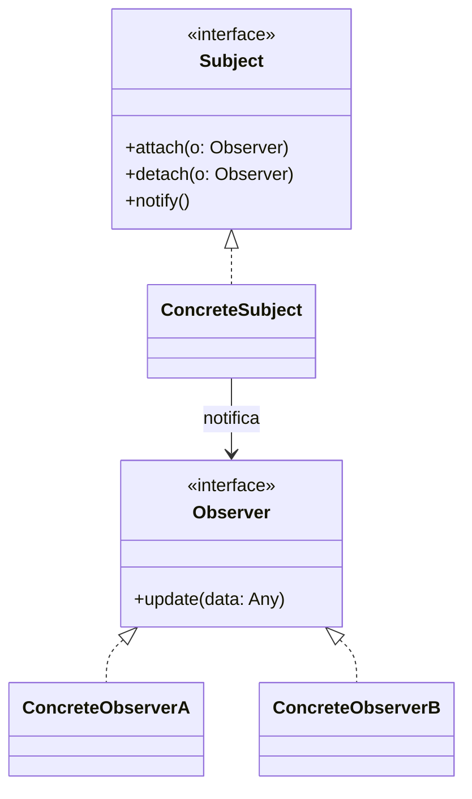
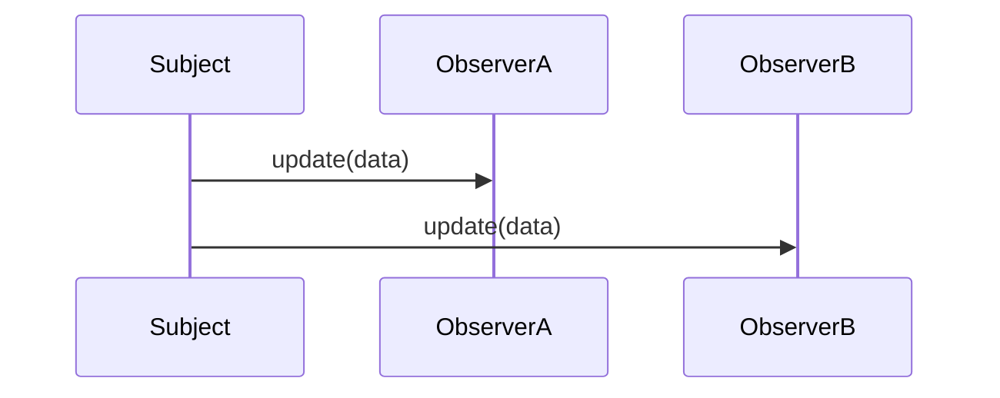

## 1) Nome & objetivo (1 frase)

**Observer**: um **sujeito** (Subject) notifica **observadores** sobre mudanças, desacoplando **quem emite** de **quem reage**.

## 2) Quando aplicar (checklist)

- Um produtor de eventos/estado precisa **notificar vários interessados**.
- Você quer **baixo acoplamento** entre origem (domínio/infra) e destino (UI).
- Precisa de **reatividade** (streams, push) em vez de _polling_.
- Em Android: **UI reagir a estado** (StateFlow), **eventos únicos** (SharedFlow), **stream de dados** (Room/Flow, Retrofit + cache), **conectividade**, **sensor/locação**, **player**.

# 3) Quando NÃO aplicar & riscos

- O dado é **estático** ou consultado raramente (um `suspend/fun` simples resolve).
- Há **um único consumidor** e a entrega não precisa ser assíncrona.
- Riscos: **fan-out** sem controle, **vazamento de assinaturas**, **backpressure** ignorada.

## 4) Anti-patterns & como evitar

- **Callback hell**: padronize em **Flow/Channel**; evite cascatas de listeners.
- **Subject global** (God Observable): limite escopo por feature/camada.
- **LiveData em domínio**: mantenha o **domínio sem Android** (use Flow). Adapte só na UI se necessário.
- **Eventos “consumíveis” via StateFlow**: use **SharedFlow** ou **Channel** para _one-shot events_.

## 5) Cuidados SOLID

- **SRP**: ViewModel orquestra, **não** produz tudo; cada produtor em seu módulo.
- **OCP**: novos observadores **sem** mudar o produtor (dep. de abstração).
- **DIP**: UI depende de **Fluxos (interfaces)**, não de concretos.

## 6) Estrutura (UML)





> Em Kotlin/Android, o **Subject** costuma ser um Flow (ou StateFlow/SharedFlow) e os **Observers** são os consumidores (collect{}) — UI, use cases, workers.

## 7) Antes (code smell real no Android)

_Problema_: múltiplos `Listeners` manuais, difícil gerenciar ciclo de vida e concorrência.

```kotlin
interface ConnectivityListener {
    fun onConnected()
    fun onDisconnected()
}

class ConnectivityMonitor {
    private val listeners = mutableSetOf<ConnectivityListener>()

    fun addListener(l: ConnectivityListener) { listeners += l }
    fun removeListener(l: ConnectivityListener) { listeners -= l }

    // chamado por um callback do sistema
    fun onSystemCallback(connected: Boolean) {
        listeners.forEach {
            if (connected) it.onConnected() else it.onDisconnected()
        }
    }
}

// ViewModel (acoplada a callbacks, risco de leak se esquecer remove)
class MainViewModel(
    private val monitor: ConnectivityMonitor
) : ViewModel(), ConnectivityListener {

    private val _online = MutableStateFlow(false)
    val online: StateFlow<Boolean> = _online

    init { monitor.addListener(this) }
    override fun onCleared() { monitor.removeListener(this) }

    override fun onConnected() { _online.value = true }
    override fun onDisconnected() { _online.value = false }
}
```

**Cheiros**: gerenciamento manual de inscrições, difícil compor com outros fluxos, risco de concorrência/leaks.

---

## 8) Depois (Observer via Flow/StateFlow/SharedFlow)

### 8.1 Produtor (Subject) expõe Flow

```kotlin
interface ConnectivityObserver {
    val isOnline: Flow<Boolean>
}

class ConnectivityObserverImpl(
    private val app: Application
) : ConnectivityObserver {

    // Simplificação: em produção use callbackFlow/monitor do sistema
    override val isOnline: Flow<Boolean> = callbackFlow {
        val callback = object : SomeSystemNetworkCallback {
            override fun onAvailable() { trySend(true) }
            override fun onLost() { trySend(false) }
        }
        registerSystemCallback(app, callback)
        awaitClose { unregisterSystemCallback(app, callback) }
    }
    .distinctUntilChanged()
    .conflate()
}
```

### 8.2 ViewModel observa e expõe StateFlow

```kotlin
class MainViewModel(
    observer: ConnectivityObserver
) : ViewModel() {

    // Hot state para Compose
    val online: StateFlow<Boolean> =
        observer.isOnline
            .stateIn(
                scope = viewModelScope,
                started = SharingStarted.WhileSubscribed(5000),
                initialValue = false
            )

    // Exemplo de eventos one-shot
    private val _events = MutableSharedFlow<UiEvent>()
    val events: SharedFlow<UiEvent> = _events

    sealed interface UiEvent { data object ShowOfflineSnack : UiEvent }

    init {
        viewModelScope.launch {
            online
                .filter { !it }
                .collect { _events.emit(UiEvent.ShowOfflineSnack) }
        }
    }
}
```

### 8.3 UI (Compose) coleta com segurança de ciclo de vida

```kotlin
@Composable
fun MainScreen(vm: MainViewModel) {
    val online by vm.online.collectAsStateWithLifecycle() // lifecycle-runtime-compose

    // Estado reativo
    if (!online) {
        Text("Você está offline")
    }

    // Eventos one-shot
    val ctx = LocalContext.current
    LaunchedEffect(Unit) {
        vm.events.collect { event ->
            if (event is MainViewModel.UiEvent.ShowOfflineSnack) {
                Toast.makeText(ctx, "Sem conexão", Toast.LENGTH_SHORT).show()
            }
        }
    }
}
```

> Padrão **Observer**: o produtor **não conhece** seus observadores; qualquer parte pode **coletar** o Flow. Compose re-renderiza automaticamente ao novo valor.

## 9) Testes essenciais (com kotlinx-coroutines-test e Turbine)

```kotlin
// build.gradle: testImplementation("app.cash.turbine:turbine:1.1.0")

class MainViewModelTest {

    @Test
    fun `emite evento quando ficar offline`() = runTest {
        // Fake subject
        val subject = MutableSharedFlow<Boolean>(replay = 0)
        val observer = object : ConnectivityObserver {
            override val isOnline: Flow<Boolean> = subject
        }

        val vm = MainViewModel(observer)

        // Observa eventos one-shot
        val job = launch { vm.events.test {
            subject.emit(true)  // online
            subject.emit(false) // offline -> evento esperado
            assertTrue(awaitItem() is MainViewModel.UiEvent.ShowOfflineSnack)
            cancelAndConsumeRemainingEvents()
        } }

        job.join()
    }

    @Test
    fun `online StateFlow reflete produtor`() = runTest {
        val subject = MutableSharedFlow<Boolean>()
        val observer = object : ConnectivityObserver {
            override val isOnline: Flow<Boolean> = subject
        }
        val vm = MainViewModel(observer)

        val collected = mutableListOf<Boolean>()
        val job = launch { vm.online.take(2).toList(collected) }

        subject.emit(true)
        subject.emit(false)

        job.join()
        assertEquals(listOf(false, true), collected.take(2)) // initial=false, depois true
    }
}
```

---

## 10) Trade-offs

- **Pró**: baixo acoplamento, composição de streams, integração perfeita com **Compose/Room/WorkManager**.
- **Contra**: precisa atenção a **escopo/ciclo de vida**, **backpressure** e **cold** vs **hot**; debug de concorrência pode ser mais complexo.

## 11) Relações com outros padrões

- **Observer + State**: UI observa UiState (StateFlow) que muda conforme o **State** interno.
- **Observer vs Mediator**: Mediator coordena múltiplos _subjects_; Observer apenas notifica.
- **Observer em Android**: `Flow/LiveData/Rx` são implementações práticas do padrão.

## 12) Checklist Anti Over-Engineering

- Precisa realmente de **stream contínuo**? Se não, prefira suspend fun.
- **Escolha correta**: `StateFlow` para **estado atual**, `SharedFlow`/**Channel** para **eventos**.
- Garanta **cancelamento** (escopos corretos: viewModelScope/lifecycle).
- Evite **Subjects globais**; exponha por **interface** da feature/módulo.

## 13) Resumo em 5 linhas

- **Observer** desacopla produtor/consumidor e viabiliza reatividade.
- Em Android, use **Flow/StateFlow/SharedFlow**; Compose observa com lifecycle.
- Escolha `StateFlow` para estado e `SharedFlow` para eventos únicos.
- Cuidado com ciclo de vida, backpressure e sobreuso.
- Combina naturalmente com **MVVM** e **Clean Architecture**.
