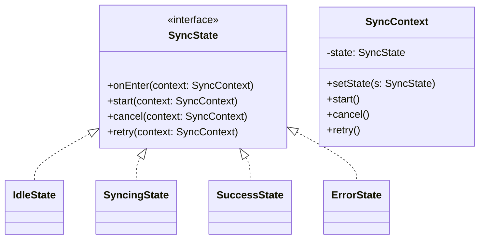
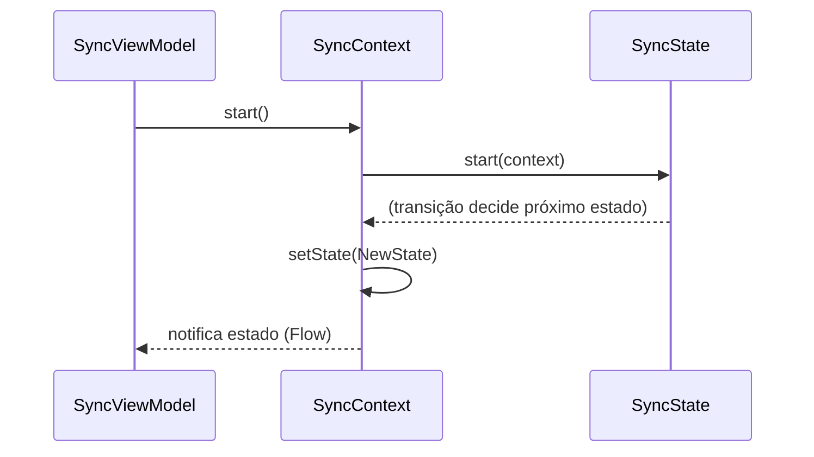

## 1) Nome & objetivo (1 frase)

**State**: modelar **mudanças de comportamento** de um objeto conforme seu **estado interno**, trocando o objeto-estado em vez de if/when espalhados.

## 2) Quando aplicar (checklist)

- A lógica varia conforme **estados bem definidos** (Ex.: _Idle_ → _Syncing_ → _Success_ → _Error_ → _Retrying_).
- Você vê **switch/when** repetidos nos mesmos estados em vários pontos.
- Precisa **evoluir regras** por estado (timeouts, transições condicionais).
- Em Android: **workflow de sincronização**, **player de mídia**, **checkout**, **login com 2FA**, **wizard/onboarding**.

## 3) Quando NÃO aplicar & riscos

- Estados são **poucos e estáticos**, com regras triviais (um when local basta).
- Não há **transições ricas** (eventos/ações quase não mudam).
- Risco: classes demais para um fluxo simples → **over-engineering**.

## 4) Anti-patterns & prevenção

- **Enum + when gigante** replicado em toda parte → centralize no **Context** e em **State objects**.
- **Transições implícitas** (lógicas “escondidas” na UI) → formalize eventos/ações.
- **God State** (um estado fazendo tudo) → responsabilidades pequenas por estado.

## 5) Cuidados SOLID

- **SRP**: cada State cuida do **comportamento daquele estado**.
- **OCP**: adicione novo estado sem editar todos os when do app.
- **LSP/ISP/DIP**: defina **interface mínima** de eventos (ex.: onStartSync, onCancel, onRetry); dependência do **abstrato** SyncState.

## 6) Estrutura (UML)





## 7) Antes (code smell real no Android)

_Problema_: ViewModel cheia de when(state) para cada ação.

```kotlin
enum class SyncUiState { IDLE, SYNCING, SUCCESS, ERROR }

class SyncViewModel(
    private val repo: SyncRepository
) : ViewModel() {

    private val _ui = MutableStateFlow(SyncUiState.IDLE)
    val ui: StateFlow<SyncUiState> = _ui

    fun start() = viewModelScope.launch {
        when (_ui.value) {
            SyncUiState.IDLE, SyncUiState.ERROR -> {
                _ui.value = SyncUiState.SYNCING
                val ok = repo.sync()
                _ui.value = if (ok) SyncUiState.SUCCESS else SyncUiState.ERROR
            }
            SyncUiState.SYNCING -> Unit // ignore
            SyncUiState.SUCCESS -> Unit
        }
    }

    fun retry() = viewModelScope.launch {
        if (_ui.value == SyncUiState.ERROR) start() else Unit
    }

    fun cancel() { /* if SYNCING then cancel job... vários whens… */ }
}
```

**Cheiros**: transições espalhadas, difícil de evoluir (ex.: retry com backoff, cancel cooperativo, parcial).

## 8) Depois (State aplicado, Kotlin/Android)

```kotlin
// 1) Contratos
interface SyncState {
    fun onEnter(context: SyncContext) {}
    fun start(context: SyncContext) {}
    fun cancel(context: SyncContext) {}
    fun retry(context: SyncContext) {}
}

// 2) Contexto: único ponto que guarda o estado atual
class SyncContext(
    private val scope: CoroutineScope,
    private val repo: SyncRepository,
    private val _ui: MutableStateFlow<UiState>
) {
    private var state: SyncState = IdleState

    fun setState(s: SyncState) {
        state = s
        state.onEnter(this)
        _ui.value = s.toUiState()
    }

    // eventos expostos
    fun start() = state.start(this)
    fun cancel() = state.cancel(this)
    fun retry() = state.retry(this)

    // helpers usados pelos estados
    fun doSync() {
        setState(SyncingState)
        scope.launch {
            val ok = repo.sync() // suspending, pode lançar
            setState(if (ok) SuccessState else ErrorState())
        }
    }

    fun cancelSync() {
        // exemplo: cancelar trabalho cooperativo
        // poderíamos manter um Job interno, etc.
        setState(IdleState)
    }
}

// 3) Estados concretos
object IdleState : SyncState {
    override fun start(context: SyncContext) = context.doSync()
}
object SyncingState : SyncState {
    override fun cancel(context: SyncContext) = context.cancelSync()
}
object SuccessState : SyncState {
    override fun start(context: SyncContext) = context.doSync() // permitir novo sync
}
data class ErrorState(val attempts: Int = 0) : SyncState {
    override fun retry(context: SyncContext) {
        // exemplo simples de backoff incremental
        val next = copy(attempts = attempts + 1)
        context.setState(next)
        context.doSync()
    }
}

// 4) Mapeamento p/ UI
sealed interface UiState {
    data object Idle : UiState
    data object Syncing : UiState
    data object Success : UiState
    data class Error(val attempts: Int) : UiState
}

private fun SyncState.toUiState(): UiState = when (this) {
    IdleState -> UiState.Idle
    SyncingState -> UiState.Syncing
    SuccessState -> UiState.Success
    is ErrorState -> UiState.Error(this.attempts)
    else -> UiState.Idle
}

// 5) ViewModel fina e testável
class SyncViewModel(
    repo: SyncRepository
) : ViewModel() {

    private val _ui = MutableStateFlow<UiState>(UiState.Idle)
    val ui: StateFlow<UiState> = _ui

    private val ctx = SyncContext(viewModelScope, repo, _ui)

    fun start() = ctx.start()
    fun cancel() = ctx.cancel()
    fun retry() = ctx.retry()
}

// 6) Compose (exemplo)
@Composable
fun SyncScreen(vm: SyncViewModel) {
    val state by vm.ui.collectAsState()

    when (state) {
        UiState.Idle -> IdleContent(onStart = vm::start)
        UiState.Syncing -> SyncingContent(onCancel = vm::cancel)
        UiState.Success -> SuccessContent(onSyncAgain = vm::start)
        is UiState.Error -> ErrorContent(
            attempts = (state as UiState.Error).attempts,
            onRetry = vm::retry
        )
    }
}
```

> Nota: Você pode enriquecer `SyncContext` com **Job supervision**, **WorkManager** para _long-running sync_, e telemetria.

## 9) Testes essenciais

```kotlin
class StateTransitionsTest {

    @Test
    fun `idle start -> syncing -> success`() = runTest {
        val repo = object : SyncRepository {
            override suspend fun sync() = true
        }
        val ui = MutableStateFlow<UiState>(UiState.Idle)
        val ctx = SyncContext(this, repo, ui)

        ctx.start()
        assertTrue(ui.value is UiState.Syncing)

        advanceUntilIdle()
        assertTrue(ui.value is UiState.Success)
    }

    @Test
    fun `error retry increments attempts`() = runTest {
        var calls = 0
        val repo = object : SyncRepository {
            override suspend fun sync(): Boolean {
                calls++
                return calls >= 2 // falha 1x, sucesso na 2ª
            }
        }
        val ui = MutableStateFlow<UiState>(UiState.Idle)
        val ctx = SyncContext(this, repo, ui)

        ctx.setState(ErrorState(attempts = 0))
        ctx.retry() // attempts -> 1 e chama doSync

        // primeiro ciclo: vai a Syncing
        assertTrue(ui.value is UiState.Syncing)
        advanceUntilIdle()
        // depois do segundo sync: sucesso
        assertTrue(ui.value is UiState.Success)
    }
}
```

## 10) Trade-offs

- **Pró**: transições explícitas, regras por estado coesas, fácil estender/experimentar.
- **Contra**: mais classes/arquivos; boilerplate para fluxos simples.

## 11) Relações com outros padrões

- **State vs Strategy**: State foca evolução de estados; Strategy foca variações estáticas de algoritmo.
- **State + Observer (Flow)**: UI reage às mudanças de estado naturalmente.
- **State + Factory**: criação controlada de estados (com parâmetros).

## 12) Checklist Anti Over-Engineering

- Estados **mudam comportamento** de forma relevante?
- Há **transições** não triviais (cancel, retry, timeouts)?
- Removemos when duplicados na VM/UI?
- Estados são **pequenos** e focados?
- Testes cobrem **transições** e **efeitos** por estado?

## 13) Resumo em 5 linhas

- **State** encapsula comportamento **por estado** e formaliza transições.
- Tira when duplicado da VM/UI e melhora manutenção.
- Excelente para **sync**, **player**, **checkout**, **login 2FA**.
- Custo: mais classes; use quando o fluxo justificar.
- Combina bem com **Flow/Compose** para reatividade limpa.
