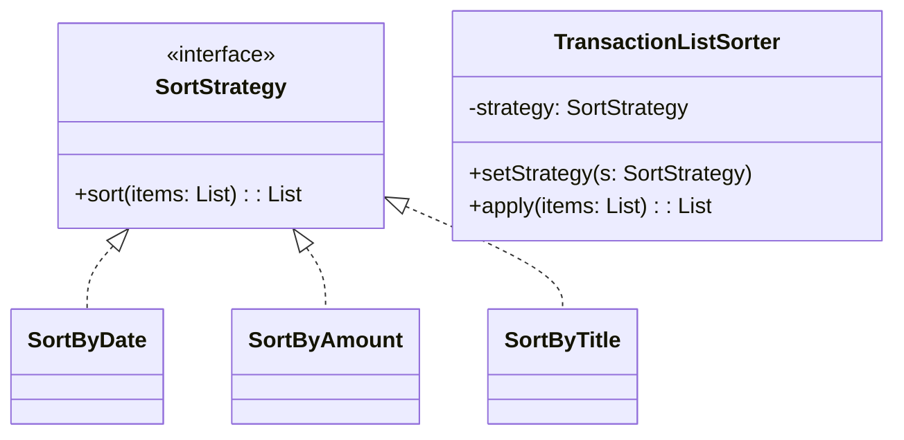
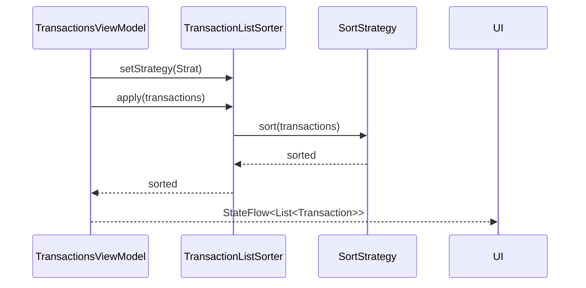

## 1) Nome & objetivo (1 frase)

**Strategy**: encapsular **variações de um algoritmo** atrás de uma **mesma interface**, permitindo trocar o comportamento em tempo de execução sem if/when espalhados.

## 2) Quando aplicar (checklist)

- Você tem **múltiplas formas** de executar uma lógica (ex.: ordenação, filtro, precificação, retry/backoff).
- Os `if/when` para escolher o comportamento **espalharam** pela codebase.
- Precisa **trocar o comportamento** em runtime (ex.: usuário escolhe “ordenar por data/valor/nome”).
- Deseja **testar cada variação** isoladamente.
- Em Android: mudança de ordenação/filtro em **listas exibidas com Compose**, troca de **estratégia de cache** (memória/disk/network), **política de retry** em repositório.

## 3) Quando NÃO aplicar & riscos

- Só existe **1 forma** estável do algoritmo (sem roadmap de variações).
- A variação é **trivial** e local (um if simples já resolve).
- Você não precisa **trocar em runtime** nem ganhar testabilidade adicional.
- Risco: **classe/arquivo a mais sem ganho real** → _over-engineering_.

## 4) Anti-patterns relacionados & como evitar

- **God Object**: não concentre todas estratégias dentro de uma classe gigante. Separe por arquivo/feature.
- **Service Locator**: prefira DI explícita (Hilt/Koin) para fornecer a Strategy.
- **Duplicação de lógica**: fator comum no **Contexto** (quem usa a strategy), não dentro das estratégias.

## 5) Cuidados SOLID

- **SRP**: cada Strategy resolve uma variação clara.
- **OCP**: adicione novas estratégias **sem** editar o cliente (registre no DI/menu).
- **LSP/ISP**: interface **mínima** e contratos compatíveis.
- **DIP**: dependa da **abstração** `SortStrategy`, injete a concreta via DI ou parâmetro.

## 6) Estrutura (UML)





## 7) Antes (code smell real no Android)

_Problema_: ViewModel com when espalhado para cada ordenação.

```kotlin
// BEFORE: ViewModel cheia de when/ifs para cada ordenação
enum class SortType { DATE_DESC, AMOUNT_DESC, TITLE_ASC }

class TransactionsViewModel(
    private val repo: TransactionsRepository
) : ViewModel() {

    private val _uiState = MutableStateFlow(emptyList<Transaction>())
    val uiState: StateFlow<List<Transaction>> = _uiState

    var currentSort: SortType = SortType.DATE_DESC
        private set

    fun load() = viewModelScope.launch {
        val data = repo.fetch()
        _uiState.value = when (currentSort) {
            SortType.DATE_DESC -> data.sortedByDescending { it.date }
            SortType.AMOUNT_DESC -> data.sortedByDescending { it.amount }
            SortType.TITLE_ASC -> data.sortedBy { it.title.lowercase() }
        }
    }

    fun changeSort(to: SortType) {
        currentSort = to
        load()
    }
}
```

**Cheiros**: lógica de ordenação se repete; cada nova variação mexe na VM; difícil testar cada ordenação em isolamento.

## 8) Depois (Strategy aplicado, Kotlin/Android)

```kotlin
// Domain models (pode ficar em :core)
data class Transaction(
    val id: String,
    val title: String,
    val amount: Double,
    val date: Long // epoch millis
)

// Strategy
interface SortStrategy {
    fun sort(items: List<Transaction>): List<Transaction>
}

class SortByDateDesc : SortStrategy {
    override fun sort(items: List<Transaction>) = items.sortedByDescending { it.date }
}
class SortByAmountDesc : SortStrategy {
    override fun sort(items: List<Transaction>) = items.sortedByDescending { it.amount }
}
class SortByTitleAsc : SortStrategy {
    override fun sort(items: List<Transaction>) = items.sortedBy { it.title.lowercase() }
}

// Contexto: isolado e testável
class TransactionListSorter(
    private var strategy: SortStrategy
) {
    fun setStrategy(new: SortStrategy) { strategy = new }
    fun apply(items: List<Transaction>) = strategy.sort(items)
}

// Repository (exemplo)
interface TransactionsRepository {
    suspend fun fetch(): List<Transaction>
}

// ViewModel (limpa, sem when/ifs de regra)
enum class SortType { DATE_DESC, AMOUNT_DESC, TITLE_ASC }

class TransactionsViewModel(
    private val repo: TransactionsRepository,
    private val sorter: TransactionListSorter
) : ViewModel() {

    private val _uiState = MutableStateFlow<List<Transaction>>(emptyList())
    val uiState: StateFlow<List<Transaction>> = _uiState

    private var currentSort: SortType = SortType.DATE_DESC

    fun load() = viewModelScope.launch {
        val data = repo.fetch()
        _uiState.value = sorter.apply(data)
    }

    fun changeSort(to: SortType) {
        currentSort = to
        sorter.setStrategy(
            when (to) {
                SortType.DATE_DESC -> SortByDateDesc()
                SortType.AOUNT_DESC -> SortByAmountDesc() // <- cuidado: AMOUNT_DESC correto
                SortType.TITLE_ASC -> SortByTitleAsc()
            }
        )
        load()
    }
}

// Compose (exemplo simples)
@Composable
fun TransactionsScreen(
    viewModel: TransactionsViewModel,
    onSelectSort: (SortType) -> Unit
) {
    val items by viewModel.uiState.collectAsState()
    // ... TopAppBar com menu de ordenação chamando onSelectSort
    // LazyColumn(items) { /* render */ }
}
```

> Obs.: Em produção, registre as estratégias via **DI** (Hilt/Koin) ou **factory** simples para não instanciar direto na VM.

## 9) Testes essenciais

```kotlin
class SortStrategiesTest {

    private val sample = listOf(
        Transaction("1", "Zeta", 10.0, 1000L),
        Transaction("2", "alpha", 30.0, 3000L),
        Transaction("3", "Beta", 20.0, 2000L)
    )

    @Test
    fun `SortByDateDesc orders by date desc`() {
        val sorted = SortByDateDesc().sort(sample)
        assertEquals(listOf("2","3","1"), sorted.map { it.id })
    }

    @Test
    fun `SortByAmountDesc orders by amount desc`() {
        val sorted = SortByAmountDesc().sort(sample)
        assertEquals(listOf("2","3","1"), sorted.map { it.id })
    }

    @Test
    fun `SortByTitleAsc orders by title asc (case-insensitive)`() {
        val sorted = SortByTitleAsc().sort(sample)
        assertEquals(listOf("2","3","1"), sorted.map { it.id }) // alpha, Beta, Zeta
    }
}

class TransactionListSorterTest {
    @Test
    fun `applies injected strategy`() {
        val sorter = TransactionListSorter(SortByAmountDesc())
        val items = listOf(
            Transaction("A", "x", 1.0, 1L),
            Transaction("B", "y", 3.0, 1L)
        )
        val result = sorter.apply(items)
        assertEquals(listOf("B","A"), result.map { it.id })
    }
}
```

## 10) Trade-offs

- **Pró**: coesão, testabilidade, extensão limpa (OCP), troca em runtime.
- **Contra**: novos arquivos/classes; overhead conceitual se houver só 1 variação.

## 11) Relações com outros padrões

- **Strategy vs State**: Strategy muda **como fazer**; State modela **estados evolutivos**.
- **Strategy vs Template Method**: Template fixa etapas e delega _hooks_; Strategy troca o algoritmo inteiro.
- **Strategy + Factory/DI**: escolha/fornecimento de estratégias sem new no cliente.

## 12) Checklist Anti Over-Engineering

- Já existem **≥ 2 variações** (ou no roadmap curto)?
- O cliente hoje tem **ifs repetidos**?
- Ganho de **testabilidade** é relevante?
- Estratégias são **pequenas e focadas**?
- Registro de estratégias via **DI/factory**, não Service Locator.

## 13) Resumo em 5 linhas

- Strategy encapsula variações de algoritmo em uma interface única.
- Remove `if/when` do cliente, melhora OCP e testes.
- Útil em listas (ordenação/filtro), cache, retry/backoff etc.
- Custo: mais classes/arquivos; evite se não há variações reais.
- Combine com DI/factory para seleção limpa em Android.

