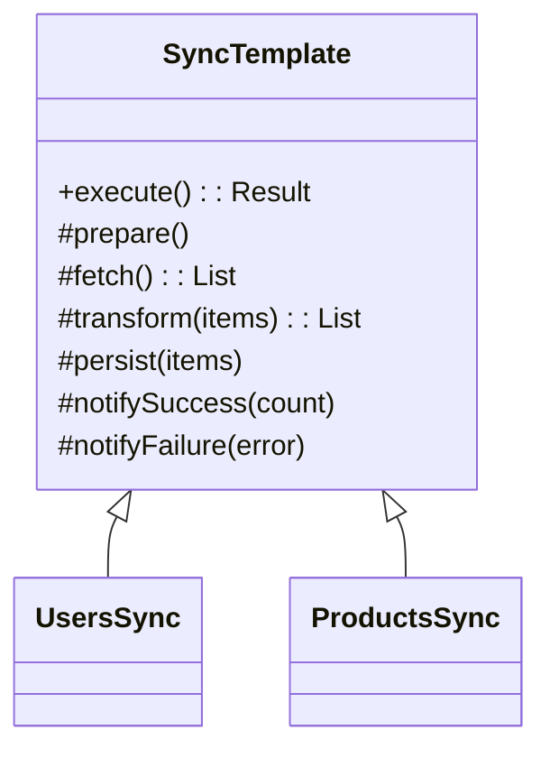
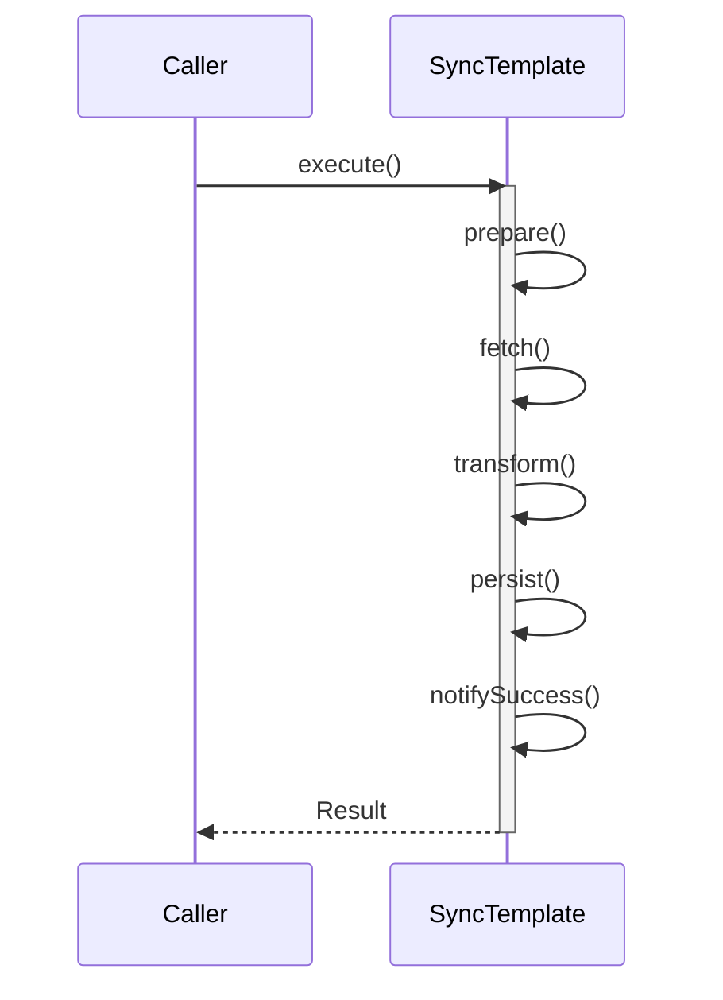

## 1) Nome & objetivo (1 frase)

**Template Method**: definir o **esqueleto** de um algoritmo em uma operação **final**, delegando **etapas variáveis** para métodos “ganchos” (overrides) nas subclasses.

## 2) Quando aplicar (checklist)

- Há um **fluxo fixo** (mesmas etapas, ordem estável), mas certas **etapas variam** por caso/feature.
- Quer **padronizar** logging/telemetria/erros/pareamento de transações, com variação só no “miolo”.
- Em Android: **pipelines de sync, fetch → map → persist → notify, validações padronizadas** com regras específicas por módulo, **workflows de upload** (pré-condições, compressão, envio, confirmação).

## 3) Quando NÃO aplicar & riscos

- A ordem das etapas **muda com frequência** (então Strategy/Policy/Compose functions tendem a ser melhores).
- Variação é **maior que o fluxo comum** (a classe base fica inchada).
- Risco: **herança frágil**; subclasses “forçam” comportamentos não previstos.

## 4) Anti-patterns & como evitar

- **Base Class God**: base gigantesca. → Mantenha **pequena**, só o que é comum.
- **Overridable Trap**: permitir override demais. → Marque o **template final** e abra **hooks mínimos**.
- **Herança para tudo**: se precisar combinar passos livremente, prefira **Strategy/Compose**.

## 5) Cuidados SOLID

- **SRP**: a base define **orquestração**, subclasses definem **pontos variáveis**.
- **OCP**: novas variações sem mexer na base (só criar nova subclasse).
- **LSP/ISP**: contratos claros dos ganchos; não obrigue métodos que não fazem sentido.
- **DIP**: injete dependências (repo, logger, clock) na base; subclasses só usam.

## 6) Estrutura (UML)





---

## 7) Antes (code smell real no Android)

_Problema_: cada ViewModel/UseCase repete **o mesmo fluxo** de sync com pequenas variações (copiar/colar; logs divergentes).

```kotlin
class UsersSyncUseCase(
    private val api: Api,
    private val dao: UserDao,
    private val logger: Logger
) {
    suspend fun run(): Result<Unit> = runCatching {
        logger.i("start users sync")
        val remote = api.fetchUsers()
        val locals = remote.map { it.toLocal() }
        dao.upsertAll(locals)
        logger.i("done users sync: ${locals.size}")
    }.onFailure { logger.e("users sync failed", it) }
}
```

Outro lugar faz o MESMO, só muda endpoints/mapeamento…

---

## 8) Depois (Template Method aplicado, Kotlin/Android)

```kotlin
// 8.1 Base Template (final: orquestração padronizada)
abstract class SyncTemplate<Remote, Local>(
    private val logger: Logger,
    private val clock: Clock
) {

    suspend fun execute(): Result<Unit> = runCatching {
        logger.i("[${now()}] start ${name()}")
        prepare()
        val remote = fetch()
        val locals = transform(remote)
        persist(locals)
        notifySuccess(locals.size)
        logger.i("[${now()}] done ${name()}: ${locals.size}")
    }.onFailure { e ->
        logger.e("[${now()}] fail ${name()}", e)
        notifyFailure(e)
    }

    // hooks (mínimos e coesos)
    protected open suspend fun prepare() {}
    protected abstract suspend fun fetch(): List<Remote>
    protected abstract fun transform(items: List<Remote>): List<Local>
    protected abstract suspend fun persist(items: List<Local>)
    protected open fun notifySuccess(count: Int) {}
    protected open fun notifyFailure(error: Throwable) {}

    protected open fun name(): String = this::class.simpleName ?: "SyncTemplate"
    private fun now() = clock.now().toString()
}

// 8.2 Concretas (somente o que difere)
class UsersSync(
    logger: Logger,
    clock: Clock,
    private val api: Api,
    private val dao: UserDao
) : SyncTemplate<UserDto, UserEntity>(logger, clock) {

    override suspend fun fetch(): List<UserDto> = api.fetchUsers()

    override fun transform(items: List<UserDto>): List<UserEntity> =
        items.map { it.toEntity() }

    override suspend fun persist(items: List<UserEntity>) {
        dao.upsertAll(items)
    }

    override fun notifySuccess(count: Int) {
        // telemetry/event bus…
    }
}

class ProductsSync(
    logger: Logger,
    clock: Clock,
    private val api: Api,
    private val dao: ProductDao
) : SyncTemplate<ProductDto, ProductEntity>(logger, clock) {

    override suspend fun fetch(): List<ProductDto> = api.fetchProducts()

    override fun transform(items: List<ProductDto>): List<ProductEntity> =
        items.map { it.toEntity() }

    override suspend fun persist(items: List<ProductEntity>) {
        dao.upsertAll(items)
    }
}

// 8.3 ViewModel usando o template
class SyncViewModel(
    private val users: UsersSync,
    private val products: ProductsSync
) : ViewModel() {

    private val _status = MutableStateFlow<String>("Idle")
    val status: StateFlow<String> = _status

    fun syncAll() = viewModelScope.launch {
        _status.value = "Syncing users"
        users.execute().onFailure { _status.value = "Users failed" }.getOrNull()

        _status.value = "Syncing products"
        products.execute().onFailure { _status.value = "Products failed" }.getOrNull()

        _status.value = "Done"
    }
}
```

> Observação: a **orquestração** (telemetria, try/catch, logs, clock) está **centralizada**; cada subclasse só implementa o que muda.

---

## 9) Testes essenciais

```kotlin
class UsersSyncTest {

    @Test
    fun `executa pipeline completo e persiste`() = runTest {
        val logger = FakeLogger()
        val clock = FixedClock(Instant.parse("2025-10-04T12:00:00Z"))
        val api = object : Api { override suspend fun fetchUsers() = listOf(UserDto("1","A")) }
        val dao = FakeUserDao()

        val useCase = UsersSync(logger, clock, api, dao)

        val result = useCase.execute()
        assertTrue(result.isSuccess)
        assertEquals(1, dao.saved.size)
        assertTrue(logger.logs.any { it.contains("start UsersSync") })
        assertTrue(logger.logs.any { it.contains("done UsersSync: 1") })
    }
}
```

---

## 10) Trade-offs

- **Pró**: padroniza fluxo, reduz duplicação, centraliza logs/erros; fácil criar novas variações.
- **Contra**: **acoplamento por herança**; se a ordem das etapas mudar muito, o template pode engessar.

## 11) Relações com outros padrões

- **Template Method vs Strategy**: Template fixa **ordem**; Strategy troca **algoritmo** inteiro. (Muitos times usam _ambos_: Template orquestra; Strategy implementa etapas.)
- **Template + Hook Objects**: se precisar várias combinações, mova etapas para **Strategies** injetáveis.
- **Template vs Chains**: CoR delega **sequencialmente** até alguém lidar; Template **sempre** executa a sequência.

## 12) Checklist Anti Over-Engineering

- O fluxo comum é **estável** e repetido em ≥2 lugares?
- Os hooks são **poucos** e **coerentes**?
- A base **não** sabe de detalhes de cada feature?
- Mudanças futuras **cabem** nos hooks (ou é melhor Strategy/DI)?

## 13) Resumo em 5 linhas

- **Template Method** padroniza um **pipeline** e abstrai etapas variáveis.
- Tira duplicação e alinha logs/erros/telemetria.
- Ótimo para **syncs** e **pipelines** fixos.
- Cuidado com **herança frágil** e excesso de hooks.
- Combine com **Strategy** para etapas pluggables.
