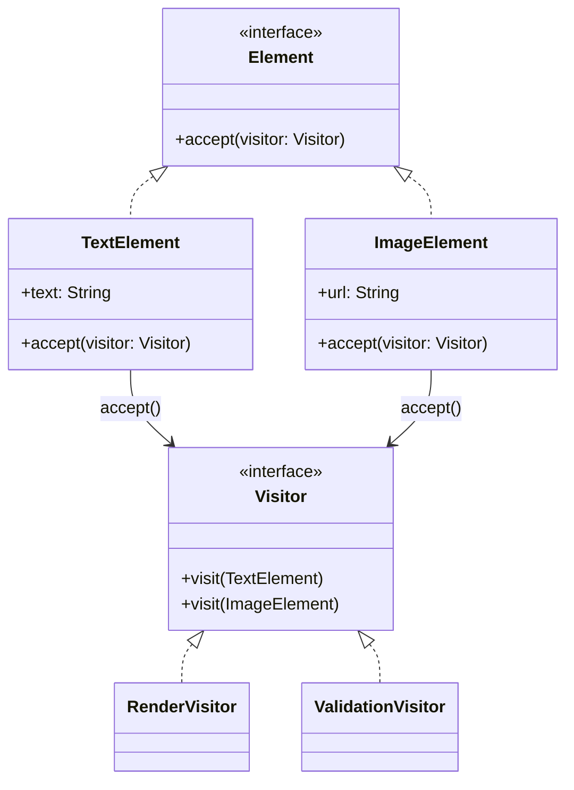
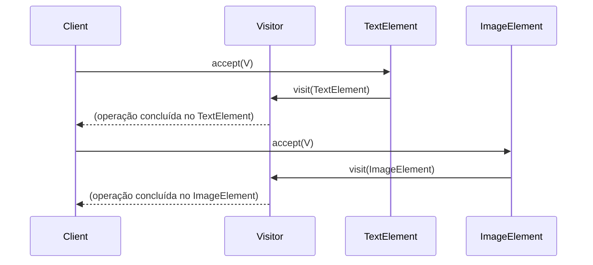

## 1) Nome & objetivo (1 frase)
**Visitor**: separar uma **operação** da **estrutura de objetos** sobre a qual ela atua, permitindo **adicionar novos comportamentos** sem modificar essas classes.

---

## 2) Quando aplicar (checklist)

- Há uma **árvore ou hierarquia** de classes (por exemplo, tipos de nós, views, elementos de tela, ASTs).
- Quer **adicionar novas operações** (ex.: renderizar, validar, exportar, contar, serializar) **sem mudar** essas classes.
- Ideal quando o **conjunto de tipos** é **estável**, mas as **operações variam** com o tempo.

🧭 Em Android/Kotlin:

- **Renderização de diferentes tipos de UI** (ex.: listas heterogêneas no Compose).
- **Exportação de dados** (para PDF, JSON, XML).
- **Validação** de objetos de domínio.
- **Processamento de ASTs ou DSLs internas**.

---

## 3) Quando NÃO aplicar & riscos

- A hierarquia **muda frequentemente** (cada alteração quebra todos os visitantes).
- Operações **são poucas e estáveis**, mas os **tipos mudam** → prefira **polimorfismo normal**.
- Pode ficar **verboso** em Kotlin se não usar sealed classes com when.

---

## 4) Anti-patterns & como evitar

- **Visitor Deus**: um visitante faz tudo — divida responsabilidades.
- **Hierarquia instável** → avalanche de mudanças; mantenha os tipos fechados (sealed).
- **Retornos inconsistentes**: defina interface genérica ou Result.
- Use sealed interface e when em Kotlin para simplificar.

---

## 5) Cuidados SOLID

- **SRP**: visitantes encapsulam cada tipo de operação (validação, renderização…).
- **OCP**: novas operações → novos visitantes (sem tocar nas classes visitadas).
- **DIP**: as estruturas dependem apenas da **interface Visitor**.

---

## 6) Estrutura (UML)





---

## 7) Antes (code smell real)

_Problema_: when gigante e duplicado em cada operação.

```kotlin
fun render(element: Any) = when (element) {
    is TextElement -> Text(element.text)
    is ImageElement -> Image(painterResource(element.url))
    else -> {}
}

fun validate(element: Any) = when (element) {
    is TextElement -> element.text.isNotEmpty()
    is ImageElement -> element.url.startsWith("http")
    else -> false
}
```

**Cheiros**: repetição de when, violação de OCP, acoplamento de operações à estrutura.

---

## 8) Depois (Visitor aplicado)

### 8.1 Contratos

```kotlin
interface Element {
    fun accept(visitor: Visitor)
}

interface Visitor {
    fun visit(element: TextElement)
    fun visit(element: ImageElement)
}
```

### 8.2 Estrutura de dados (estável)

```kotlin
data class TextElement(val text: String) : Element {
    override fun accept(visitor: Visitor) = visitor.visit(this)
}

data class ImageElement(val url: String) : Element {
    override fun accept(visitor: Visitor) = visitor.visit(this)
}
```

### 8.3 Visitantes concretos

```kotlin
class RenderVisitor : Visitor {
    fun renderAll(elements: List<Element>) {
        elements.forEach { it.accept(this) }
    }

    override fun visit(element: TextElement) {
        println("Renderizando texto: ${element.text}")
    }

    override fun visit(element: ImageElement) {
        println("Renderizando imagem: ${element.url}")
    }
}

class ValidationVisitor : Visitor {
    private val errors = mutableListOf<String>()

    fun validateAll(elements: List<Element>): List<String> {
        elements.forEach { it.accept(this) }
        return errors
    }

    override fun visit(element: TextElement) {
        if (element.text.isBlank()) errors += "Texto vazio"
    }

    override fun visit(element: ImageElement) {
        if (!element.url.startsWith("http")) errors += "URL inválida: ${element.url}"
    }
}
```

---

## 9) Uso no ViewModel (Android)

```kotlin
class DocumentViewModel : ViewModel() {

    private val elements = listOf(
        TextElement("Olá mundo"),
        ImageElement("https://img.com/logo.png"),
        TextElement("")
    )

    private val _renderOutput = MutableStateFlow<List<String>>(emptyList())
    val renderOutput: StateFlow<List<String>> = _renderOutput

    private val _errors = MutableStateFlow<List<String>>(emptyList())
    val errors: StateFlow<List<String>> = _errors

    fun render() {
        val visitor = RenderVisitor()
        visitor.renderAll(elements)
        _renderOutput.value = elements.map { "Renderizado: $it" }
    }

    fun validate() {
        val validator = ValidationVisitor()
        _errors.value = validator.validateAll(elements)
    }
}
```

### Compose

```kotlin
@Composable
fun DocumentScreen(vm: DocumentViewModel) {
    val errors by vm.errors.collectAsState()
    val renders by vm.renderOutput.collectAsState()

    Column {
        Button(onClick = vm::validate) { Text("Validar") }
        Button(onClick = vm::render) { Text("Renderizar") }

        renders.forEach { Text(it) }

        if (errors.isNotEmpty()) {
            Text("Erros:", fontWeight = FontWeight.Bold)
            errors.forEach { Text("- $it", color = Color.Red) }
        }
    }
}
```

---

## 10) Testes essenciais

```kotlin
class VisitorTests {

    @Test
    fun `validation visitor detects errors`() {
        val elements = listOf(
            TextElement(""),
            ImageElement("ftp://bad")
        )

        val visitor = ValidationVisitor()
        val errors = visitor.validateAll(elements)

        assertTrue(errors.contains("Texto vazio"))
        assertTrue(errors.any { it.contains("URL inválida") })
    }

    @Test
    fun `render visitor prints all`() {
        val elements = listOf(TextElement("Hi"), ImageElement("https://x.com"))
        val visitor = RenderVisitor()
        visitor.renderAll(elements)
        // sem erro == sucesso
    }
}
```

---

## 11) Trade-offs

- **Pró**: adiciona novas operações facilmente; separa lógica da estrutura.
- **Contra**: requer accept() em todas as classes (intrusivo); difícil adicionar novos tipos sem alterar visitantes existentes.

---

## 12) Relações com outros padrões

- **Visitor + Composite**: aplicar visitantes em árvores de componentes.
- **Visitor + Interpreter**: visitar ASTs para interpretar ou compilar.
- **Visitor + Command**: visitantes que geram comandos.
- **Visitor vs Strategy**: Strategy muda algoritmo; Visitor adiciona operação sem tocar na estrutura.

---

## 13) Checklist Anti Over-Engineering

- A hierarquia é **estável** e operações mudam com frequência?
- Cada visitante tem **responsabilidade única**?
- Usa sealed class em Kotlin? (pode simplificar em vez do Visitor clássico).
- O Visitor traz real benefício sobre when?

---

## 14) Resumo em 5 linhas

- **Visitor** aplica novas operações sobre estruturas estáveis sem alterá-las.
- Excelente para **ASTs**, **UI compostas**, **validações** e **exportações**.
- Cada operação = um visitante.
- Pode ser simplificado com sealed class + when em Kotlin.
- Combina com **Composite**, **Interpreter**, **Command**.
