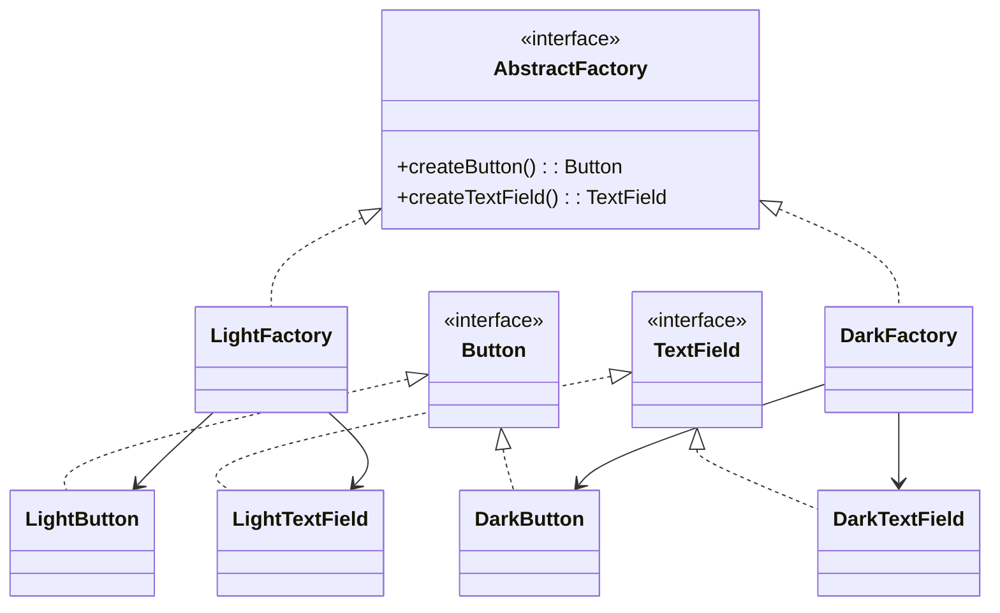
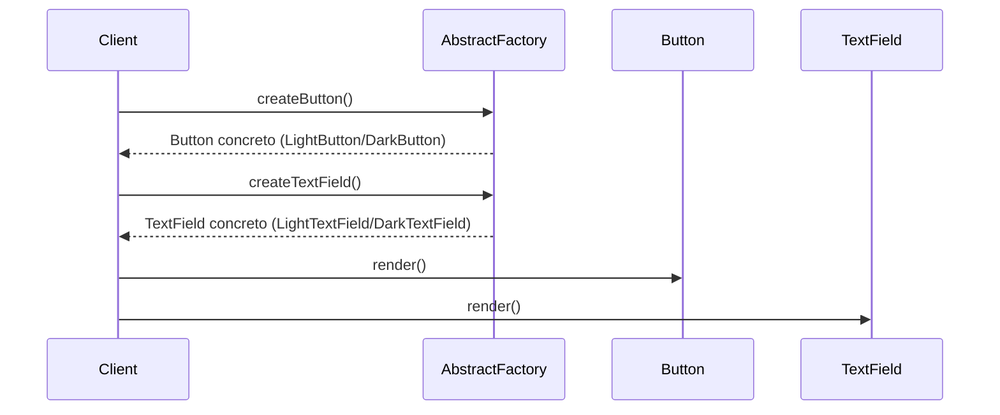

## 1) Nome & objetivo (1 frase)

**Abstract Factory**: prover uma **interface para criar famílias de objetos relacionados** (ou dependentes) **sem expor suas classes concretas**.

👉 É uma **fábrica de fábricas**: garante que os produtos criados **combinem entre si** (mesmo tema, mesmo backend, mesmo conjunto de dependências).

---

## 2) Quando aplicar (checklist)

- Precisa criar **famílias de objetos compatíveis** (ex.: UI Light/Dark, APIs REST/GraphQL, Storage Local/Cloud).
- Deseja **mudar a família inteira** de implementações em um ponto (injeção, configuração).
- Os objetos **devem ser usados juntos**, e há risco de **misturar versões incompatíveis**.
- Em Android/Kotlin:
  - **Themes** (Light/Dark) → botões, textos e ícones combinando.
  - **Repositorios** locais e remotos.
  - **DataSources** alternáveis (Room / Firebase / API).
  - **ViewComponents** adaptados a diferentes design systems.

---

## 3) Quando NÃO aplicar & riscos

- Só há **um tipo de produto** → Factory Method já basta.
- Você **não precisa garantir compatibilidade** entre produtos.
- O número de fábricas explode em projetos pequenos (boilerplate).

---

## 4) Anti-patterns & como evitar

- **God Abstract Factory**: fabrica tudo no app. → Quebre por domínio.
- **Produtos inconsistentes**: defina contratos claros e **enforce** via interface.
- **Lógica condicional dentro da fábrica abstrata** → quebra o propósito; subclasses decidem.

---

## 5) Cuidados SOLID

- **SRP**: cada família tem sua própria fábrica.
- **OCP**: novas famílias criam novas fábricas sem alterar código existente.
- **DIP**: o cliente depende da **abstração da fábrica**, não das implementações concretas.

---

## 6) Estrutura (UML)





---

## 7) Antes (code smell real)

_Problema_: criação explícita de componentes de UI por tema — difícil trocar.

```kotlin
fun renderScreen(theme: String) {
    val button = if (theme == "dark") DarkButton() else LightButton()
    val text = if (theme == "dark") DarkTextField() else LightTextField()

    button.render()
    text.render()
}
```

**Cheiros**: repetição de condicionais; se adicionar novo tema, todos os lugares precisam mudar.

---

## 8) Depois (Abstract Factory aplicado)

## 8.1 Contratos

```kotlin
interface Button {
    fun render()
}

interface TextField {
    fun render()
}

interface UiFactory {
    fun createButton(): Button
    fun createTextField(): TextField
}
```

### 8.2 Implementações concretas

```kotlin
class LightButton : Button {
    override fun render() = println("Renderizando botão claro ☀️")
}

class DarkButton : Button {
    override fun render() = println("Renderizando botão escuro 🌙")
}

class LightTextField : TextField {
    override fun render() = println("Renderizando campo de texto claro ☀️")
}

class DarkTextField : TextField {
    override fun render() = println("Renderizando campo de texto escuro 🌙")
}
```

### 8.3 Fábricas concretas

```kotlin
class LightUiFactory : UiFactory {
    override fun createButton(): Button = LightButton()
    override fun createTextField(): TextField = LightTextField()
}

class DarkUiFactory : UiFactory {
    override fun createButton(): Button = DarkButton()
    override fun createTextField(): TextField = DarkTextField()
}
```

### 8.4 Cliente

```kotlin
class Screen(private val factory: UiFactory) {
    fun render() {
        val button = factory.createButton()
        val text = factory.createTextField()
        button.render()
        text.render()
    }
}
```

---

## 9) Exemplo prático (Android/Compose)

```kotlin
enum class Theme { LIGHT, DARK }

class UiFactoryProvider {
    fun getFactory(theme: Theme): UiFactory =
        when (theme) {
            Theme.LIGHT -> LightUiFactory()
            Theme.DARK -> DarkUiFactory()
        }
}

@Composable
fun LoginScreen(theme: Theme) {
    val factory = UiFactoryProvider().getFactory(theme)
    val button = factory.createButton()
    val field = factory.createTextField()

    // em Compose, isso poderia gerar composables
    button.render()
    field.render()
}
```

---

## 10) Testes essenciais

```kotlin
class AbstractFactoryTests {

    @Test
    fun `dark factory creates dark components`() {
        val factory = DarkUiFactory()
        assertTrue(factory.createButton() is DarkButton)
        assertTrue(factory.createTextField() is DarkTextField)
    }

    @Test
    fun `light factory creates light components`() {
        val factory = LightUiFactory()
        assertTrue(factory.createButton() is LightButton)
        assertTrue(factory.createTextField() is LightTextField)
    }
}
```

---

# 11) Trade-offs

- **Pró**: garante compatibilidade entre objetos; substituição fácil da família inteira.
- **Contra**: mais classes; difícil escalar se precisar combinar múltiplas variações (tema + plataforma).

---

## 12) Relações com outros padrões

- **Abstract Factory vs Factory Method**: Factory Method cria **um tipo**; Abstract Factory cria **um conjunto compatível**.
- **Abstract Factory + Singleton**: uma única instância global da fábrica ativa.
- **Abstract Factory + Builder**: Builder pode usar a fábrica para criar as partes.
- **Abstract Factory + Dependency Injection**: DI pode atuar como uma fábrica abstrata configurável.

---

## 13) Checklist Anti Over-Engineering

- Há **famílias** de objetos relacionados?
- Existe **risco de mistura** entre implementações incompatíveis?
- A criação é **coesa por domínio** (UI, storage, rede)?
- É realmente preciso mais de uma fábrica (não apenas parâmetros no construtor)?

---

## 14) Resumo em 5 linhas

- **Abstract Factory** cria **famílias de objetos relacionados** sem acoplamento.
- Ideal para **temas**, **data sources**, **design systems**.
- Substituir uma família → troca uma fábrica.
- Evita if/else espalhados.
- Combina com **Builder**, **DI**, **Singleton**.
