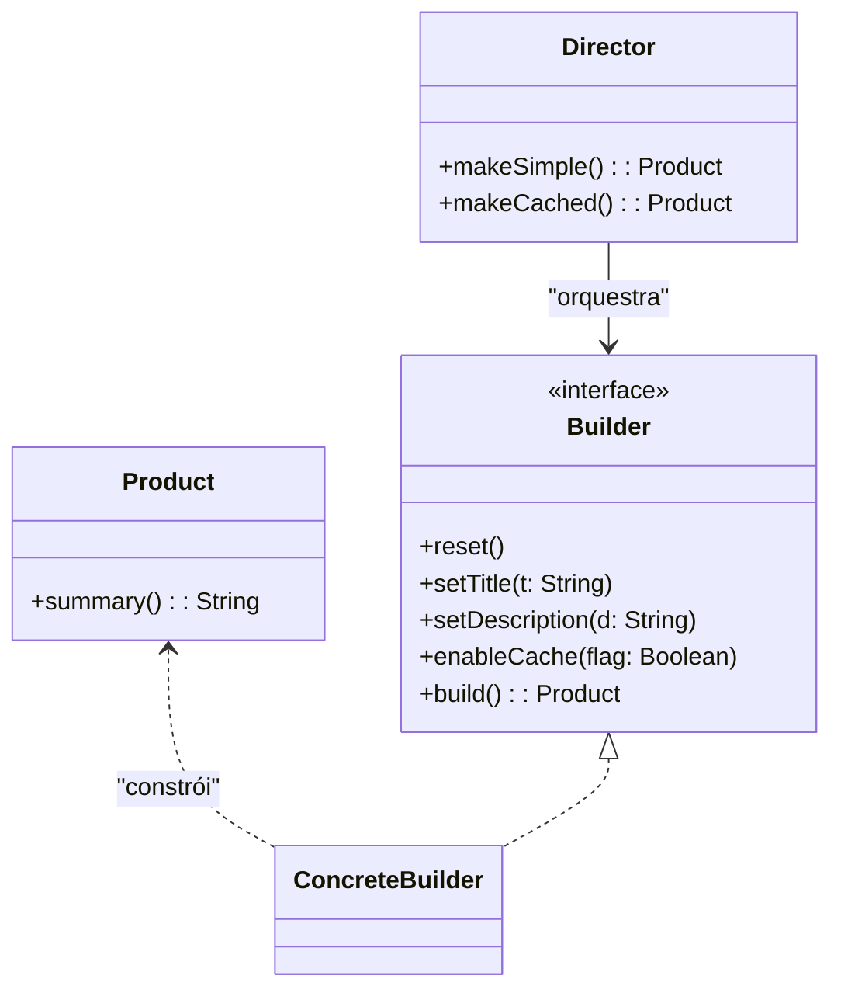
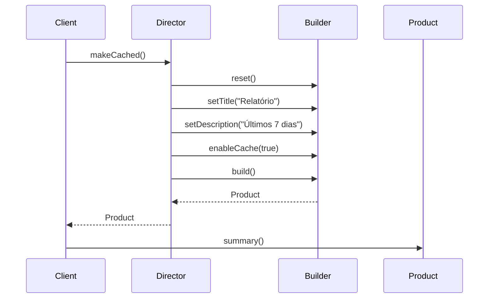

## 1) Nome & objetivo (1 frase)

**Builder**: construir **objetos complexos passo a passo**, separando **como** construir de **o que** construir, permitindo **variações** de montagem com a mesma representação final.

## 2) Quando aplicar (checklist)

- Objeto possui **muitos parâmetros opcionais**/combináveis (DTOs, Requests, Configs).
- Precisa de **ordem controlada** de montagem (pré-validações, normalizações).
- Existem **variações** de construção (ex.: request JSON vs Protobuf, cache on/off).
- Em Android: criação de **Retrofit/OkHttp** com múltiplos passos, **notificações** (NotificationCompat.Builder), **WorkRequests**, **Compose DSL** de telas dinâmicas.

## 3) Quando NÃO aplicar & riscos

- O construtor tem **poucos parâmetros** e é estável → construtor normal/copy() resolve.
- Se só precisa de **validação simples** → prefira **factory** com checagens.
- Overkill em modelos simples → mais classes/boilerplate.

## 4) Anti-patterns & como evitar

- **Telescoping constructors** (muitos construtores encadeados) → use Builder.
- **Builder anêmico** (apenas passa campos) → inclua **regras de montagem/validação**.
- **Expor objeto parcialmente construído** → só build() retorna a instância imutável.

## 5) Cuidados SOLID

- **SRP**: Builder cuida da **construção/validação**; o produto final é **imutável** e focado no domínio.
- **OCP**: novas variações criam **novos builders** ou **diretores** sem mudar o cliente.
- **DIP**: cliente conhece a **abstração do builder/diretor**, não detalhes concretos.

---

## 6) Estrutura (UML)





---

## 7) Antes (code smell real)

_Problema_: construtor com muitos parâmetros, difícil de ler e validar.

```kotlin
data class ReportRequest(
    val title: String,
    val description: String?,
    val includeCharts: Boolean,
    val cacheEnabled: Boolean,
    val tags: List<String>?,
    val timezone: String
)

// Chamada confusa, com opcionais nulos e ordem frágil:
val req = ReportRequest("Relatório", null, true, false, null, "America/Belem")
```

**Cheiros**: ordem frágil, pouca clareza de intenção, validações espalhadas.

---

## 8) Depois (Builder aplicado, Kotlin/Android)

### 8.1 Produto imutável

```kotlin
data class ReportRequest private constructor(
    val title: String,
    val description: String?,
    val includeCharts: Boolean,
    val cacheEnabled: Boolean,
    val tags: List<String>,
    val timezone: String
) {
    fun summary() = "$title | charts=$includeCharts | cache=$cacheEnabled | tz=$timezone"

    class Builder {
        private var title: String? = null
        private var description: String? = null
        private var includeCharts: Boolean = false
        private var cacheEnabled: Boolean = false
        private var tags: MutableList<String> = mutableListOf()
        private var timezone: String = "America/Belem"

        fun reset() = apply {
            title = null; description = null
            includeCharts = false; cacheEnabled = false
            tags.clear(); timezone = "America/Belem"
        }

        fun setTitle(t: String) = apply { title = t.trim() }
        fun setDescription(d: String?) = apply { description = d?.trim().takeUnless { it.isNullOrBlank() } }
        fun includeCharts(flag: Boolean) = apply { includeCharts = flag }
        fun enableCache(flag: Boolean) = apply { cacheEnabled = flag }
        fun addTag(tag: String) = apply { tags += tag }
        fun setTimezone(tz: String) = apply { timezone = tz }

        fun build(): ReportRequest {
            val t = requireNotNull(title) { "title é obrigatório" }
            require(timezone.isNotBlank()) { "timezone inválido" }
            return ReportRequest(
                title = t,
                description = description,
                includeCharts = includeCharts,
                cacheEnabled = cacheEnabled,
                tags = tags.toList(),
                timezone = timezone
            )
        }
    }
}
```

### 8.2 Director (opcional: receitas de construção)

```kotlin
class ReportDirector(private val builder: ReportRequest.Builder) {

    fun makeSimple(title: String): ReportRequest =
        builder.reset()
            .setTitle(title)
            .includeCharts(false)
            .enableCache(false)
            .build()

    fun makeCachedWeekly(title: String): ReportRequest =
        builder.reset()
            .setTitle(title)
            .setDescription("Últimos 7 dias")
            .includeCharts(true)
            .enableCache(true)
            .addTag("weekly")
            .build()
}
```

### 8.3 Uso em ViewModel

```kotlin
class ReportViewModel : ViewModel() {
    private val builder = ReportRequest.Builder()
    private val director = ReportDirector(builder)

    private val _request = MutableStateFlow<ReportRequest?>(null)
    val request: StateFlow<ReportRequest?> = _request

    fun createWeekly(title: String) {
        _request.value = director.makeCachedWeekly(title)
    }
}
```

### 8.4 Compose (exemplo)

```kotlin
@Composable
fun ReportScreen(vm: ReportViewModel) {
    val req by vm.request.collectAsState()
    Column {
        Button(onClick = { vm.createWeekly("Relatório Financeiro") }) {
            Text("Gerar semanal (cached)")
        }
        Text(req?.summary() ?: "—")
    }
}
```

---

## 9) Variação: Builder fluente para OkHttp/Retrofit-like

```kotlin
class HttpClient private constructor(
    val baseUrl: String,
    val timeoutMs: Long,
    val log: Boolean
) {
    class Builder {
        private var baseUrl: String = ""
        private var timeoutMs: Long = 10_000
        private var log: Boolean = false

        fun baseUrl(url: String) = apply { baseUrl = url }
        fun timeout(ms: Long) = apply { timeoutMs = ms }
        fun logging(enable: Boolean) = apply { log = enable }

        fun build(): HttpClient {
            require(baseUrl.startsWith("http")) { "baseUrl inválida" }
            return HttpClient(baseUrl, timeoutMs, log)
        }
    }
}
```

---

## 10) Testes essenciais

```kotlin
class BuilderTests {

    @Test
    fun `builder builds simple weekly cached report`() {
        val director = ReportDirector(ReportRequest.Builder())
        val r = director.makeCachedWeekly("Relatório")
        assertTrue(r.cacheEnabled)
        assertTrue(r.includeCharts)
        assertEquals("Relatório", r.title)
        assertTrue(r.tags.contains("weekly"))
    }

    @Test(expected = IllegalArgumentException::class)
    fun `missing title throws`() {
        ReportRequest.Builder().build()
    }
}
```

---

## 11) Trade-offs

- **Pró**: clareza de intenção, validações centralizadas, montagem passo a passo, imutabilidade do produto.
- **Contra**: mais classes/boilerplate; pode ser redundante quando **Kotlin DSL**/copy() já resolvem.

## 12) Relações com outros padrões

- **Builder vs Factory Method**: Factory decide **qual classe**; Builder decide **como montar**.
- **Builder + Director**: receitas reutilizáveis (presets).
- **Builder + Abstract Factory**: fábrica fornece **partes**; Builder **monta** o todo.
- **Builder + Prototype**: Builder pode partir de um **clone** e customizar.

## 13) Checklist Anti Over-Engineering

- O objeto tem **muitos opcionais** e **regras** de montagem?
- Precisa de **variações** frequentes (presets/director)?
- Consegue **validar** tudo no build() e manter o produto **imutável**?
- Se é simples, prefira **factory** ou **construtor** (YAGNI).

## 14) Resumo em 5 linhas

- **Builder** organiza a construção de objetos complexos em **passos claros**.
- Centraliza **validações** e permite **receitas** via **Director**.
- Ótimo para **Requests/Configs/Clients** e padrões ao estilo OkHttp/Notification.
- Evita **telescoping constructors** e melhora a leitura.
- Combine com **Abstract Factory/Prototype** conforme o caso.
