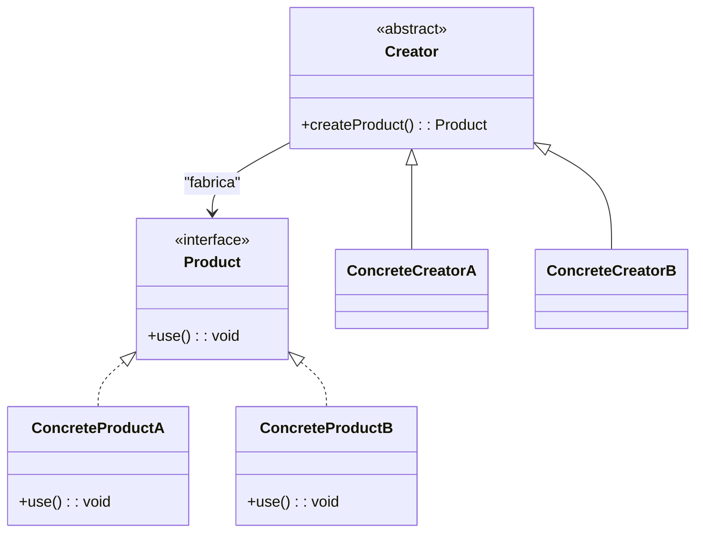
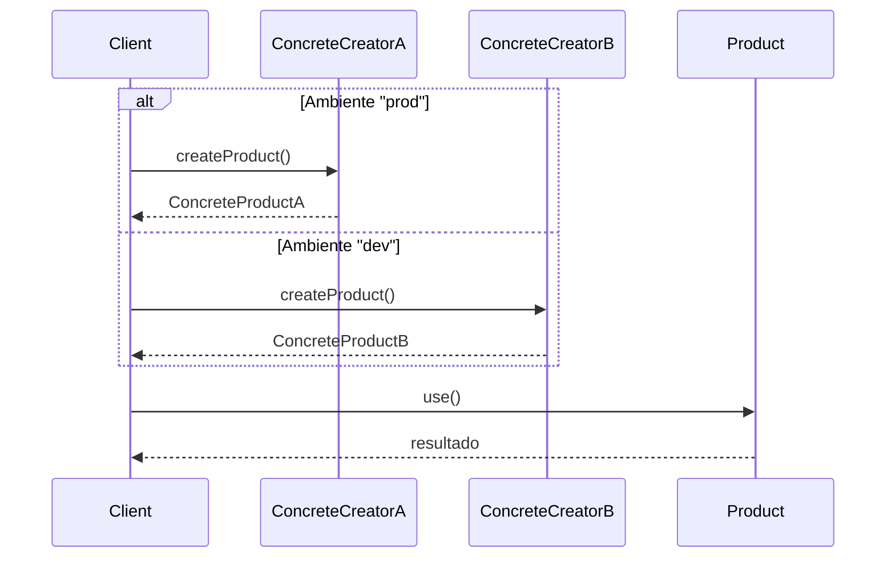

## 1) Nome & objetivo (1 frase)

**Factory Method**: definir uma **interface para criação de objetos**, permitindo que **subclasses decidam qual classe concreta instanciar**, mantendo o código cliente **desacoplado** da implementação.

---

## 2) Quando aplicar (checklist)

- Seu código **cria objetos diretamente** (new / construtor) de classes que **mudam com frequência**.
- Deseja **delegar a decisão** de qual tipo concreto instanciar.
- Precisa **garantir consistência** ou **pré-processamento** na criação (ex.: configuração, validação, log).
- Em Android/Kotlin:
  - Criação de **ViewModels**, **UseCases**, **Repositories**, **adapters**.
  - Factories de **network clients** (Retrofit, OkHttp).
  - Criação de **entidades/DTOs** a partir de dados (JSON, DB).

---

## 3) Quando NÃO aplicar & riscos

- O tipo concreto **nunca muda** → uso desnecessário de abstração.
- Você **não precisa herdar** para variar a criação → **use simples funções de fábrica** (object, companion, ou create()).
- Multiplicar fábricas para tipos triviais gera **boilerplate** sem benefício.

---

## 4) Anti-patterns & como evitar

- **God Factory**: central única que cria tudo → quebre por contexto.
- **Factory Method sem polimorfismo** (sempre retorna o mesmo tipo) → não agrega valor.
- **Factories complexas** → prefira Abstract Factory ou Builder se o processo tiver muitos passos.

---

## 5) Cuidados SOLID

- **SRP**: cada fábrica tem um propósito único (não crie todos os tipos nela).
- **OCP**: novas implementações adicionam novas fábricas, sem alterar o cliente.
- **DIP**: cliente depende da **abstração da fábrica**, não da implementação concreta.

---

## 6) Estrutura (UML)





---

## 7) Antes (code smell real)

_Problema_: código cliente **instancia diretamente** classes concretas — difícil mudar comportamento.

```kotlin
class LoggerService {
    fun getLogger(env: String): Logger {
        return if (env == "prod") FileLogger() else ConsoleLogger()
    }
}

class FileLogger : Logger {
    override fun log(msg: String) = println("[FILE] $msg")
}

class ConsoleLogger : Logger {
    override fun log(msg: String) = println("[CONSOLE] $msg")
}
```

**Cheiro**: o if de criação espalhado → quebra o OCP (abrir para extensão, fechado para modificação).

---

## 8) Depois (Factory Method aplicado)

### 8.1 Contratos

```kotlin
interface Logger {
    fun log(msg: String)
}

abstract class LoggerCreator {
    abstract fun createLogger(): Logger
}
```

### 8.2 Implementações concretas

```kotlin
class FileLogger : Logger {
    override fun log(msg: String) = println("[FILE] $msg")
}

class ConsoleLogger : Logger {
    override fun log(msg: String) = println("[CONSOLE] $msg")
}
```

### 8.3 Fábricas concretas

```kotlin
class FileLoggerCreator : LoggerCreator() {
    override fun createLogger(): Logger = FileLogger()
}

class ConsoleLoggerCreator : LoggerCreator() {
    override fun createLogger(): Logger = ConsoleLogger()
}
```

### 8.4 Cliente

```kotlin
class LogClient(private val factory: LoggerCreator) {
    private val logger: Logger = factory.createLogger()

    fun run() {
        logger.log("Iniciando execução...")
    }
}
```

### 8.5 Uso no Android (ViewModel ou UseCase)

```kotlin
class LoggerFactory {
    fun create(env: String): LoggerCreator =
        if (env == "prod") FileLoggerCreator() else ConsoleLoggerCreator()
}

class MainViewModel(factory: LoggerFactory) : ViewModel() {
    private val logger = factory.create("dev").createLogger()
    fun action() = logger.log("Ação executada!")
}
```

---

## 9) Testes essenciais

```kotlin
class FactoryMethodTests {

    @Test
    fun `factory creates correct logger`() {
        val fileCreator = FileLoggerCreator()
        val consoleCreator = ConsoleLoggerCreator()

        assertTrue(fileCreator.createLogger() is FileLogger)
        assertTrue(consoleCreator.createLogger() is ConsoleLogger)
    }

    @Test
    fun `client uses injected factory polymorphically`() {
        val client = LogClient(ConsoleLoggerCreator())
        client.run() // deve imprimir "[CONSOLE] Iniciando execução..."
    }
}
```

---

## 10) Trade-offs

- **Pró**: facilita extensão, testabilidade e substituição de dependências.
- **Contra**: mais classes e indireção (overhead para tipos simples).

---

## 11) Relações com outros padrões

- **Factory Method vs Abstract Factory**: Factory cria **um** tipo; Abstract cria **famílias**.
- **Factory Method + Singleton**: fábrica pode ser única global.
- **Factory Method + Prototype**: fábrica pode clonar objetos existentes.
- **Factory Method + Dependency Injection**: DI frameworks (como Hilt/Koin) automatizam essa lógica.

---

## 12) Checklist Anti Over-Engineering

- A criação muda com frequência?
- Há polimorfismo real (várias implementações possíveis)?
- Cliente precisa **não conhecer** a classe concreta?
- A fábrica tem uma **única responsabilidade**?

---

## 13) Resumo em 5 linhas

- **Factory Method** encapsula a criação de objetos em subclasses.
- Evita if/else e new espalhados.
- Facilita testes e extensão.
- Ideal para **serviços**, **repositórios**, **e clients configuráveis**.
- Pode ser substituído por funções create() ou DI em casos simples.
