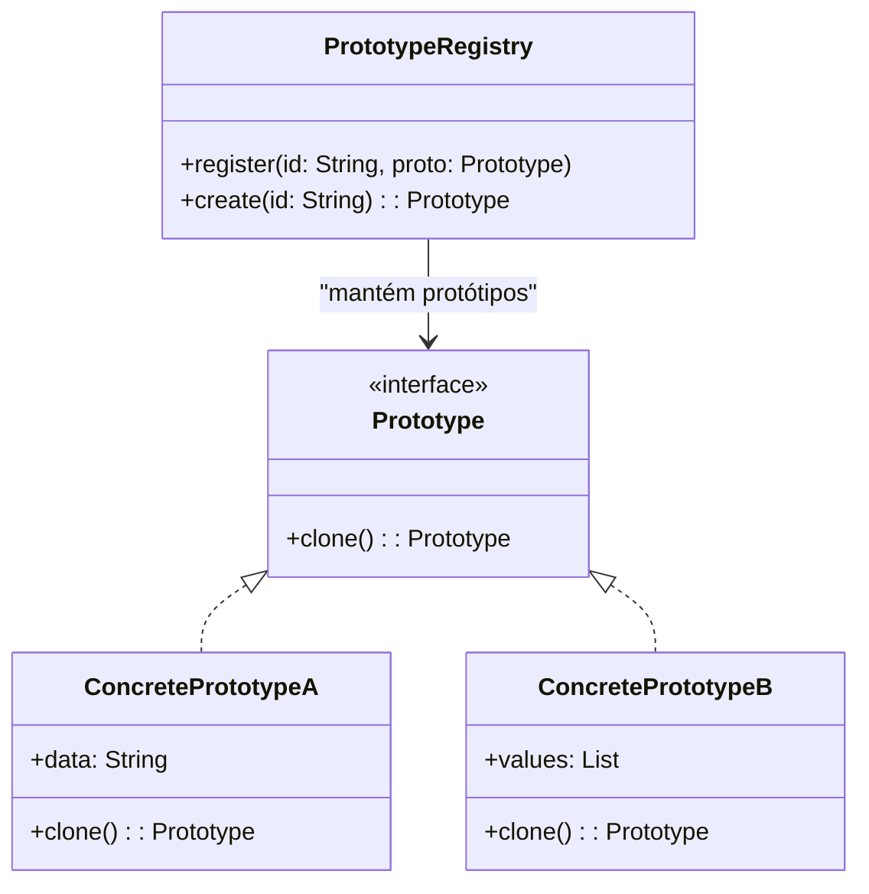
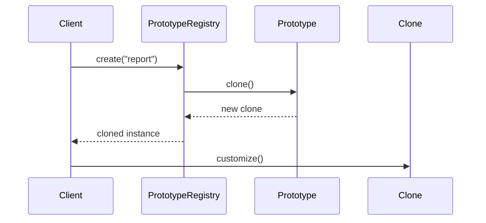

## 1) Nome & objetivo (1 frase)

**Prototype**: criar novos objetos **clonando instâncias existentes**, em vez de instanciar do zero — útil quando a **criação é custosa** ou o **estado inicial é complexo**.

---

## 2) Quando aplicar (checklist)

- O custo de criar novos objetos é **alto** (ex.: deep copy, parsing, setup pesado).
- Precisa criar **várias cópias configuráveis** de um objeto base.
- Deseja **manter estados iniciais** padronizados e variar só detalhes.
- Em Android/Kotlin:
  - duplicação de **configurações de UI** ou **templates** (Compose, XML).
  - **Clonagem de Requests** (com headers/base config).
  - **Modelos de domínio** reutilizáveis (produtos, templates de contrato, relatórios).

---

## 3) Quando NÃO aplicar & riscos

- O objeto é **leve e simples** (melhor criar via construtor ou factory).
- Precisa de **controle fino de dependências injetadas** (DI é melhor).
- Clone sem deep copy → referências mutáveis compartilhadas (bug clássico).

---

## 4) Anti-patterns & como evitar

- **Shallow copy perigoso**: use copy() ou deepClone() adequadamente.
- **Lógica pesada em clone()** → quebre em _PrototypeManager_ para centralizar.
- **Mutabilidade alta**: prefira objetos imutáveis (com copy()).

---

## 5) Cuidados SOLID

- **SRP**: a classe define como se clona (nada mais).
- **OCP**: novas variações criam novos protótipos.
- **DIP**: cliente depende apenas da **interface Cloneable/Prototype**, não da classe concreta.

---

## 6) Estrutura (UML + Sequence)





---

## 7) Antes (code smell real)

_Problema_: múltiplas instâncias sendo criadas manualmente, com repetições de setup.

```kotlin
val base = ReportConfig("v1", "USD", includeCharts = true)

val report1 = ReportConfig("v1", "USD", includeCharts = true).copy(title = "Resumo Semanal")
val report2 = ReportConfig("v1", "USD", includeCharts = true).copy(title = "Resumo Mensal")
```

**Cheiro**: duplicação de configuração base em vários pontos → risco de inconsistência.

---

## 8) Depois (Prototype aplicado)

### 8.1 Contrato base

```kotlin
interface Prototype<T> {
    fun clone(): T
}
```

### 8.2 Protótipos concretos

```kotlin
data class ReportConfig(
    val version: String,
    val currency: String,
    val includeCharts: Boolean,
    val title: String = ""
) : Prototype<ReportConfig> {
    override fun clone(): ReportConfig = copy()
}
```

### 8.3 Registro de protótipos

```kotlin
class PrototypeRegistry {
    private val map = mutableMapOf<String, Prototype<*>>()

    fun register(id: String, proto: Prototype<*>) {
        map[id] = proto
    }

    @Suppress("UNCHECKED_CAST")
    fun <T> create(id: String): T? {
        val proto = map[id] ?: return null
        return (proto.clone() as T)
    }
}
```

### 8.4 Uso em ViewModel

```kotlin
class ReportViewModel : ViewModel() {
    private val registry = PrototypeRegistry()

    init {
        registry.register("weekly", ReportConfig("v1", "USD", true, "Modelo Semanal"))
        registry.register("monthly", ReportConfig("v1", "USD", true, "Modelo Mensal"))
    }

    fun createCustom(title: String): ReportConfig {
        val base = registry.create<ReportConfig>("weekly")!!
        return base.copy(title = title)
    }
}
```

### 8.5 Compose

```kotlin
@Composable
fun ReportScreen(vm: ReportViewModel) {
    val weekly = remember { vm.createCustom("Relatório Financeiro - Semana") }
    Text("Relatório criado: ${weekly.title} | Charts=${weekly.includeCharts}")
}
```

---

## 9) Variação com objetos mais complexos (deep clone)

```kotlin
data class UserProfile(
    val name: String,
    val preferences: MutableList<String>
) : Prototype<UserProfile> {
    override fun clone(): UserProfile =
        copy(preferences = preferences.toMutableList()) // deep clone
}
```

---

## 10) Testes essenciais

```kotlin
class PrototypeTests {

    @Test
    fun `registry returns independent clone`() {
        val registry = PrototypeRegistry()
        val base = ReportConfig("v1", "USD", true, "Base")
        registry.register("report", base)

        val clone = registry.create<ReportConfig>("report")!!
        assertNotSame(base, clone)
        assertEquals(base.currency, clone.currency)
    }

    @Test
    fun `deep clone duplicates mutable list`() {
        val u1 = UserProfile("Ana", mutableListOf("DarkMode"))
        val u2 = u1.clone()
        u2.preferences += "Notifications"
        assertFalse(u1.preferences.contains("Notifications"))
    }
}
```

---

## 11) Trade-offs

- **Pró**: criação rápida e consistente; ótimo para templates/configs.
- **Contra**: risco de **clones rasos** (referências compartilhadas), **mutabilidade** perigosa.

---

## 12) Relações com outros padrões

- **Prototype vs Builder**: Builder constrói passo a passo; Prototype **clona** pronto.
- **Prototype + Factory**: Factory pode criar instâncias via clone.
- **Prototype + Registry**: comum em engines (Unity, Android themes).
- **Prototype + Memento**: Memento usa snapshot; Prototype cria cópias.

---

## 13) Checklist Anti Over-Engineering

- O custo de criação é **alto** ou precisa de **templates reutilizáveis**?
- Você controla o tipo de clone (**deep** vs **shallow**)?
- O estado mutável foi isolado?
- Está realmente mais legível do que copy() direto?

---

## 14) Resumo em 5 linhas

- **Prototype** clona instâncias prontas para criação rápida.
- Ideal para **templates/configurações base**.
- Evita duplicação de setup inicial.
- Cuidado com **mutabilidade** e **deep copy**.
- Pode integrar-se com **Factory** ou **Registry**.
