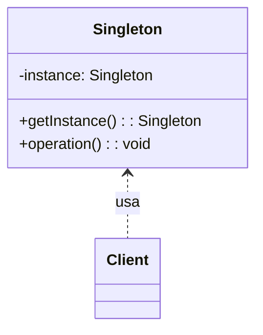
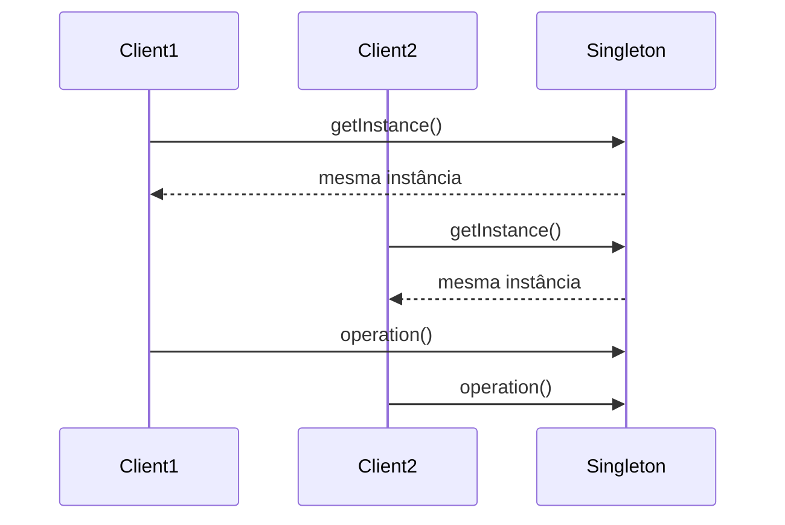

## 1) Nome & objetivo (1 frase)

**Singleton**: garantir que **exista apenas uma instância** de uma classe durante a execução do sistema e fornecer um **ponto global de acesso** a ela.

---

## 2) Quando aplicar (checklist)

- A classe representa **um recurso global compartilhado** (configuração, cache, logger, database).
- O custo de múltiplas instâncias seria alto ou inconsistente.
- Precisa **controlar concorrência e visibilidade** (thread-safe).
- Em Android/Kotlin:
  - **App-wide configs** (ThemeManager, Analytics, Logger).
  - **Serviços** (RoomDatabase, Retrofit client).
  - **Controladores únicos** (AuthManager, Session).

---

## 3) Quando NÃO aplicar & riscos

- Classe **precisa ser testada isoladamente** → Singleton dificulta mocks.
- O ciclo de vida da instância **deve acompanhar um escopo** (Activity/ViewModel).
- Risco de **memory leak** se segurar Context ou View inadvertidamente.
- Acesso global tende a **mascarar dependências** (violando DIP).

---

## 4) Anti-patterns & como evitar

- **God Singleton**: resolve “tudo” (DB, prefs, logger). → Separe responsabilidades.
- **Context leak**: nunca guardar Activity/View dentro do Singleton.
- **Hidden dependencies**: injete via construtor sempre que possível.
- **Non-thread-safe**: cuidado com race conditions em inicialização preguiçosa.

---

## 5) Cuidados SOLID

- **SRP**: a instância única deve ter **uma única responsabilidade**.
- **OCP**: mudanças no comportamento não devem exigir múltiplos singletons.
- **DIP**: prefira **injeção de dependência** ao uso direto do Singleton.

---

## 6) Estrutura (UML)





---

## 7) Antes (code smell real)

_Problema_: criação múltipla de instâncias pesadas (Retrofit, Room) em vários pontos.

```kotlin
class ApiService {
    val retrofit = Retrofit.Builder()
        .baseUrl("https://api.meuapp.com")
        .build()
}

val api1 = ApiService().retrofit
val api2 = ApiService().retrofit // cria novamente — desperdício
```

**Cheiros**: custo duplicado, sem controle de instância única.

---

## 8) Depois (Singleton aplicado corretamente)

### 8.1 Singleton básico (thread-safe Kotlin)

```kotlin
object ApiClient {
    val retrofit: Retrofit by lazy {
        Retrofit.Builder()
            .baseUrl("https://api.meuapp.com")
            .build()
    }
}
```

Uso:

```kotlin
val api = ApiClient.retrofit
```

> ✅ Kotlin object é thread-safe por padrão e inicializa apenas uma vez.

---

### 8.2 Singleton com dependências

```kotlin
class Logger private constructor(
    private val writer: (String) -> Unit
) {
    fun log(msg: String) = writer("[LOG] $msg")

    companion object {
        @Volatile private var instance: Logger? = null

        fun getInstance(writer: (String) -> Unit = ::println): Logger =
            instance ?: synchronized(this) {
                instance ?: Logger(writer).also { instance = it }
            }
    }
}
```

Uso:

```kotlin
val logger = Logger.getInstance()
logger.log("Iniciando sistema...")
```

---

### 8.3 Singleton + Android Application Scope

```kotlin
@HiltAndroidApp
class MyApp : Application() {

    override fun onCreate() {
        super.onCreate()
        AppConfig.init(this)
    }
}

object AppConfig {
    private lateinit var context: Context

    fun init(ctx: Context) {
        context = ctx.applicationContext // evita leaks
    }

    fun getVersionName(): String =
        context.packageManager.getPackageInfo(context.packageName, 0).versionName
}
```

---

### 8.4 Singleton com injeção (Koin / Hilt)

✅ preferível a “manual”: garante ciclo de vida e testabilidade.

**Koin:**

```kotlin
val appModule = module {
    single { Retrofit.Builder().baseUrl("https://api.app.com").build() }
    single { Logger() }
}
```

**Hilt:**

```kotlin
@Module
@InstallIn(SingletonComponent::class)
object NetworkModule {
    @Provides @Singleton
    fun provideRetrofit(): Retrofit =
        Retrofit.Builder().baseUrl("https://api.app.com").build()
}
```

---

## 9) Testes essenciais

```kotlin
class SingletonTests {

    @Test
    fun `singleton returns same instance`() {
        val l1 = Logger.getInstance()
        val l2 = Logger.getInstance()
        assertSame(l1, l2)
    }

    @Test
    fun `lazy object initializes only once`() {
        val a1 = ApiClient.retrofit
        val a2 = ApiClient.retrofit
        assertSame(a1, a2)
    }
}
```

---

## 10) Trade-offs
- **Pró**: garante unicidade, reduz overhead de criação, ótimo para caches/configs.
- **Contra**: dificulta testes e substituição (mocking), esconde dependências, pode vazar contexto.

---

## 11) Relações com outros padrões

- **Singleton + Factory**: factory global, gerando instâncias sob demanda.
- **Singleton + Builder**: builder configurável retornando sempre a mesma instância.
- **Singleton + Abstract Factory**: fabrica global de famílias de objetos.
- **Singleton vs Dependency Injection**: DI é o Singleton **bem controlado** e testável.

---

## 12) Checklist Anti Over-Engineering

- Precisa **realmente** de uma única instância global?
- Evita guardar **Context/Views**?
- A instância é **thread-safe**?
- A testabilidade não foi comprometida?
- Se sim → use **injeção de dependência** no lugar.

---

## 13) Resumo em 5 linhas

- **Singleton** garante **uma única instância global**.
- Útil para **configuração**, **cache**, **serviços únicos**.
- Em Kotlin, object já implementa Singleton de forma segura.
- Em Android, cuidado com **context leaks** e **testabilidade**.
- Prefira **injeção (Hilt/Koin)** para dependências globais.
