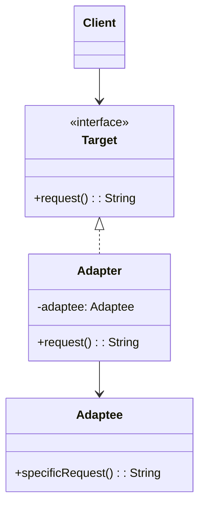
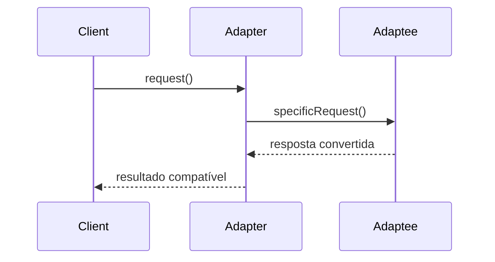

## 1) Nome & objetivo (1 frase)

**Adapter**: converter a **interface de uma classe existente** em outra que o cliente espera, permitindo que **componentes incompatíveis trabalhem juntos**.

> É o padrão do “tradutor” — transforma formatos ou APIs para encaixarem.

---

## 2) Quando aplicar (checklist)

- Deseja **reutilizar uma classe existente**, mas sua interface não é compatível com o novo código.
- Precisa **integrar bibliotecas externas** (ex.: SDKs, APIs).
- Quer **unificar acesso** a diferentes backends sob uma interface comum.
- Em Android/Kotlin:
  - Adaptar API de terceiros (ex.: Firebase, Retrofit, Room).
  - Converter entre **modelos de domínio e DTOs**.
  - Integrar sistemas legados ou SDKs pagos.
  - Usar **RecyclerView.Adapter** — nomeado assim justamente por esse padrão.

---

## 3) Quando NÃO aplicar & riscos

- Interfaces já são compatíveis — o adapter só adicionaria sobrecarga.
- Pode resolver com **extensão (extension function)** simples em Kotlin.
- Abuso de adapters encadeados → perda de clareza e performance.

---

## 4) Anti-patterns & como evitar

- **Adapters em cascata** (Adapter de Adapter): se perceber isso, repense o design.
- **Acoplamento disfarçado**: o adapter deve depender apenas da **interface-alvo**, não do cliente.
- **Lógica extra** dentro do adapter → mantenha apenas a tradução, não comportamento novo.

---

## 5) Cuidados SOLID

- **SRP**: adapter converte interface, não implementa lógica de negócio.
- **OCP**: novos adapters para novas fontes, sem alterar o cliente.
- **DIP**: cliente depende da abstração esperada, não da origem concreta.

---

## 6) Estrutura (UML)





---

## 7) Antes (code smell real)

_Problema_: a nova interface de domínio espera DomainUser, mas o SDK retorna SdkUser.

```kotlin
class SdkUser(val nome: String, val idade: Int)

fun processUser(user: DomainUser) { println("Olá ${user.name}") }

val sdkUser = SdkUser("Ronald", 30)
processUser(sdkUser) // erro — tipos incompatíveis
```

---

## 8) Depois (Adapter aplicado)

### 8.1 Interfaces e classes existentes

```kotlin
// Classe "adaptee" (já existente no SDK)
class SdkUser(val nome: String, val idade: Int)

// Interface esperada no domínio
interface DomainUser {
    val name: String
    val age: Int
}
```

### 8.2 Adapter

```kotlin
class SdkUserAdapter(private val sdk: SdkUser) : DomainUser {
    override val name: String get() = sdk.nome
    override val age: Int get() = sdk.idade
}
```

### 8.3 Cliente

```kotlin
fun processUser(user: DomainUser) {
    println("Olá ${user.name}, idade ${user.age}")
}

fun main() {
    val sdkUser = SdkUser("Ronald", 30)
    val adapted = SdkUserAdapter(sdkUser)
    processUser(adapted)
}
```

---

## 9) Aplicação prática (Android / API)

**Exemplo**: Adapter entre ApiUserResponse (DTO) e UserEntity (Room).

```kotlin
data class ApiUserResponse(val fullName: String, val years: Int)
@Entity data class UserEntity(val name: String, val age: Int)

interface UserMapper {
    fun toEntity(dto: ApiUserResponse): UserEntity
}

class ApiToRoomUserAdapter : UserMapper {
    override fun toEntity(dto: ApiUserResponse): UserEntity =
        UserEntity(name = dto.fullName, age = dto.years)
}
```

---

## 10) Versão funcional (Kotlin idiomático)

Em Kotlin, o Adapter pode ser substituído por **extension**:

```kotlin
fun ApiUserResponse.toEntity() = UserEntity(name = fullName, age = years)
```

Mas o padrão **clássico** (classe Adapter) ainda é útil para:
- Múltiplas estratégias de conversão;
- Substituição dinâmica em testes;
- Inversão de controle (injeção de adapters diferentes).

---

## 11) Testes essenciais

```kotlin
class AdapterTests {

    @Test
    fun `sdk user adapts correctly`() {
        val sdk = SdkUser("Renata", 28)
        val adapted = SdkUserAdapter(sdk)
        assertEquals("Renata", adapted.name)
        assertEquals(28, adapted.age)
    }

    @Test
    fun `api response converts to room entity`() {
        val dto = ApiUserResponse("Ana", 20)
        val entity = ApiToRoomUserAdapter().toEntity(dto)
        assertEquals("Ana", entity.name)
        assertEquals(20, entity.age)
    }
}
```

---

## 12) Trade-offs

- **Pró**: facilita integração, separa domínios, permite mockar em testes.
- **Contra**: mais classes, pode esconder acoplamentos indevidos.

---

## 13) Relações com outros padrões

- **Adapter vs Facade**: Adapter converte **interfaces**; Facade **simplifica sistemas complexos**.
- **Adapter + Bridge**: Bridge separa abstração/implementação; Adapter apenas converte.
- **Adapter + Decorator**: ambos envolvem um objeto, mas Decorator **adiciona comportamento**.

---

## 14) Checklist Anti Over-Engineering

- Interfaces realmente **incompatíveis**?
- Adaptação é **reutilizável** (não só para 1 lugar)?
- Pode resolver com **extension function**?
- Adaptação **não mistura lógica de negócio**?

---

## 15) Resumo em 5 linhas

- **Adapter** traduz interfaces incompatíveis para funcionarem juntas.
- Útil em **integrações de SDKs/APIs**.
- Mantém o **cliente desacoplado** do fornecedor.
- Em Kotlin, pode virar **extension** se for simples.
- Evite encadear adapters desnecessariamente.
