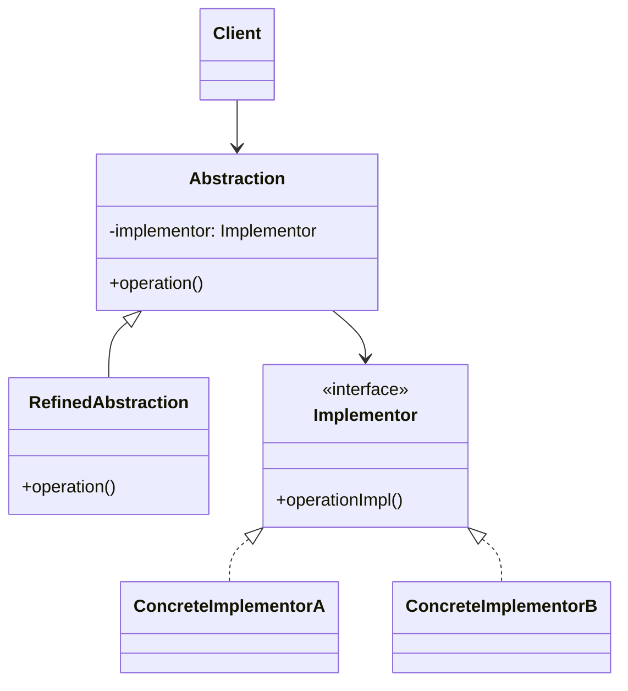
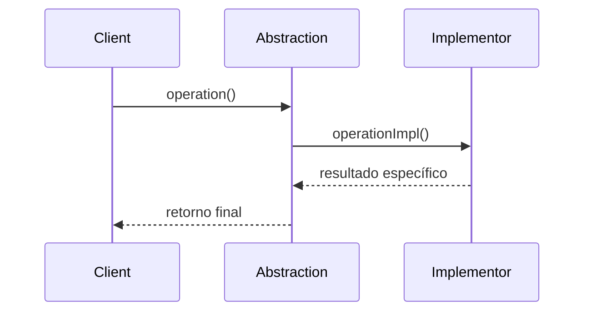

## 1) Nome & objetivo (1 frase)

**Bridge**: separar **abstração** da **implementação**, permitindo que **ambas evoluam independentemente** sem afetar uma à outra.

   Pensa como uma ponte (bridge) entre dois mundos: **o que** algo faz e **como** é feito.

---

## 2) Quando aplicar (checklist)

- Precisa variar **duas dimensões** independentes (ex.: tipo de dispositivo × tipo de renderizador).
- Classes tendem a crescer em **heranças multiplas** (Ex: CircleRed, CircleBlue, SquareRed…).
- Deseja **mudar implementações em tempo de execução** (injeção, plugins).
- Em Android/Kotlin:
  - **Temas + Views** (dark/light + layout).
  - **Storage local vs remoto** (Room vs Firestore).
  - **Relatórios + formatos de exportação** (PDF, CSV, Excel).
  - **Player + Codec** (áudio, vídeo, streams).

---

## 3) Quando NÃO aplicar & riscos

- Só há **uma dimensão de variação** (melhor usar Strategy).
- O acoplamento já é baixo e o sistema simples.
- Excesso de abstrações — risco de over-engineering.

---

## 4) Anti-patterns & como evitar

- **Abstrações vazias**: não criar interfaces só “porque sim”.
- **Implementações acopladas** à abstração (quebra o propósito).
- **Bridge ≠ Inheritance**: não herde implementação — **componha**.

---

## 5) Cuidados SOLID

- **SRP**: abstração e implementação têm papéis separados.
- **OCP**: novas abstrações e implementações sem alterar o núcleo.
- **DIP**: abstração depende da **interface de implementação**, não de classes concretas.

---

## 6) Estrutura (UML)





---

## 7) Antes (code smell real)

_Problema_: renderizadores duplicados por cor e forma.

```kotlin
class CircleRed { fun draw() = println("Desenhando círculo vermelho") }
class CircleBlue { fun draw() = println("Desenhando círculo azul") }
class SquareRed { fun draw() = println("Desenhando quadrado vermelho") }
class SquareBlue { fun draw() = println("Desenhando quadrado azul") }
```

**Cheiro**: explosão combinatória — difícil manter.

---

## 8) Depois (Bridge aplicado)

### 8.1 Implementor (lado da implementação)

```kotlin
interface Renderer {
    fun renderShape(name: String)
}

class RedRenderer : Renderer {
    override fun renderShape(name: String) =
        println("Desenhando $name vermelho ❤️")
}

class BlueRenderer : Renderer {
    override fun renderShape(name: String) =
        println("Desenhando $name azul 💙")
}
```

### 8.2 Abstraction (lado da abstração)

```kotlin
abstract class Shape(protected val renderer: Renderer) {
    abstract fun draw()
}

class Circle(renderer: Renderer) : Shape(renderer) {
    override fun draw() = renderer.renderShape("círculo")
}

class Square(renderer: Renderer) : Shape(renderer) {
    override fun draw() = renderer.renderShape("quadrado")
}
```

### 8.3 Uso (cliente)

```kotlin
fun main() {
    val red = RedRenderer()
    val blue = BlueRenderer()

    val shapes = listOf(
        Circle(red),
        Circle(blue),
        Square(red)
    )

    shapes.forEach { it.draw() }
}
```

---

## 9) Aplicação prática (Android)

**Exemplo real**: repositórios configuráveis (local ou remoto).

```kotlin
interface DataSource {
    suspend fun fetchData(): String
}

class RemoteDataSource : DataSource {
    override suspend fun fetchData() = "Dados do servidor ☁️"
}

class LocalDataSource : DataSource {
    override suspend fun fetchData() = "Dados do cache 💾"
}

abstract class Repository(protected val source: DataSource) {
    abstract suspend fun getData(): String
}

class UserRepository(source: DataSource) : Repository(source) {
    override suspend fun getData(): String = source.fetchData()
}
```

Uso:

```kotlin
val repo = UserRepository(RemoteDataSource())
println(repo.getData())
```

Com o Bridge, o **Repository** é a abstração e o **DataSource** é a implementação, podendo ser trocado facilmente.

---

## 10) Testes essenciais

```kotlin
class BridgeTests {

    @Test
    fun `repository uses correct data source`() = runTest {
        val repo = UserRepository(LocalDataSource())
        assertEquals("Dados do cache 💾", repo.getData())
    }

    @Test
    fun `shape renders with correct color`() {
        val c = Circle(RedRenderer())
        val s = Square(BlueRenderer())
        c.draw()
        s.draw()
    }
}
```

---

## 11) Trade-offs

- **Pró**: reduz duplicação, melhora flexibilidade, fácil troca de implementação.
- **Contra**: mais classes e indireções, difícil visualizar em sistemas pequenos.

---

## 12) Relações com outros padrões

- **Bridge vs Adapter**: Adapter “adapta” uma interface existente; Bridge **separa duas hierarquias** desde o início.
- **Bridge + Factory**: Factory pode decidir qual implementor usar.
- **Bridge + Strategy**: Strategy muda comportamento; Bridge muda implementação.

---

## 13) Checklist Anti Over-Engineering

- Há **duas dimensões variáveis independentes**?
- Precisa **substituir implementações** em runtime?
- É realmente necessário ou uma **injeção simples** resolveria?
- Evite criar bridge só por “elegância arquitetural”.

---

## 14) Resumo em 5 linhas

- **Bridge** separa abstração e implementação.
- Facilita **combinações dinâmicas** sem herança explosiva.
- Ideal para **renderizadores, fontes de dados e temas**.
- Substitui dependências em runtime sem quebrar contrato.
- Evite em sistemas simples — pode complicar demais.
