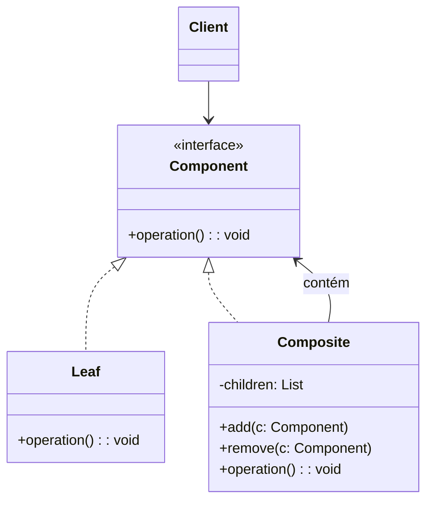
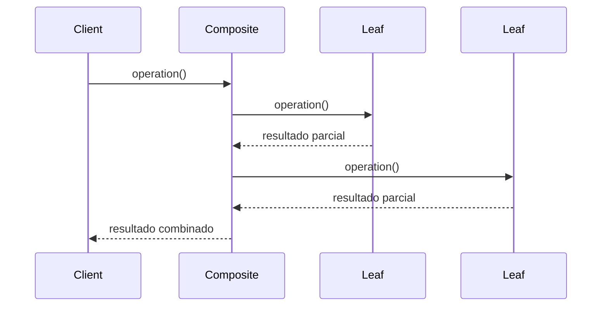

## 1) Nome & objetivo (1 frase)

**Composite**: compor objetos em **estruturas de árvore** para representar **hierarquias parte-todo**, permitindo tratar **objetos individuais e composições** de forma uniforme.

> Exemplo natural: **View e ViewGroup** no Android — ambos implementam a mesma interface View.

---

## 2) Quando aplicar (checklist)

- Deseja representar **estruturas hierárquicas** (menus, pastas, árvores, layouts).
- Deseja **tratar elementos simples e compostos da mesma forma**.
- Precisa de **operações recursivas** (renderizar, calcular, listar).
- Em Android/Kotlin:
  - **Layouts compostos** (ViewGroup/View).
  - **Menus com subitens**.
  - **Sistema de arquivos (folders/files)**.
  - **Estruturas de UI Compose** (Column, Row, Box, etc).

---

## 3) Quando NÃO aplicar & riscos

- Estrutura **não é hierárquica** (flat list).
- O comportamento dos nós é **muito diferente** (difícil uniformizar interface).
- Se a árvore é muito grande e acessada com frequência → **impacto de performance** (recursividade).

---

## 4) Anti-patterns & como evitar

- **Métodos não aplicáveis** em subclasses (ex.: add() em folhas). → Use **interfaces segregadas** ou **lançar exceções controladas**.
- **Misturar responsabilidades** (renderizar e armazenar filhos no mesmo lugar). → mantenha responsabilidades separadas.
- **Ciclos de referência** → verifique se parent e child não se referem mutuamente sem controle.

---

## 5) Cuidados SOLID

- **SRP**: cada nó (folha/composite) tem papel claro.
- **OCP**: novos tipos de nós podem ser adicionados sem alterar o cliente.
- **LSP**: folhas e compostos devem ser tratáveis da mesma forma.

---

## 6) Estrutura (UML)





---

## 7) Antes (code smell real)

_Problema_: estruturas aninhadas gerenciadas manualmente.

```kotlin
class Folder(val name: String, val files: MutableList<String> = mutableListOf())

fun printStructure(folder: Folder) {
    println("📁 ${folder.name}")
    folder.files.forEach { println("  📄 $it") }
}
```

**Cheiros**: difícil adicionar subpastas; código não escalável.

---

## 8) Depois (Composite aplicado)

### 8.1 Contrato unificado

```kotlin
interface FileComponent {
    fun show(indent: String = "")
}
```

### 8.2 Folha

```kotlin
class File(private val name: String) : FileComponent {
    override fun show(indent: String) = println("$indent📄 $name")
}
```

### 8.3 Composite

```kotlin
class Folder(private val name: String) : FileComponent {
    private val children = mutableListOf<FileComponent>()

    fun add(component: FileComponent) = children.add(component)
    fun remove(component: FileComponent) = children.remove(component)

    override fun show(indent: String) {
        println("$indent📁 $name")
        children.forEach { it.show("$indent   ") }
    }
}
```

### 8.4 Cliente

```kotlin
fun main() {
    val root = Folder("Documentos")
    val photos = Folder("Fotos")
    val reports = Folder("Relatórios")

    photos.add(File("aniversario.jpg"))
    reports.add(File("financeiro.pdf"))
    reports.add(File("planejamento.xlsx"))

    root.add(photos)
    root.add(reports)

    root.show()
}
```

**Saída:**

```
📁 Documentos
   📁 Fotos
      📄 aniversario.jpg
   📁 Relatórios
      📄 financeiro.pdf
      📄 planejamento.xlsx
```

---

## 9) Aplicação prática (Android Compose)

Em **Jetpack Compose**, cada elemento (Column, Row, Box, Text) é um **Composite**.

```kotlin
@Composable
fun FolderView(folder: Folder) {
    Column {
        Text("📁 ${folder.name}")
        folder.children.forEach { child ->
            when (child) {
                is File -> Text("   📄 ${child.name}")
                is Folder -> FolderView(child)
            }
        }
    }
}
```

> Aqui o Compose atua exatamente como Composite: Column contém outros composables recursivamente.

---

## 10) Testes essenciais

```kotlin
class CompositeTests {

    @Test
    fun `composite structure renders correctly`() {
        val root = Folder("Raiz")
        val sub = Folder("Sub")
        sub.add(File("doc.txt"))
        root.add(sub)
        assertDoesNotThrow { root.show() }
    }

    @Test
    fun `leaf shows correctly`() {
        val file = File("readme.md")
        assertDoesNotThrow { file.show() }
    }
}
```

---

## 11) Trade-offs

- **Pró**: estrutura recursiva elegante, flexível, extensível.
- **Contra**: pode aumentar complexidade; difícil otimizar árvores grandes.

---

## 12) Relações com outros padrões

- **Composite + Iterator**: iterar facilmente sobre a árvore.
- **Composite + Visitor**: aplicar operações recursivas em toda a estrutura.
- **Composite + Decorator**: ambos envolvem objetos, mas Decorator **adiciona comportamento** a um único nó.

---

## 13) Checklist Anti Over-Engineering

- Estrutura é **hierárquica**?
- Elementos podem ser tratados **de forma uniforme**?
- As operações são **recursivas** e repetitivas?
- Se for simples (flat list) → não use Composite.

---

## 14) Resumo em 5 linhas

- **Composite** modela estruturas **em árvore** (parte-todo).
- Permite tratar **folhas e compostos** igualmente.
- Muito usado em **UI, menus, sistemas de arquivos**.
- Facilita **operações recursivas**.
- Evite se não houver hierarquia real.
