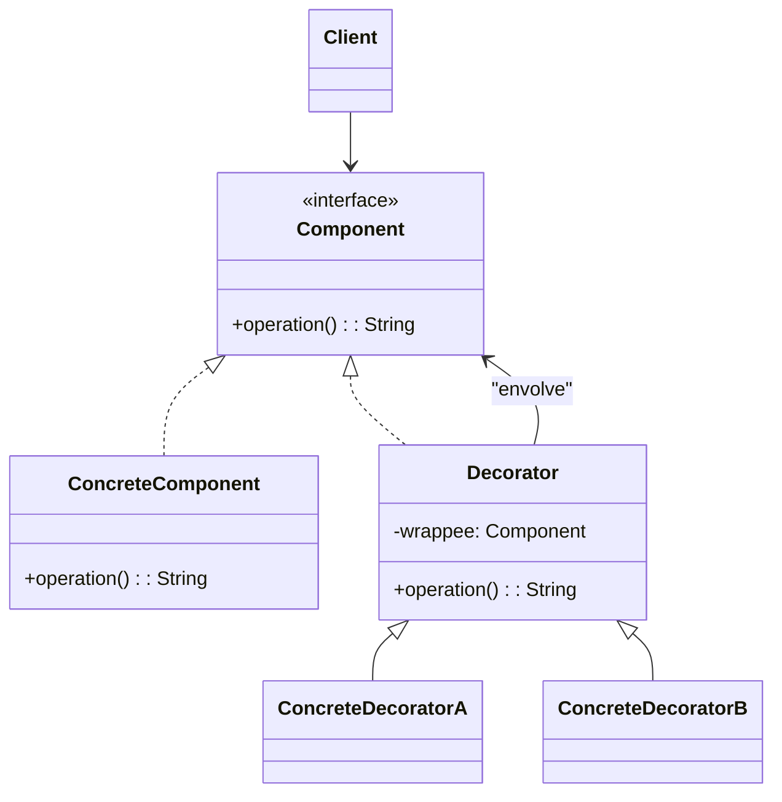
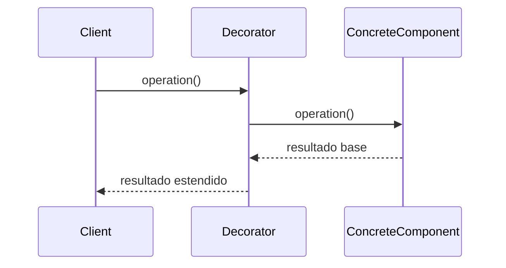

## 1) Nome & objetivo (1 frase)

**Decorator**: anexar **comportamentos adicionais** a um objeto **dinamicamente**, mantendo a mesma interface.

> É o padrão do “embrulho funcional”: cada decorator adiciona funcionalidade sem mudar a essência do objeto.

---

## 2) Quando aplicar (checklist)

- Deseja **adicionar responsabilidades** em tempo de execução sem criar subclasses.
- Precisa **combinar** comportamentos de forma flexível (ex.: cache + logging).
- Quer **seguir o princípio aberto/fechado** (OCP).
- Em Android/Kotlin:
  - **Compose Modifiers** (ex.: padding().background().clickable()).
  - **Interceptors** em OkHttp (cadeia de decorators).
  - **Streams/IO** (BufferedInputStream, DataInputStream).
  - **View wrappers** (ex.: ContextThemeWrapper).

---

## 3) Quando NÃO aplicar & riscos

- O comportamento adicional **poderia ser herdado facilmente** e nunca muda.
- Muitas camadas de decorators → **dificuldade de depuração**.
- Decorators com **estado complexo** → perda de previsibilidade.

---

## 4) Anti-patterns & como evitar

- **Decorator gordo**: adiciona múltiplas responsabilidades. → crie decorators especializados.
- **Encadeamento confuso**: documente a ordem de aplicação.
- **Alterar a interface** quebra o padrão (todos devem expor a mesma).

---

## 5) Cuidados SOLID

- **SRP**: cada decorator adiciona **apenas uma** responsabilidade.
- **OCP**: adicione novos decorators sem alterar código existente.
- **DIP**: cliente depende da **abstração** do componente, não de decorators concretos.

---

## 6) Estrutura (UML





---

## 7) Antes (code smell real)

_Problema_: funções duplicadas para adicionar logs e cache em API calls.

```kotlin
class ApiClient {
    fun fetchData(): String {
        println("Calling API...")
        return "Data"
    }

    fun fetchDataWithCache(): String {
        println("Checking cache...")
        return "Cached Data"
    }

    fun fetchDataWithLog(): String {
        println("Logging API call...")
        return fetchData()
    }
}
```

**Cheiros**: duplicação, difícil combinar (ex.: log + cache juntos).

---

## 8) Depois (Decorator aplicado)

### 8.1 Componente base

```kotlin
interface DataSource {
    fun readData(): String
}
```

### 8.2 Componente concreto

```kotlin
class ApiDataSource : DataSource {
    override fun readData(): String {
        println("📡 Buscando dados da API...")
        return "API Response"
    }
}
```

### 8.3 Decorator abstrato

```kotlin
open class DataSourceDecorator(private val wrappee: DataSource) : DataSource {
    override fun readData(): String = wrappee.readData()
}
```

### 8.4 Decorators concretos

```kotlin
class CacheDecorator(wrappee: DataSource) : DataSourceDecorator(wrappee) {
    private var cache: String? = null

    override fun readData(): String {
        if (cache == null) {
            println("💾 Nenhum cache. Buscando e salvando...")
            cache = super.readData()
        } else {
            println("⚡ Retornando do cache.")
        }
        return cache!!
    }
}

class LogDecorator(wrappee: DataSource) : DataSourceDecorator(wrappee) {
    override fun readData(): String {
        println("🪵 Log: iniciando leitura de dados.")
        val data = super.readData()
        println("✅ Log: leitura concluída.")
        return data
    }
}
```

### 8.5 Cliente

```kotlin
fun main() {
    val api = ApiDataSource()
    val cached = CacheDecorator(api)
    val logged = LogDecorator(cached)

    println("Primeira leitura:")
    println(logged.readData())
    println("\nSegunda leitura:")
    println(logged.readData())
}
```

**Saída:**

```shell
🪵 Log: iniciando leitura de dados.
💾 Nenhum cache. Buscando e salvando...
📡 Buscando dados da API...
✅ Log: leitura concluída.
Primeira leitura: API Response

🪵 Log: iniciando leitura de dados.
⚡ Retornando do cache.
✅ Log: leitura concluída.
Segunda leitura: API Response
```

---

## 9) Aplicação prática (Android/Compose)

**Compose** aplica Decorator Pattern por design:

```kotlin
Text(
    text = "Olá mundo!",
    modifier = Modifier
        .padding(16.dp)
        .background(Color.LightGray)
        .clickable { println("Clicado!") }
)
```

Cada chamada (padding, background, clickable) **retorna um novo objeto decorado**, preservando o contrato de Modifier.

---

## 10) Versão funcional (Kotlin idiomática)

Kotlin permite um _syntactic_ sugar para Decorator com _extension composition_:

```kotlin
fun DataSource.withCache() = CacheDecorator(this)
fun DataSource.withLog() = LogDecorator(this)

val source = ApiDataSource().withCache().withLog()
source.readData()
```


---

## 11) Testes essenciais

```kotlin
class DecoratorTests {

    @Test
    fun `cache decorator stores first call`() {
        val api = ApiDataSource()
        val cached = CacheDecorator(api)
        cached.readData()
        val result = cached.readData()
        assertEquals("API Response", result)
    }

    @Test
    fun `log decorator calls inner component`() {
        val api = ApiDataSource()
        val logged = LogDecorator(api)
        val data = logged.readData()
        assertEquals("API Response", data)
    }
}
```

---

## 12) Trade-offs

- **Pró**: fácil extensão de comportamento; combinações dinâmicas; evita herança.
- **Contra**: difícil depurar quando há muitos níveis de decorators; pode afetar performance.

---

## 13) Relações com outros padrões

- **Decorator vs Proxy**: Proxy controla acesso; Decorator **enriquece funcionalidade**.
- **Decorator + Chain of Responsibility**: ambos encadeiam, mas CoR **decide fluxo**, não adiciona comportamento.
- **Decorator + Factory**: Factory pode montar decorators conforme configuração.

---

## 14) Checklist Anti Over-Engineering

- O comportamento é **complementar** (não central)?
- Precisa de **combinações dinâmicas**?
- A ordem de execução está clara/documentada?
- Pode ser substituído por **composição direta**?

---

## 15) Resumo em 5 linhas

- **Decorator** adiciona funcionalidades **sem alterar a classe original**.
- Excelente para **logging, cache, segurança e UI modifiers**.
- Funciona **em cadeia**, mantendo a interface original.
- Evita herança múltipla e facilita extensibilidade.
- Em Kotlin, pode ser implementado com **DSLs e extensions**.
