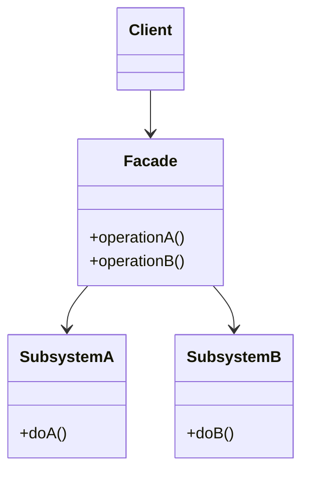
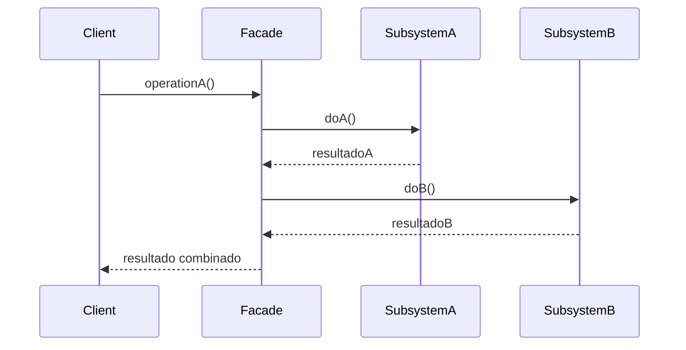

## 1) Nome & objetivo (1 frase)

**Facade**: fornecer uma **interface unificada e simples** para um **subsistema complexo**, escondendo detalhes internos e reduzindo o acoplamento.

> É o “balcão único” — o cliente interage com uma única porta de entrada em vez de lidar com múltiplos módulos diretamente.

---

## 2) Quando aplicar (checklist)

- O sistema possui **vários componentes ou APIs complexas**.
- Deseja **isolar a complexidade** interna de bibliotecas ou módulos.
- Precisa **fornecer uma interface estável** mesmo que as implementações mudem.
- Em Android/Kotlin:
  - **Camada de Use Cases** acessando múltiplos repositórios.
  - **Serviços de autenticação**, que combinam Firebase, API e banco local.
  - **SDKs de pagamento, câmera, mapas, analytics**, etc.
  - **Facade sobre Retrofit + Room** para fornecer dados já consolidados.

---

## 3) Quando NÃO aplicar & riscos

- O sistema é **pequeno e simples** → a “fachada” seria código redundante.
- Se o Facade **começa a crescer demais**, é sinal de **mau design ou God Object**.
- Não use para **esconder má arquitetura** — use para organizar uma boa.

---

## 4) Anti-patterns & como evitar

- **God Facade**: faz de tudo; divida por domínio (ex.: AuthFacade, PaymentFacade).
- **Acoplamento reverso**: o Facade deve conhecer o subsistema, **não o contrário**.
- **Exposição indevida**: mantenha o subsistema **interno (package-private)** sempre que possível.

---

## 5) Cuidados SOLID

- **SRP**: o Facade agrupa um conjunto de operações coesas.
- **OCP**: novas operações entram no subsistema, não necessariamente no Facade.
- **DIP**: clientes dependem da **abstração Facade**, não do sistema interno.

---

## 6) Estrutura (UML)





---

## 7) Antes (code smell real)

_Problema_: o cliente precisa chamar vários serviços para fazer login.

```kotlin
fun login(email: String, senha: String): Boolean {
    val token = AuthApi().authenticate(email, senha)
    val user = UserRepository().getUserByEmail(email)
    val prefs = SharedPrefsManager()
    prefs.saveToken(token)
    prefs.saveUser(user)
    return token.isNotEmpty()
}
```

**Cheiros**: acoplamento direto a múltiplos módulos → difícil de testar, trocar ou evoluir.

---

## 8) Depois (Facade aplicado)

### 8.1 Subsistemas

```kotlin
class AuthApi {
    fun authenticate(email: String, senha: String) = "token-${email.hashCode()}"
}

class UserRepository {
    fun getUserByEmail(email: String) = "Usuário: $email"
}

class SharedPrefsManager {
    fun saveToken(token: String) = println("🔐 Token salvo: $token")
    fun saveUser(user: String) = println("👤 Usuário salvo: $user")
}
```

### 8.2 Facade

```kotlin
class AuthFacade(
    private val api: AuthApi = AuthApi(),
    private val repo: UserRepository = UserRepository(),
    private val prefs: SharedPrefsManager = SharedPrefsManager()
) {
    fun login(email: String, senha: String): Boolean {
        val token = api.authenticate(email, senha)
        val user = repo.getUserByEmail(email)
        prefs.saveToken(token)
        prefs.saveUser(user)
        return token.isNotEmpty()
    }
}
```

### 8.3 Cliente

```kotlin
fun main() {
    val auth = AuthFacade()
    val success = auth.login("ronald@exemplo.com", "1234")
    println(if (success) "✅ Login efetuado" else "❌ Falha no login")
}
```

**Saída:**

```shell
🔐 Token salvo: token-123456
👤 Usuário salvo: Usuário: ronald@exemplo.com
✅ Login efetuado
```

---

## 9) Aplicação prática (Android)

**Exemplo**: um _UseCase_ que atua como Facade sobre vários repositórios.

```kotlin
class GetUserDataFacade(
    private val api: UserApi,
    private val dao: UserDao,
    private val cache: UserCache
) {
    suspend fun getUserData(userId: String): User {
        val cached = cache.get(userId)
        if (cached != null) return cached

        val user = api.fetchUser(userId)
        dao.save(user)
        cache.save(user)
        return user
    }
}
```

> No ViewModel:

```kotlin
val user = getUserDataFacade.getUserData("123")
```

O ViewModel só conhece o Facade, e não precisa saber se o dado vem do cache, DAO ou API.

---

## 10) Versão funcional (Kotlin idiomática)

Kotlin facilita Facades com funções de extensão:

```kotlin
fun UserRepository.loginUser(email: String, senha: String): Boolean {
    val token = AuthApi().authenticate(email, senha)
    SharedPrefsManager().saveToken(token)
    return token.isNotEmpty()
}
```

Mas o **padrão completo** com classe dedicada ainda é preferível em projetos grandes, pois centraliza responsabilidades e facilita testes.

---

## 11) Testes essenciais

```kotlin
class FacadeTests {

    @Test
    fun `login calls subsystems in correct order`() {
        val facade = AuthFacade()
        val result = facade.login("user@test.com", "123")
        assertTrue(result)
    }
}
```

---

## 12) Trade-offs

- **Pró**: reduz acoplamento, simplifica o uso de subsistemas complexos, melhora testabilidade.
- **Contra**: pode se tornar um _God Object_ se crescer demais; requer disciplina na separação de domínios.

---

## 13) Relações com outros padrões

- **Facade vs Adapter**: Adapter converte interfaces; Facade **simplifica várias interfaces**.
- **Facade + Singleton**: frequentemente usados juntos (facade global).
- **Facade + Mediator**: ambos centralizam interações, mas Mediator coordena **entre objetos**, Facade apenas **expõe** um ponto único.

---

## 14) Checklist Anti Over-Engineering

- O subsistema é **realmente complexo**?
- O Facade mantém **interface estável** e fácil de usar?
- Não virou um **monólito de chamadas**?
- Está **isento de lógica de negócio** (apenas orquestração)?

---

## 15) Resumo em 5 linhas

- **Facade** fornece uma **interface única e simples** para um sistema complexo.
- Ideal para **API Gateways, UseCases e SDKs**.
- Reduz acoplamento e facilita manutenção.
- Muito comum em **arquiteturas limpas** (camada de aplicação).
- Evite transformá-lo em um **God Object**.
