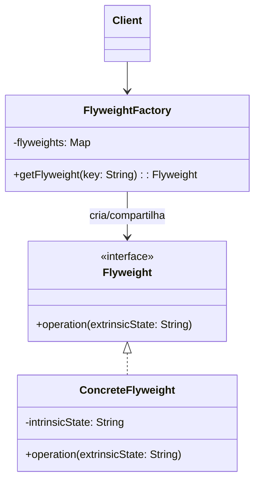
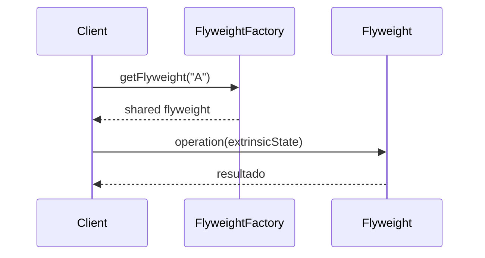

# 1) Nome & objetivo (1 frase)

**Flyweight**: reduzir o uso de memória compartilhando **objetos imutáveis** entre múltiplos contextos, evitando a criação redundante de instâncias idênticas.

> É o padrão do “compartilhamento inteligente”: armazena o que é comum e separa o que é variável.

---

## 2) Quando aplicar (checklist)

- O sistema cria **muitos objetos semelhantes**, consumindo muita memória.
- As diferenças entre objetos são **extrínsecas** (vindas do contexto, não do próprio objeto).
- Os objetos são **imutáveis** ou têm partes imutáveis.
- Em Android/Kotlin:
  - **RecyclerView ViewHolders** (compartilhamento de layouts).
  - **Fontes, ícones e drawables** (cache).
  - **TextStyle, Color, Shape** — todos flyweights em Compose.
  - **Bitmaps ou Paint** reutilizados em Canvas.

---

## 3) Quando NÃO aplicar & riscos

- Os objetos têm **muito estado variável** → o ganho é pequeno.
- A criação é barata e o volume é baixo.
- Gerenciar contexto externo (extrínseco) aumenta complexidade desnecessária.

---

## 4) Anti-patterns & como evitar

- **Flyweight mutável**: quebra a segurança do padrão; sempre imutável.
- **Fábrica de flyweights desorganizada**: centralize no FlyweightFactory.
- **Contexto extrínseco misturado no objeto**: mantenha separado (parâmetros externos).

---

## 5) Cuidados SOLID

- **SRP**: o flyweight representa apenas o **estado compartilhado**.
- **OCP**: novas variações de flyweights podem ser criadas sem alterar o cliente.
- **DIP**: o cliente depende da **abstração** da fábrica, não de instâncias diretas.

---

## 6) Estrutura (UML)





---

## 7) Antes (code smell real)

_Problema_: cada célula da lista cria seu próprio ícone idêntico.

```kotlin
data class Item(val name: String, val icon: Drawable)

val items = List(1000) { Item("Item $it", ContextCompat.getDrawable(ctx, R.drawable.star)!!) }
```

**Cheiros**: 1000 drawables idênticos → consumo desnecessário de memória e GC.

---

## 8) Depois (Flyweight aplicado)

### 8.1 Flyweight (estado intrínseco)

```kotlin
interface IconFlyweight {
    fun draw(position: Int)
}
```

### 8.2 Implementação concreta

```kotlin
class StarIcon(private val drawable: Drawable) : IconFlyweight {
    override fun draw(position: Int) {
        println("⭐ Desenhando estrela na posição $position com hash ${drawable.hashCode()}")
    }
}
```

### 8.3 Flyweight Factory

```kotlin
object IconFactory {
    private val icons = mutableMapOf<Int, IconFlyweight>()

    fun getStarIcon(resId: Int, context: Context): IconFlyweight =
        icons.getOrPut(resId) {
            val drawable = ContextCompat.getDrawable(context, resId)!!
            println("Criando novo drawable para $resId")
            StarIcon(drawable)
        }
}
```

### 8.4 Cliente

```kotlin
fun main() {
    val ctx = FakeContext()
    repeat(3) { position ->
        val icon = IconFactory.getStarIcon(123, ctx)
        icon.draw(position)
    }
}
```

**Saída:**

```shell
Criando novo drawable para 123
⭐ Desenhando estrela na posição 0 com hash 1012723
⭐ Desenhando estrela na posição 1 com hash 1012723
⭐ Desenhando estrela na posição 2 com hash 1012723
```

> 🔥 Apenas **um drawable criado**, reutilizado por todos os itens.

---

## 9) Aplicação prática (Android Compose)

Compose já usa Flyweight internamente: todos os Color, TextStyle e Shape são imutáveis e compartilháveis.

Exemplo prático:

```kotlin
val red = Color.Red
val redAgain = Color.Red
println(red === redAgain) // true → flyweight interno
```

Você pode aplicar o padrão para **otimizar caches de Paint, Path ou Brush** personalizados:

```kotlin
object PaintFactory {
    private val paints = mutableMapOf<Color, Paint>()
    fun getPaint(color: Color): Paint =
        paints.getOrPut(color) {
            println("Criando novo Paint para $color")
            Paint().apply { this.color = color.toArgb() }
        }
}
```

---

## 10) Versão funcional (Kotlin idiomática)

Flyweight Factory pode ser simplificada:

```kotlin
class FlyweightFactory<T>(
    private val create: (String) -> T
) {
    private val cache = mutableMapOf<String, T>()
    fun get(key: String): T = cache.getOrPut(key) { create(key) }
}
```

Uso:

```kotlin
val icons = FlyweightFactory { id -> "Icon-$id" }
println(icons.get("star"))
println(icons.get("star")) // retorna cacheado
```

---

## 11) Testes essenciais

```kotlin
class FlyweightTests {

    @Test
    fun `factory reuses same instance`() {
        val ctx = FakeContext()
        val icon1 = IconFactory.getStarIcon(1, ctx)
        val icon2 = IconFactory.getStarIcon(1, ctx)
        assertSame(icon1, icon2)
    }

    @Test
    fun `different keys create different flyweights`() {
        val ctx = FakeContext()
        val i1 = IconFactory.getStarIcon(1, ctx)
        val i2 = IconFactory.getStarIcon(2, ctx)
        assertNotSame(i1, i2)
    }
}
```

---

## 12) Trade-offs

- **Pró**: economia de memória, performance em listas ou gráficos intensivos.
- **Contra**: código mais complexo; precisa gerenciar contexto extrínseco; pode aumentar acoplamento se mal usado.

---

## 13) Relações com outros padrões

- **Flyweight + Factory**: fábrica responsável por criar e compartilhar instâncias.
- **Flyweight + Proxy**: Proxy pode esconder a criação e acesso do flyweight.
- **Flyweight + Composite**: árvores grandes podem usar flyweights para nós repetidos.

---

## 14) Checklist Anti Over-Engineering

- Há **muitos objetos idênticos** sendo criados?
- O estado é **majoritariamente imutável**?
- Você consegue **isolar o contexto extrínseco**?
- O ganho de memória **supera a complexidade extra**?

---

## 15) Resumo em 5 linhas

- **Flyweight** compartilha instâncias imutáveis entre múltiplos contextos.
- Reduz **uso de memória e GC pressure**.
- Muito usado em Comp**ose, RecyclerView e caches de UI**.
- Exige **fábrica central e controle de estado extrínseco**.
- Evite se os objetos forem altamente mutáveis ou únicos.
