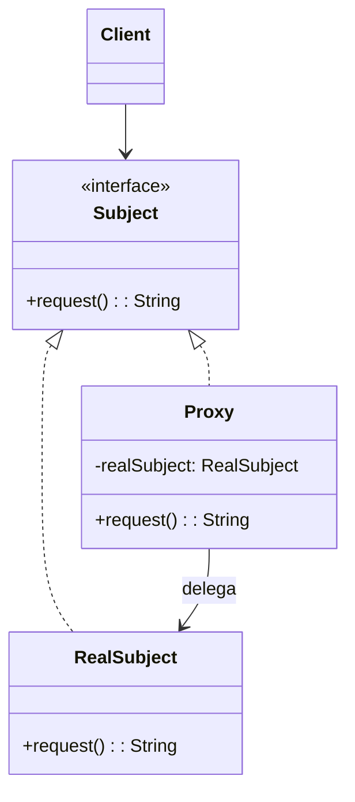
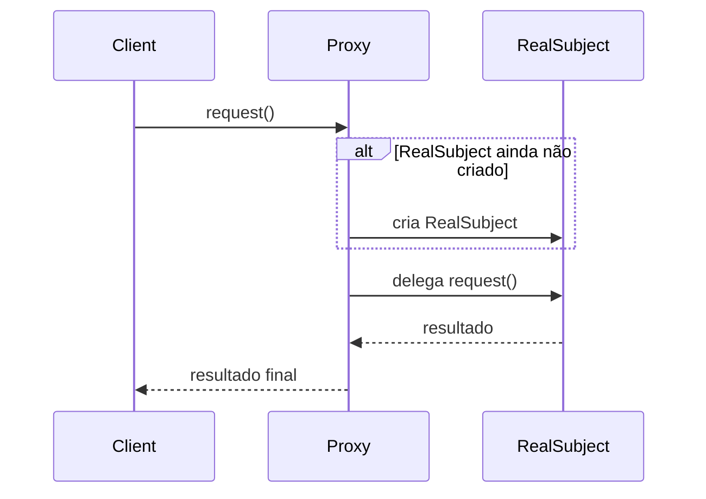

## 1) Nome & objetivo (1 frase)

**Proxy**: fornecer um **substituto ou representante** para outro objeto, controlando o acesso a ele — permitindo **lazy loading, caching, segurança** ou **monitoramento** sem alterar o código real.

> É o padrão do “representante”: o cliente interage com o proxy como se fosse o objeto real.

---

## 2) Quando aplicar (checklist)

- Deseja **controlar o acesso** a um objeto (ex.: criar sob demanda, validar, logar).
- O objeto real é **caro de instanciar** (ex.: imagem grande, conexão remota).
- Precisa **adiar a inicialização** até o uso real.
- Em Android/Kotlin:
  - **Room DAO e Retrofit Service** → gerados via proxy dinâmico.
  - **ViewBinding** (lazy init de views).
  - **AOP/Interceptors** para log, permissão, segurança.
  - **Lazy properties** (by lazy { ... }) — proxy nativo do Kotlin.

---

## 3) Quando NÃO aplicar & riscos

- O objeto real é **barato** e o acesso é constante → proxy adiciona latência desnecessária.
- Proxies **aninhados demais** → difícil de depurar.
- Pode **mascarar exceções** se mal implementado.

---

## 4) Anti-patterns & como evitar

- **Proxy gordo**: adiciona múltiplas funções (cache + log + validação). → crie proxies especializados.
- **Proxy quebrando contrato**: o cliente deve interagir com ele **sem notar diferença**.
- **Acesso circular**: o proxy delega para outro proxy — cuidado com loops.

---

## 5) Cuidados SOLID

- **SRP**: proxy tem apenas uma responsabilidade (ex.: lazy load, cache, segurança).
- **OCP**: novos comportamentos → novos proxies, sem alterar o real.
- **DIP**: cliente depende da **interface comum**, não da classe concreta.

---

6) Estrutura (UML + Sequence)





---

## 7) Antes (code smell real)

_Problema_: imagem pesada carregada sempre que acessada.

```kotlin
class Image(val filename: String) {
    init { println("Carregando imagem: $filename") }
    fun display() = println("Exibindo $filename")
}

fun main() {
    val img = Image("banner.png")
    img.display()
    img.display()
}
```

**Cheiros**: a imagem é carregada duas vezes — mesmo sem necessidade.

---

## 8) Depois (Proxy aplicado)

### 8.1 Interface comum

```kotlin
interface Graphic {
    fun display()
}
```

### 8.2 RealSubject

```kotlin
class RealImage(private val filename: String) : Graphic {
    init { println("🖼️ Carregando imagem real: $filename") }
    override fun display() = println("📸 Exibindo $filename")
}
```

### 8.3 Proxy

```kotlin
class ImageProxy(private val filename: String) : Graphic {
    private var realImage: RealImage? = null

    override fun display() {
        if (realImage == null) {
            println("🕓 Carregando sob demanda...")
            realImage = RealImage(filename)
        }
        realImage!!.display()
    }
}
```

### 8.4 Cliente

```kotlin
fun main() {
    val img = ImageProxy("banner.png")
    println("Imagem criada, mas ainda não carregada.")
    img.display() // carrega agora
    img.display() // reutiliza cache
}
```

**Saída:**

```shell
Imagem criada, mas ainda não carregada.
🕓 Carregando sob demanda...
🖼️ Carregando imagem real: banner.png
📸 Exibindo banner.png
📸 Exibindo banner.png
```

✅ O objeto real (RealImage) só é criado **quando necessário**.

---

## 9) Aplicação prática (Android)

**Exemplo real**: Lazy initialization com by lazy (proxy interno do Kotlin):

```kotlin
val db: RoomDatabase by lazy {
    Room.databaseBuilder(context, AppDatabase::class.java, "app.db").build()
}
```

**Retrofit Proxy**

```kotlin
interface ApiService {
    @GET("users") suspend fun getUsers(): List<User>
}

// Retrofit cria um PROXY dessa interface em runtime
val service = retrofit.create(ApiService::class.java)
```

O cliente chama service.getUsers() como se fosse o objeto real — mas o proxy faz toda a mágica (conversão, HTTP, deserialização).

---

## 10) Versão funcional (Kotlin idiomática)

Kotlin permite criar proxies customizados com **delegação por propriedade**:

```kotlin
class LazyProxy<T>(private val initializer: () -> T) {
    private var value: T? = null
    fun get(): T {
        if (value == null) {
            println("Inicializando proxy...")
            value = initializer()
        }
        return value!!
    }
}

val logger by lazy { println("🔧 Criando Logger"); Any() }
```

---

## 11) Testes essenciais

```kotlin
class ProxyTests {

    @Test
    fun `image proxy loads only once`() {
        val proxy = ImageProxy("foto.png")
        proxy.display()
        proxy.display()
        // Esperado: apenas um carregamento real
    }

    @Test
    fun `lazy proxy initializes once`() {
        val proxy = LazyProxy { "Heavy Object" }
        assertEquals("Heavy Object", proxy.get())
        assertEquals("Heavy Object", proxy.get())
    }
}
```


---

## 12) Trade-offs

- **Pró**: inicialização sob demanda, controle de acesso, logging, cache.
- **Contra**: mais complexidade e indireção; debugging mais difícil; pode mascarar exceções.

---

## 13) Relações com outros padrões

- **Proxy vs Decorator**: ambos envolvem delegação, mas Decorator **adiciona comportamento**; Proxy **controla acesso**.
- **Proxy + Flyweight**: Proxy pode adiar criação de flyweights.
- **Proxy + Facade**: Facade pode usar Proxy para **lazy initialization** de subsistemas.

---

## 14) Checklist Anti Over-Engineering

- O objeto real é **pesado** ou de **acesso restrito**?
- Precisa de **lazy loading, segurança ou cache**?
- O cliente **não deve saber** se é proxy ou real?
- Se o ganho for pequeno → evite adicionar indireção.

---

## 15) Resumo em 5 linhas

- **Proxy** é um **representante controlado** de outro objeto.
- Permite **lazy loading, cache e segurança**.
- Amplamente usado em **Retrofit, Room, ViewBinding**.
- Mantém a mesma interface do objeto real.
- Evite excesso de indireções para não perder clareza.
